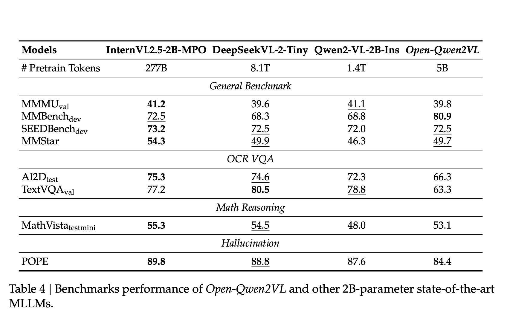

# Meet Open-Qwen2VL: A Fully Open and Compute-Efficient Multimodal Large Language Model

> Multimodal Large Language Models (MLLMs) have advanced the integration of visual and textual modalities, enabling progress in tasks such as image captioning, visual question answering, and document interpretation. However, the replication and further development of these models are often hindered by a lack of transparency. Many state-of-the-art MLLMs do not release key components, including training […]

Multimodal Large Language Models (MLLMs) have advanced the integration of visual and textual modalities, enabling progress in tasks such as image captioning, visual question answering, and document interpretation. However, the replication and further development of these models are often hindered by a lack of transparency. Many state-of-the-art MLLMs do not release key components, including training code, data curation methodologies, and pretraining datasets. Furthermore, the substantial computational resources required for training these models pose a significant barrier, particularly for academic researchers with limited infrastructure. This lack of accessibility impedes reproducibility and slows the dissemination of new techniques within the research community.

Researchers from UC Santa Barbara, Bytedance and NVIDIA introduce Open-Qwen2VL, a 2-billion parameter Multimodal [Large Language Model](https://www.marktechpost.com/2025/01/11/what-are-large-language-model-llms/) that has been pre-trained on 29 million image-text pairs using approximately 220 A100-40G GPU hours. Developed collaboratively by researchers from UC Santa Barbara, ByteDance, and Nvidia Research, Open-Qwen2VL is designed to address reproducibility and resource constraints in MLLM research. The project provides a complete suite of open-source resources, including the training codebase, data filtering scripts, WebDataset-formatted pretraining data, and both base and instruction-tuned model checkpoints. This comprehensive release aims to support transparent experimentation and method development in the multimodal learning domain.

Open-Qwen2VL is based on the Qwen2.5-1.5B-Instruct LLM backbone, coupled with a SigLIP-SO-400M vision encoder. An Adaptive Average-Pooling Visual Projector reduces the number of visual tokens from 729 to 144 during pretraining, which improves computational efficiency. The token count is increased back to 729 during the supervised fine-tuning (SFT) stage. This low-to-high resolution strategy maintains image understanding capabilities while optimizing for resource usage.

To further enhance training efficiency, Open-Qwen2VL implements multimodal sequence packing, allowing the concatenation of multiple image-text pairs into sequences of approximately 4096 tokens, thereby minimizing padding and computational overhead. The vision encoder parameters remain frozen during pretraining to conserve resources and are optionally unfrozen during SFT to improve downstream performance.

Open-Qwen2VL is trained on only 0.36% of the token count used in Qwen2-VL, yet demonstrates comparable or superior performance across several benchmarks. The model achieves a score of 80.9 on MMBench, and performs competitively on SEEDBench (72.5), MMStar (49.7), and MathVista (53.1). Ablation studies indicate that integrating a small subset (5M samples) of high-quality image-text pairs filtered using MLM-based techniques can result in measurable performance improvements, highlighting the importance of data quality over volume.

In addition, Open-Qwen2VL exhibits robust few-shot multimodal in-context learning capabilities. When evaluated on datasets such as GQA and TextVQA, the model shows 3% to 12% accuracy gains from 0-shot to 8-shot scenarios. Fine-tuning performance scales predictably with the size of the instruction tuning dataset, with performance gains plateauing around 8M examples from the MAmmoTH-VL-10M dataset.

Open-Qwen2VL introduces a reproducible and resource-efficient pipeline for training multimodal large language models. By systematically addressing the limitations of prior models in terms of openness and compute requirements, it enables broader participation in MLLM research. The model’s design choices—including efficient visual token handling, multimodal sequence packing, and judicious data selection—illustrate a viable path forward for academic institutions aiming to contribute to the field. Open-Qwen2VL establishes a reproducible baseline and provides a foundation for future work on scalable, high-performance MLLMs within constrained computational environments.

---

Check out **_the [Paper](https://arxiv.org/abs/2504.00595), [Model](https://huggingface.co/weizhiwang/Open-Qwen2VL), [Data](https://huggingface.co/datasets/weizhiwang/Open-Qwen2VL-Data) and [Code](https://github.com/Victorwz/Open-Qwen2VL)._** All credit for this research goes to the researchers of this project. Also, feel free to follow us on **[Twitter](https://x.com/intent/follow?screen_name=marktechpost)** and don’t forget to join our **[85k+ ML SubReddit](https://www.reddit.com/r/machinelearningnews/)**.

[**🔥 [Register Now] miniCON Virtual Conference on OPEN SOURCE AI: FREE REGISTRATION + Certificate of Attendance + 3 Hour Short Event (April 12, 9 am- 12 pm PST) + Hands on Workshop [Sponsored]**](https://pxl.to/hki7r39)
