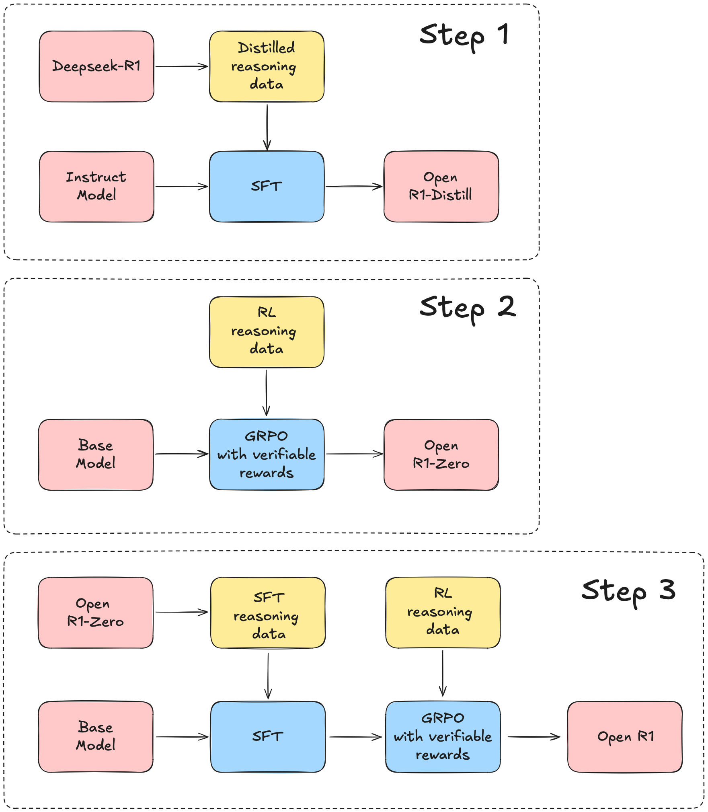

# Meet Open R1: The Full Open Reproduction of DeepSeek-R1, Challenging the Status Quo of Existing Proprietary LLMs

> Open Source LLM development is going through great change through fully reproducing and open-sourcing DeepSeek-R1, including training data, scripts, etc. Hosted on Hugging Face’s platform, this ambitious project is designed to replicate and enhance the R1 pipeline. It emphasizes collaboration, transparency, and accessibility, enabling researchers and developers worldwide to build on DeepSeek-R1’s foundational work. What […]

Open Source LLM development is going through great change through fully reproducing and open-sourcing [**DeepSeek-R1**](https://github.com/deepseek-ai/DeepSeek-R1/blob/main/DeepSeek_R1.pdf), including training data, scripts, etc. Hosted on Hugging Face’s platform, this ambitious project is designed to replicate and enhance the R1 pipeline. It emphasizes collaboration, transparency, and accessibility, enabling researchers and developers worldwide to build on DeepSeek-R1’s foundational work.

### What is Open R1?

[**Open R1**](https://github.com/huggingface/open-r1) aims to recreate the DeepSeek-R1 pipeline, an advanced system renowned for its synthetic data generation, reasoning, and reinforcement learning capabilities. This open-source project provides the tools and resources necessary to reproduce the pipeline’s functionalities. The Hugging Face repository will include scripts for training models, evaluating benchmarks, and generating synthetic datasets.

The initiative simplifies the otherwise complex model training and evaluation processes through clear documentation and modular design. By focusing on reproducibility, the Open R1 project invites developers to test, refine, and expand upon its core components.

### Key Features of the Open R1 Framework

- Training and Fine-Tuning Models: Open R1 includes scripts for fine-tuning models using techniques like Supervised Fine-Tuning (SFT). These scripts are compatible with powerful hardware setups, such as clusters of H100 GPUs, to achieve optimal performance. Fine-tuned models are evaluated on R1 benchmarks to validate their performance.

- Synthetic Data Generation: The project incorporates tools like Distilabel to generate high-quality synthetic datasets. This enables training models that excel in mathematical reasoning and code generation tasks.

- Evaluation: With a specialized evaluation pipeline, Open R1 ensures robust benchmarking against predefined tasks. This provides the effectiveness of models developed using the platform and facilitates improvements based on real-world feedback.

- Pipeline Modularity: The project’s modular design allows researchers to focus on specific components, such as data curation, training, or evaluation. This segmented approach enhances flexibility and encourages community-driven development.

### Steps in the Open R1 Development Process

The project roadmap, outlined in its documentation, highlights three key steps:

- Replication of R1-Distill Models: This involves distilling a high-quality corpus from the original DeepSeek-R1 models. The focus is on creating a robust dataset for further training.

- Development of Pure Reinforcement Learning Pipelines: The next step is to build RL pipelines that emulate DeepSeek’s R1-Zero system. This phase emphasizes the creation of large-scale datasets tailored to advanced reasoning and code-based tasks.

- End-to-End Model Development: The final step demonstrates the pipeline’s capability to transform a base model into an RL-tuned model using multi-stage training processes.

*[**Image Source**](https://github.com/huggingface/open-r1)*

The Open R1 framework is primarily built in Python, with supporting scripts in Shell and Makefile. Users are encouraged to set up their environments using tools like Conda and install dependencies such as PyTorch and vLLM. The repository provides detailed instructions for configuring systems, including multi-GPU setups, to optimize the pipeline’s performance.

In conclusion, the Open R1 initiative, which offers a fully open reproduction of DeepSeek-R1, will establish the open-source LLM production space at par with large corporations. Since the model capabilities are comparable to those of the biggest proprietary models available, this can be a big win for the open-source community. Also, the project’s emphasis on accessibility ensures that researchers and institutions can contribute to and benefit from this work regardless of their resources. [To explore the project further, visit its repository on Hugging Face’s GitHub.](https://github.com/huggingface/open-r1)

### Sources:

- [https://github.com/huggingface/open-r1](https://github.com/huggingface/open-r1)

- [https://github.com/deepseek-ai/DeepSeek-R1/blob/main/DeepSeek_R1.pdf](https://github.com/deepseek-ai/DeepSeek-R1/blob/main/DeepSeek_R1.pdf)

- [https://www.linkedin.com/feed/update/urn:li:activity:7288920634712076289/](https://www.linkedin.com/feed/update/urn:li:activity:7288920634712076289/)

---

Also, don’t forget to follow us on **[Twitter](https://x.com/intent/follow?screen_name=marktechpost)** and join our **[Telegram Channel](https://arxiv.org/abs/2406.09406)** and [**LinkedIn Gr**](https://www.linkedin.com/groups/13668564/)[**oup**](https://www.linkedin.com/groups/13668564/). Don’t Forget to join our **[70k+ ML SubReddit](https://www.reddit.com/r/machinelearningnews/)**.

**🚨[ [Recommended Read] Nebius AI Studio expands with vision models, new language models, embeddings and LoRA](https://nebius.com/blog/posts/studio-embeddings-vision-and-language-models?utm_medium=newsletter&utm_source=marktechpost&utm_campaign=embedding-post-ai-studio) **_(Promoted)_
