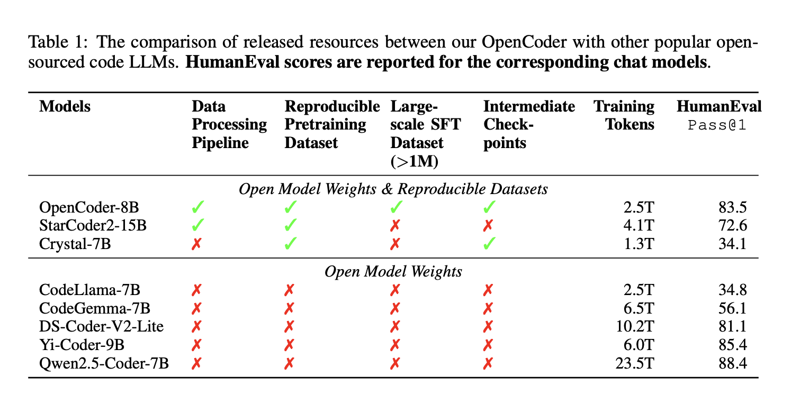

# Meet OpenCoder: A Completely Open-Source Code LLM Built on the Transparent Data Process Pipeline and Reproducible Dataset

> Large Language Models (LLMs) have revolutionized various domains, with a particularly transformative impact on software development through code-related tasks. The emergence of tools like ChatGPT, Copilot, and Cursor has fundamentally changed how developers work, showcasing the potential of code-specific LLMs. However, a significant challenge persists in developing open-source code LLMs, as their performance consistently lags […]

Large Language Models (LLMs) have revolutionized various domains, with a particularly transformative impact on software development through code-related tasks. The emergence of tools like ChatGPT, Copilot, and Cursor has fundamentally changed how developers work, showcasing the potential of code-specific LLMs. However, a significant challenge persists in developing open-source code LLMs, as their performance consistently lags behind state-of-the-art models. This performance gap primarily stems from the proprietary training datasets used by leading LLM providers, who maintain strict control over these crucial resources. The lack of access to high-quality training data creates a substantial barrier for the broader research community, hindering their ability to establish robust baselines and develop a deeper understanding of how top-performing code LLMs function.

Previous research efforts in code language modeling have taken various approaches to advance AI applications in software engineering. Proprietary models have demonstrated impressive performance improvements across multiple code-related benchmarks, but their closed nature significantly restricts further innovation. The research community has responded by developing open-source alternatives such as CodeGen, StarCoder, CodeLlama, and DeepSeekCoder, which have helped foster continued advancement in the field. These models have been evaluated across diverse benchmarks, including code retrieval, translation, efficiency assessment, and repository-level code completion tasks. Recently, there has been a significant push towards open-source LLMs, with projects like LLaMA, Mistral, Qwen, and ChatGLM releasing not only model checkpoints but also comprehensive training datasets. Particularly noteworthy are fully open initiatives such as OLMo and StarCoderV2, which provide extensive documentation of their training processes, data pipelines, and intermediate checkpoints, promoting transparency and reproducibility in the field.

Researchers from INF and M-A-P present **_OpenCoder,_** a robust initiative designed to address the transparency gap in code-specific language models through three primary objectives. The project aims to provide researchers with a fully transparent baseline code LLM for studying mechanical interpretability and data distribution patterns, conduct comprehensive investigations into pretrain and instruction data curation methodologies, and enable customized solutions through detailed model development insights. The research reveals crucial design choices in data curation across different training stages, emphasizing the importance of thorough data cleaning, effective deduplication strategies at the file level, and careful consideration of GitHub star metrics. A significant finding indicates that high-quality data becomes increasingly crucial during the annealing phase, while a two-stage instruction tuning approach proves particularly effective for developing broad capabilities followed by code-specific refinements. This comprehensive approach positions OpenCoder as a completely open-source Code LLM, built on transparent processes and reproducible datasets, aimed at advancing the field of code intelligence studies.

### Pre-Training Data 

OpenCoder begins with a sophisticated data processing pipeline centered on RefineCode, a high-quality, reproducible dataset comprising 960 billion tokens across 607 programming languages. The data preparation process follows a meticulous five-step approach to ensure optimal quality and diversity. The preprocessing phase initially excludes files larger than 8MB and restricts selection to specific programming language file extensions. The deduplication process employs both exact and fuzzy methods, utilizing SHA256 hash values and LSH techniques to eliminate duplicate content while preserving files with higher star counts and recent commit times. The transformation phase addresses pervasive issues through copyright notice removal and Personally Identifiable Information (PII) reduction. The filtering stage implements three distinct categories of rules: natural language filtering, general code filtering, and language-specific filtering for eight major programming languages. Finally, the data sampling phase maintains distribution balance by downsampling over-represented languages like Java and HTML, ultimately producing approximately 730 billion tokens for pretraining. Comparative analysis using PCA visualization demonstrates that RefineCode achieves a more concentrated embedding distribution compared to previous datasets, indicating higher quality and consistency.

### Pre-Training

The OpenCoder architecture encompasses two model variants: a 1.5 billion parameter model and an 8 billion parameter model. The 1.5B version features 24 layers with 2240 hidden dimensions and 14 attention heads, while the 8B version follows the Llama-3.1-8B architecture with 32 layers, 4096 hidden dimensions, and 8 attention heads. Both models utilize the SwiGLU activation function and employ a vocabulary size of 96,640. The training process follows a sophisticated pipeline across multiple phases. During pretraining, both models are trained on a massive multilingual dataset including Chinese, English, and 607 programming languages. The 1.5B model processes 2 trillion tokens over four epochs, followed by annealing training on 100 billion additional tokens. The 8B model undergoes training on 2.5 trillion tokens for 3.5 epochs, with a subsequent decay phase using 100 billion tokens. Both models employ the WSD learning schedule with carefully tuned hyperparameters. Training is conducted on large GPU clusters, with the 1.5B model requiring 28,034 GPU hours on H800s and the 8B model consuming 96,000 GPU hours on H100s.

### Post Training

The post-training phase of OpenCoder involves an extensive and sophisticated approach to instruction tuning, by using multiple data sources and synthesis methods. The process begins with collecting open-source instruction corpora from various sources like Evol-Instruct, Infinity-Instruct, and McEval, with careful language sampling and LLM-based filtering to extract code-relevant content. Real user queries from WildChat and Code-290k-ShareGpt are incorporated after thorough cleaning and quality enhancement through LLM regeneration. The architecture implements three specialized instruction synthesis approaches: _Educational Instruction Synthesis_ employs a scorer model to identify high-quality seed data and generates test cases for validation; Package-related Instruction Synthesis addresses the challenge of outdated package usage by incorporating current documentation from popular Python libraries; and Large-scale Diverse Instruction Synthesis utilizes a comprehensive framework that includes context cleaning, task specification, prompt engineering, and response refinement. Each component is designed to ensure the final instruction dataset is diverse, practical, and aligned with current programming practices.

OpenCoder employs a strategic two-stage instruction-tuning process to develop comprehensive capabilities in both theoretical computer science and practical coding tasks. The first stage focuses on theoretical knowledge, utilizing a combination of RealUser-Instruct (0.7M examples), Large-scale Diverse-Instruct (2.3M examples), and Filtered Infinity-Instruct (1.0M examples) to build a strong foundation in computer science concepts like algorithms, data structures, and networking principles. The second stage transitions to practical coding proficiency, incorporating McEval-Instruct (36K examples), Evol-Instruct (111K examples), Educational-Instruct (110K examples), and Package-Instruct (110K examples). This stage emphasizes exposure to high-quality GitHub code samples, ensuring the model can generate syntactically and semantically correct code while maintaining proper formatting and structure. This dual-phase approach enables OpenCoder to balance theoretical understanding with practical coding capabilities, creating a more versatile and effective code generation system.

The evaluation of OpenCoder demonstrates its exceptional performance across multiple benchmarks, assessing both base models and instruction-tuned versions. The base models were primarily evaluated on code completion capabilities through established benchmarks like HumanEval, MBPP (including their enhanced versions HumanEval+ and MBPP+), and BigCodeBench. These assessments measured the model’s proficiency in understanding and applying Python data structures, and algorithms, and handling complex library interactions.

The instruction-tuned models underwent more comprehensive testing across five major benchmarks. LiveCodeBench evaluated the model’s ability to solve complex algorithmic problems from platforms like _LeetCode_ and _CodeForces_. MultiPL-E assessed code generation capabilities across multiple programming languages including_ C++, Java, PHP, and TypeScript_. McEval thoroughly evaluated 40 programming languages with approximately 2,000 samples, where OpenCoder-8B-Instruct demonstrated superior multilingual performance compared to similar-sized open-source models. Similarly, MdEval tested the model’s debugging capabilities across 18 languages with 1.2K samples, showcasing OpenCoder’s effective bug identification and fixing abilities.

The results consistently indicate that OpenCoder achieves state-of-the-art performance among open-source models, particularly excelling in multilingual code generation and debugging tasks. These comprehensive evaluations validate the effectiveness of OpenCoder’s two-stage instruction-tuning approach and its sophisticated architecture.

_OpenCoder_ represents a significant advancement in open-source code language models, achieving performance comparable to proprietary solutions while maintaining complete transparency. Through the release of its comprehensive training materials, including data pipelines, datasets, and detailed protocols, OpenCoder sets a new standard for reproducible research in code AI. The extensive ablation studies conducted across various training phases provide valuable insights for future development, making OpenCoder not just a powerful tool but a foundation for advancing the field of code intelligence.

---

Check out the **[Paper](https://arxiv.org/abs/2411.04905), [Project](https://opencoder-llm.github.io/), [GitHub Page](https://github.com/OpenCoder-llm/OpenCoder-llm), and [Models on Hugging Face](https://huggingface.co/collections/infly/opencoder-672cec44bbb86c39910fb55e)**. All credit for this research goes to the researchers of this project. Also, don’t forget to follow us on **[Twitter](https://twitter.com/Marktechpost)** and join our **[Telegram Channel](https://pxl.to/at72b5j)** and [**LinkedIn Gr**](https://www.linkedin.com/groups/13668564/)[**oup**](https://www.linkedin.com/groups/13668564/). **If you like our work, you will love our**[** newsletter..**](https://marktechpost-newsletter.beehiiv.com/subscribe) Don’t Forget to join our **[55k+ ML SubReddit](https://www.reddit.com/r/machinelearningnews/)**.

**[[FREE AI WEBINAR](https://landing.deepset.ai/webinar-implementing-idp-with-genai-in-financial-services?utm_campaign=2411%20-%20webinar%20-%20credX%20-%20IDP%20with%20GenAI%20in%20Financial%20Services&utm_source=marktechpost&utm_medium=newsletter)] ****[Implementing Intelligent Document Processing with GenAI in Financial Services and Real Estate Transactions](https://landing.deepset.ai/webinar-implementing-idp-with-genai-in-financial-services?utm_campaign=2411%20-%20webinar%20-%20credX%20-%20IDP%20with%20GenAI%20in%20Financial%20Services&utm_source=marktechpost&utm_medium=newsletter)**
