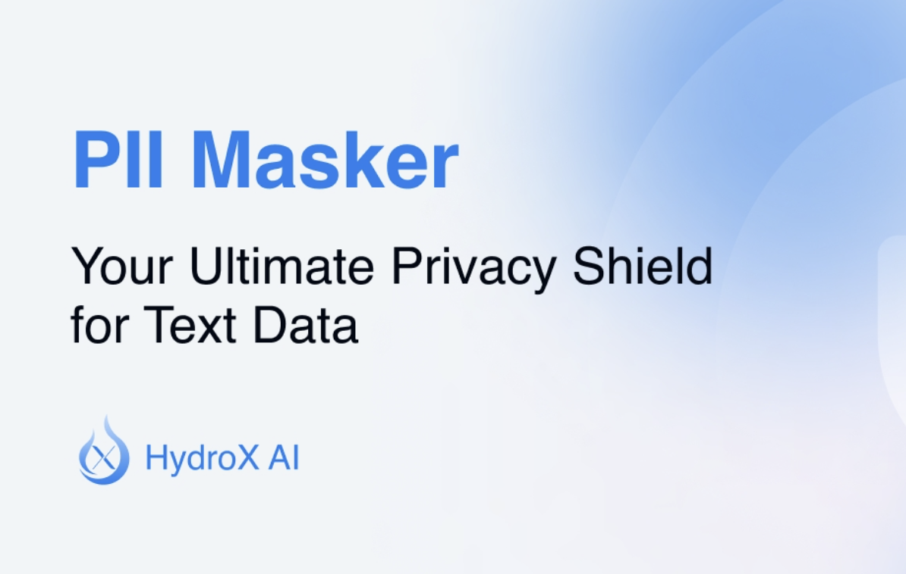

# Meet PII Masker: An Open-Source Tool for Protecting Sensitive Data by Automatically Detecting and Masking PII Using Advanced AI Powered by DeBERTa-v3

> In a data-driven world, privacy and security have become pressing concerns for individuals and organizations alike. With data breaches and information misuse becoming alarmingly frequent, safeguarding sensitive information is critical. Among the most challenging aspects of data protection is managing Personally Identifiable Information (PII), such as names, addresses, and social security numbers, which are highly […]

In a data-driven world, privacy and security have become pressing concerns for individuals and organizations alike. With data breaches and information misuse becoming alarmingly frequent, safeguarding sensitive information is critical. Among the most challenging aspects of data protection is managing Personally Identifiable Information (PII), such as names, addresses, and social security numbers, which are highly vulnerable to exposure. Inadequate handling of PII can lead to severe financial, reputational, and legal consequences. Organizations need advanced tools to ensure that sensitive data remains confidential while still being able to leverage it for analysis and development. This is where PII Masker comes in, offering a much-needed solution for PII protection.

**[PII Masker](https://github.com/HydroXai/pii-masker-v1?tab=readme-ov-file)** is an advanced open-source tool designed to protect sensitive data by leveraging state-of-the-art artificial intelligence (AI) models. Developed by HydroXai, PII Masker is available on GitHub and aims to streamline the process of identifying and masking PII within data sets. With the increasing need for privacy compliance, including regulations such as GDPR and CCPA, PII Masker provides a powerful means of automating the detection and anonymization of PII. Instead of relying on manual efforts, which are time-consuming and prone to errors, PII Masker allows organizations to safeguard sensitive data with greater accuracy and efficiency.

PII Masker utilizes cutting-edge AI models, particularly Natural Language Processing (NLP), to accurately detect and classify sensitive information. The tool employs transformer-based architectures, such as BERT (Bidirectional Encoder Representations from Transformers), to deeply understand the context in which sensitive information appears. This allows it to distinguish between similarly structured data points, such as distinguishing an address from a sequence of random numbers. One of the major benefits of using PII Masker is its modular architecture—it can be customized to suit different requirements and data environments, making it versatile for a variety of use cases. PII Masker’s AI-driven model ensures not only high precision in identifying PII but also minimizes false positives, which are often an issue in traditional masking techniques.

The importance of PII Masker cannot be overstated, especially in the era of stringent data privacy laws and regulations. Many organizations struggle to balance the need to utilize data with the necessity of safeguarding privacy. PII Masker addresses this challenge by providing a reliable way to anonymize sensitive information while retaining the integrity of the data for analysis purposes. HydroXai has released data showcasing PII Masker’s performance, with results indicating a significant reduction in false positives compared to other PII detection tools.

In conclusion, PII Masker represents a significant advancement in data privacy technology, offering organizations an effective way to address the ever-growing challenges of PII management. By integrating AI and NLP, PII Masker not only automates the detection and anonymization of sensitive data but also improves accuracy and scalability compared to traditional methods. As an open-source tool, PII Masker is accessible for a wide range of users, encouraging collaboration and continued improvement. For organizations aiming to comply with data privacy regulations and ensure the protection of sensitive information, PII Masker is a valuable tool that enhances data security while preserving usability.

---

Check out the** [GitHub Page](https://github.com/HydroXai/pii-masker-v1?tab=readme-ov-file)**. All credit for this research goes to the researchers of this project. Also, don’t forget to follow us on **[Twitter](https://twitter.com/Marktechpost)** and join our **[Telegram Channel](https://pxl.to/at72b5j)** and [**LinkedIn Gr**](https://www.linkedin.com/groups/13668564/)[**oup**](https://www.linkedin.com/groups/13668564/). **If you like our work, you will love our**[** newsletter..**](https://marktechpost-newsletter.beehiiv.com/subscribe) Don’t Forget to join our **[55k+ ML SubReddit](https://www.reddit.com/r/machinelearningnews/)**.

**[[Trending](https://www.marktechpost.com/2024/10/28/llmware-introduces-model-depot-an-extensive-collection-of-small-language-models-slms-for-intel-pcs/)] ****[LLMWare Introduces Model Depot: An Extensive Collection of Small Language Models (SLMs) for Intel PCs](https://www.marktechpost.com/2024/10/28/llmware-introduces-model-depot-an-extensive-collection-of-small-language-models-slms-for-intel-pcs/)**
