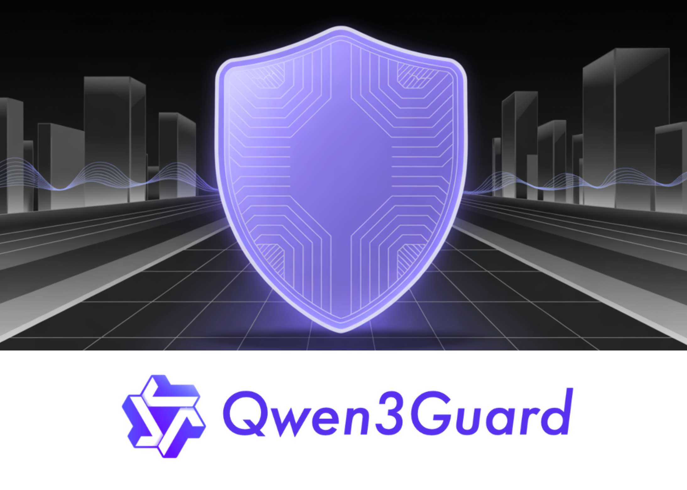

# Meet Qwen3Guard: The Qwen3-based Multilingual Safety Guardrail Models Built for Global, Real-Time AI Safety

> Can safety keep up with real-time LLMs? Alibaba’s Qwen team thinks so, and it just shipped Qwen3Guard—a multilingual guardrail model family built to moderate prompts and streaming responses in-real-time. Qwen3Guard comes in two variants: Qwen3Guard-Gen (a generative classifier that reads full prompt/response context) and Qwen3Guard-Stream (a token-level classifier that moderates as text is generated). Both […]

**Can safety keep up with real-time LLMs?** Alibaba’s Qwen team thinks so, and it just shipped Qwen3Guard—a multilingual guardrail model family built to moderate prompts and streaming responses in-real-time.

Qwen3Guard comes in two variants: **Qwen3Guard-Gen** (a generative classifier that reads full prompt/response context) and **Qwen3Guard-Stream** (a token-level classifier that moderates as text is generated). Both are released in **0.6B, 4B, and 8B** parameter sizes and target global deployments with coverage for **119 languages and dialects**. The models are open-sourced, with weights on Hugging Face and GitHub Repo.

*https://github.com/QwenLM/Qwen3Guard*

### What’s new?

- **Streaming moderation head:** Stream attaches **two lightweight classification heads** to the final transformer layer—one monitors the user prompt, the other scores each generated token in real time as _Safe / Controversial / Unsafe_. This enables policy enforcement while a reply is being produced, instead of post-hoc filtering.

- **Three-tier risk semantics:** Beyond binary safe/unsafe labels, a **Controversial** tier supports adjustable strictness (binary tightening/loosening) across datasets and policies—useful when “borderline” content must be routed or escalated, not simply dropped.

- **Structured outputs for Gen:** The generative variant emits a standard header—`Safety: ...`, `Categories: ...`, `Refusal: ...`—that’s trivial to parse for pipelines and RL reward functions. Categories include **Violent, Non-violent Illegal Acts, Sexual Content, PII, Suicide & Self-Harm, Unethical Acts, Politically Sensitive Topics, Copyright Violation, Jailbreak**.

### Benchmarks and safety RL

The Qwen research team shows **state-of-the-art average F1** across English, Chinese, and multilingual safety benchmarks for both prompt and response classification, with data plotted for Qwen3Guard-Gen versus prior open models. While the research team emphasizes relative gains rather than a single composite metric, the consistent lead across settings is the key point.

For training downstream assistants, the research team test safety-driven RL using Qwen3Guard-Gen as a reward signal. A **Guard-only** reward maximizes safety but spikes refusals and slightly dents arena-hard-v2 win rate; a **Hybrid** reward (penalizing over-refusals, blending quality signals) lifts the WildGuard-measured safety score from **~60 to >97** without degrading reasoning tasks, and even nudges arena-hard-v2 upward. This is a practical recipe for teams that saw prior reward shaping collapse into “refuse-everything” behavior.

*https://github.com/QwenLM/Qwen3Guard*

### Where it fits?

Most open guard models only classify completed outputs. Qwen3Guard’s **dual heads + token-time scoring** align with production agents that stream responses, enabling **early intervention** (block, redact, or redirect) with lower latency cost than re-decoding. The **Controversial** tier also maps cleanly onto enterprise policy knobs (e.g., treat “Controversial” as unsafe in regulated contexts, but allow with review in consumer chat).

### Summary

Qwen3Guard is a practical guardrail stack: open-weights (0.6B/4B/8B), two operating modes (full-context Gen, token-time Stream), tri-level risk labeling, and multilingual coverage (119 languages). For production teams, this is a credible baseline to replace post-hoc filters with real-time moderation and to align assistants with safety rewards while monitoring refusal rates.

---

Check out the **[Paper](https://github.com/QwenLM/Qwen3Guard/blob/main/Qwen3Guard_Technical_Report.pdf)**, **[GitHub Page](https://github.com/QwenLM/Qwen3Guard)** and **[Full Collection on HF](https://huggingface.co/collections/Qwen/qwen3guard-68d2729abbfae4716f3343a1)**. Feel free to check out our **[GitHub Page for Tutorials, Codes and Notebooks](https://github.com/Marktechpost/AI-Tutorial-Codes-Included)**. Also, feel free to follow us on **[Twitter](https://x.com/intent/follow?screen_name=marktechpost)** and don’t forget to join our **[100k+ ML SubReddit](https://www.reddit.com/r/machinelearningnews/)** and Subscribe to **[our Newsletter](https://www.aidevsignals.com/)**.
