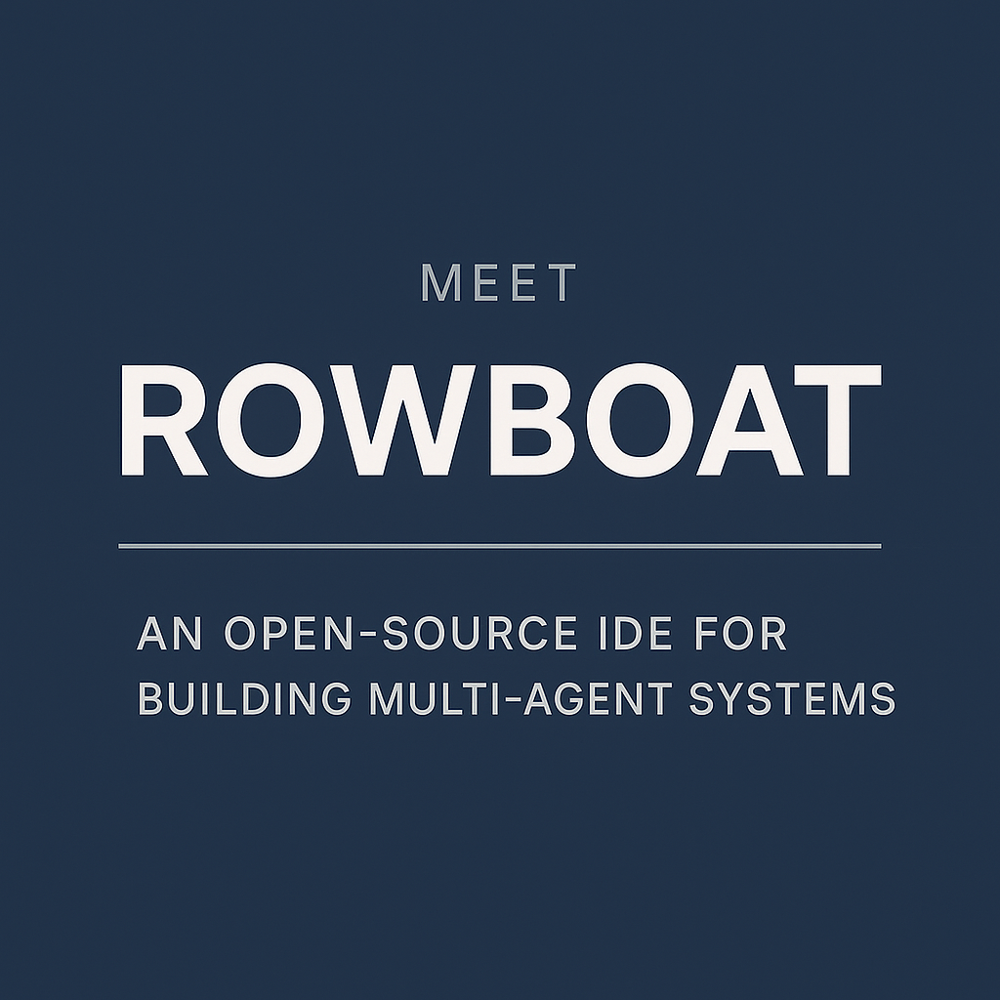

# Meet Rowboat: An Open-Source IDE for Building Complex Multi-Agent Systems

> As multi-agent systems gain traction in real-world applications—from customer support automation to AI-native infrastructure—the need for a streamlined development interface has never been greater. Meet Rowboat, an open-source IDE designed to accelerate the construction, debugging, and deployment of multi-agent AI workflows. It’s powered by OpenAI Agents SDK, connects MCP servers, and can integrate into your […]

As multi-agent systems gain traction in real-world applications—from customer support automation to AI-native infrastructure—the need for a streamlined development interface has never been greater. Meet **Rowboat**, an open-source IDE designed to accelerate the construction, debugging, and deployment of multi-agent AI workflows. It’s powered by OpenAI Agents SDK, connects MCP servers, and can integrate into your apps using HTTP or the SDK. Backed by Y Combinator and tightly integrated with OpenAI’s Agents SDK, Rowboat offers a unique combination of visual development, tool modularity, and real-time testing—making it a compelling platform for engineering agentic AI systems at scale.

## Rethinking Multi-Agent Development

Developing multi-agent systems typically requires orchestrating interactions between multiple specialized agents, each responsible for a distinct task or capability. This often involves stitching together prompts, toolchains, and APIs—an effort that is not only tedious but error-prone. Rowboat abstracts away much of this complexity by introducing a visual, AI-assisted development environment that allows teams to define agent behavior using natural language, integrate modular toolsets, and evaluate systems through interactive testing.

The IDE is built with developers and applied AI teams in mind, especially those working on domain-specific use cases in customer experience (CX), enterprise automation, and backend infrastructure.

## Key Features and Architecture

### 1. Copilot: Natural Language-Based Agent Design

At the heart of Rowboat lies its AI-powered Copilot—a system that transforms natural language specifications into runnable multi-agent workflows. For example, users can describe, “Build an assistant for a telecom company to handle data plan upgrades and billing inquiries,” and the Copilot scaffolds the entire system accordingly. This dramatically reduces the ramp-up time for teams new to multi-agent architectures.

### 2. Tool Integration via MCP Compatibility

Rowboat supports Modular Command Protocol (MCP) servers, enabling seamless tool injection into agents. Developers can import tools defined in an external MCP server, assign them to individual agents within Rowboat, and trigger tool invocations through agent reasoning steps. This modular design ensures clear separation of responsibilities, enabling scalable and maintainable agent workflows.

### 3. Interactive Testing in the Playground

The built-in **Playground** offers a live testing environment where users can interact with their agents, observe system behavior, and debug tool calls. It supports step-by-step inspection of conversation history, function execution, and context propagation—critical capabilities when validating agent coordination or investigating unexpected behaviors.

### 4. Flexible Deployment via HTTP API and Python SDK

Rowboat isn’t just a visual IDE—it ships with an HTTP API and a Python SDK, giving teams the flexibility to embed Rowboat agents into broader infrastructure. Whether you’re running agents in a cloud-native microservice or embedding them in internal developer tools, the SDK provides both stateless and session-aware configurations.

## Practical Use Cases

Rowboat is well-suited for teams building production-grade assistant systems. Some real-world applications include:

- **Financial Services**: Automate credit card support, loan updates, and payment reminders using a team of domain-specific agents.

- **Insurance**: Assist users with claims processing, policy inquiries, and premium calculations.

- **Travel & Hospitality**: Handle flight updates, hotel bookings, itinerary changes, and multilingual support.

- **Telecom**: Support billing resolution, plan changes, SIM management, and device troubleshooting.

These scenarios benefit from decomposing tasks into specialized agents with focused tool access—exactly the design pattern that Rowboat enables.

## Conclusion

Rowboat fills an important gap in the AI development ecosystem: a purpose-built environment for prototyping and managing multi-agent systems. Its intuitive design, natural language integration, and modular architecture make it more than just an IDE—it’s a full development suite for agentic systems. Whether you’re building a customer service assistant, a backend orchestration tool, or a custom LLM agent pipeline, Rowboat provides the foundation.

---

Check out the **[GitHub Page](https://github.com/rowboatlabs/rowboat?tab=readme-ov-file)**. Also, don’t forget to follow us on **[Twitter](https://x.com/intent/follow?screen_name=marktechpost)** and join our **[Telegram Channel](https://arxiv.org/abs/2406.09406)** and [**LinkedIn Gr**](https://www.linkedin.com/groups/13668564/)[**oup**](https://www.linkedin.com/groups/13668564/). Don’t Forget to join our **[90k+ ML SubReddit](https://www.reddit.com/r/machinelearningnews/)**.

[**🔥 [Register Now] miniCON Virtual Conference on AGENTIC AI: FREE REGISTRATION + Certificate of Attendance + 4 Hour Short Event (May 21, 9 am- 1 pm PST) + Hands on Workshop**](https://minicon.marktechpost.com/)
