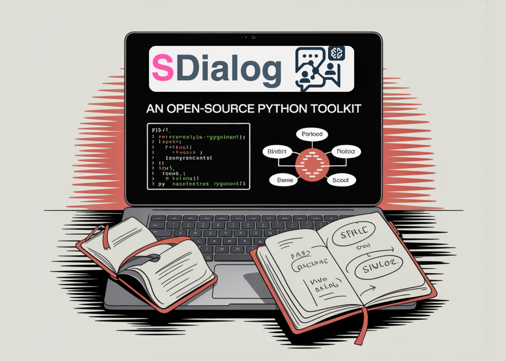

# Meet SDialog: An Open-Source Python Toolkit for Building, Simulating, and Evaluating LLM-based Conversational Agents End-to-End

> How can developers reliably generate, control, and inspect large volumes of realistic dialogue data without building a custom simulation stack every time? Meet SDialog, an open sourced Python toolkit for synthetic dialogue generation, evaluation, and interpretability that targets the full conversational pipeline from agent definition to analysis. It standardizes how a Dialog is represented and […]

How can developers reliably generate, control, and inspect large volumes of realistic dialogue data without building a custom simulation stack every time? Meet **[SDialog](https://github.com/idiap/sdialog?tab=readme-ov-file)**, an open sourced Python toolkit for synthetic dialogue generation, evaluation, and interpretability that targets the full conversational pipeline from agent definition to analysis. It standardizes how a `Dialog` is represented and gives engineers a single workflow to build, simulate, and inspect LLM based conversational agents.

At the core of SDialog is a standard `Dialog` schema with JSON import and export. On top of this schema, the library exposes abstractions for personas, agents, orchestrators, generators, and datasets. With a few lines of code, a developer configures an LLM backend through `sdialog.config.llm`, defines personas, instantiates `Agent` objects, and calls a generator such as `DialogGenerator` or `PersonaDialogGenerator` to synthesize complete conversations that are ready for training or evaluation.

Persona driven multi agent simulation is a first class feature. Personas encode stable traits, goals, and speaking styles. For example, a medical doctor and a patient can be defined as structured personas, then passed to `PersonaDialogGenerator` to create consultations that follow the defined roles and constraints. This setup is used not only for task oriented dialogs but also for scenario driven simulations where the toolkit manages flows and events across many turns.

SDialog becomes especially interesting at the orchestration layer. Orchestrators are composable components that sit between agents and the underlying LLM. A simple pattern is `agent = agent | orchestrator`, which turns orchestration into a pipeline. Classes such as `SimpleReflexOrchestrator` can inspect each turn and inject policies, enforce constraints, or trigger tools based on the full dialogue state, not just the latest message. More advanced recipes combine persistent instructions with LLM judges that monitor safety, topic drift, or compliance, then adjust future turns accordingly.

The toolkit also includes a rich evaluation stack. The `sdialog.evaluation` module provides metrics and LLM as judge components like `LLMJudgeRealDialog`, `LinguisticFeatureScore`, `FrequencyEvaluator`, and `MeanEvaluator`. These evaluators can be plugged into a `DatasetComparator` that takes reference and candidate dialog sets, runs metric computation, aggregates scores, and produces tables or plots. This allows teams to compare different prompts, backends, or orchestration strategies with consistent quantitative criteria instead of manual inspection only.

A distinctive pillar of SDialog is mechanistic interpretability and steering. The `Inspector` in `sdialog.interpretability` registers PyTorch forward hooks on specified internal modules, for example `model.layers.15.post_attention_layernorm`, and records per token activations during generation. After running a conversation, engineers can index this buffer, view activation shapes, and search for system instructions with methods such as `find_instructs`. The `DirectionSteerer` then turns these directions into control signals, so a model can be nudged away from behaviors like anger or pushed toward a desired style by modifying activations during specific tokens.

SDialog is designed to play well with the surrounding ecosystem. It supports multiple LLM backends including OpenAI, Hugging Face, Ollama, and AWS Bedrock through a unified configuration interface. Dialogs can be loaded from or exported to Hugging Face datasets using helpers such as `Dialog.from_huggingface`. The `sdialog.server` module exposes agents through an OpenAI compatible REST API using `Server.serve`, which lets tools like Open WebUI connect to SDialog controlled agents without custom protocol work.

Finally, the same `Dialog` objects can be rendered as audio conversations. The `sdialog.audio` utilities provide a `to_audio` pipeline that turns each turn into speech, manages pauses, and can simulate room acoustics. The result is a single representation that can drive text based analysis, model training, and audio based testing for speech systems. Taken together, SDialog offers a modular, extensible framework for persona driven simulation, precise orchestration, quantitative evaluation, and mechanistic interpretability, all centered on a consistent `Dialog` schema.

---

Check out the **[Repo](https://github.com/idiap/sdialog?tab=readme-ov-file) **and**[ Docs](https://sdialog.readthedocs.io/en/latest/)**. Feel free to check out our **[GitHub Page for Tutorials, Codes and Notebooks](https://github.com/Marktechpost/AI-Tutorial-Codes-Included)**. Also, feel free to follow us on **[Twitter](https://x.com/intent/follow?screen_name=marktechpost)** and don’t forget to join our **[100k+ ML SubReddit](https://www.reddit.com/r/machinelearningnews/)** and Subscribe to **[our Newsletter](https://www.aidevsignals.com/)**. Wait! are you on telegram? **[now you can join us on telegram as well.](https://t.me/machinelearningresearchnews)**
