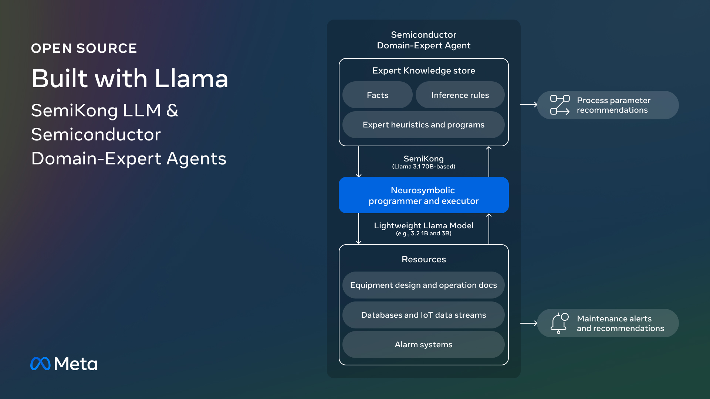

# Meet SemiKong: The World’s First Open-Source Semiconductor-Focused LLM

> The semiconductor industry enables advancements in consumer electronics, automotive systems, and cutting-edge computing technologies. The production of semiconductors involves sophisticated processes that demand unparalleled precision and expertise. These processes include chip design, manufacturing, testing, and optimization, each stage requiring deep domain knowledge. The field has traditionally depended on seasoned engineers whose experience has been built […]

The semiconductor industry enables advancements in consumer electronics, automotive systems, and cutting-edge computing technologies. The production of semiconductors involves sophisticated processes that demand unparalleled precision and expertise. These processes include chip design, manufacturing, testing, and optimization, each stage requiring deep domain knowledge. The field has traditionally depended on seasoned engineers whose experience has been built over decades. However, **_the industry faces a significant challenge: the rapid retirement of veteran experts, creating a knowledge gap that threatens innovation and efficiency._** This growing concern has prompted companies to explore AI as a viable solution for capturing, scaling, and leveraging expert knowledge.**_ Also, the cost and time associated with chip design and manufacturing must be minimized to meet market demands. _**These challenges highlight the limitations of traditional methods and emphasize the necessity of tailored AI solutions.

Existing approaches to these challenges include generalized AI models and basic automation tools. While these methods have been beneficial in analyzing data and improving decision-making, they often fall short in addressing the unique complexities of the semiconductor industry. General-purpose AI tools, for instance, lack the domain-specific understanding required to analyze intricate manufacturing processes effectively. As a result, **_companies cannot fully bridge the gap between theoretical AI capabilities and practical industry needs, leaving room for specialized solutions to transform the field._**

[**_Researchers from Meta, AITOMATIC, and other collaborators under the Foundation Models workgroup of the AI Alliance have introduced SemiKong. SemiKong represents the world’s first semiconductor-focused large language model (LLM), designed using the Llama 3.1 platform. _**](https://www.semikong.ai/)This model was fine-tuned with extensive semiconductor-specific datasets, including industry documents, research papers, and anonymized operational data. Unlike generic AI systems, SemiKong is tailored to understand semiconductor processes’ unique terminology and requirements. By integrating this model with the AITOMATIC Domain-Expert Agents (DXAs), companies can effectively leverage AI tools to address specific industry challenges. These innovations aim to reduce costs, accelerate development timelines, and promote collaboration across the semiconductor sector.

The technology behind SemiKong is built on advanced AI and neurosymbolic architectures. **_AITOMATIC’s DXAs operate through a structured three-phase lifecycle: _**

- **_Capturing domain expertise_**

- **_Training the model with synthetic and structured data_**

- **_Applying the resulting system in real-world scenarios _**

SemiKong plays a central role in this ecosystem, acting as the “brain” for complex reasoning and decision-making tasks. Lightweight model versions, such as Llama 3.2, complement the main system by enabling faster data access and analysis in resource-constrained environments. These models integrate seamlessly with manufacturing systems and IoT platforms, allowing companies to optimize workflows, predict maintenance needs, and improve decision-making.

SemiKong has outperformed several closed-source language models in generating semiconductor-specific content and understanding complex processes. **_This has led to tangible benefits, including a 20-30% reduction in time to market for new chip designs and a 15-25% improvement in first-time-right manufacturing outcomes. These tools have also improved the onboarding process for new engineers, accelerating their learning curve by 40-50%. _**In one example, SemiKong-enabled DXAs reduced the time required for etching recipe formulation, which typically takes hours to minutes.

The key takeaways from the research underscore the significance of SemiKong and DXAs in the semiconductor field:

- **_DXAs effectively capture and structure the knowledge of veteran engineers, ensuring that critical expertise is preserved and scaled for future use.  _**

- **_SemiKong reduces chip design time-to-market by up to 30%, significantly cutting costs and improving operational efficiency.  _**

- By simplifying and expediting the onboarding process, DXAs help new engineers become productive faster, reducing the industry’s reliance on seasoned experts.

- Integrating IoT platforms enables real-time parameter calibration and predictive maintenance, enhancing equipment performance and reliability.

In conclusion, **_the research highlights a pioneering solution to one of the semiconductor industry’s most pressing challenges: the loss of critical domain expertise. _**By introducing SemiKong and DXAs, the researchers have provided a comprehensive framework that preserves knowledge and enhances productivity and innovation. These advancements can potentially reshape semiconductor manufacturing, offering scalable, cost-effective solutions to address the field’s complexities. Integrating AI tools like SemiKong is crucial for a more efficient and resilient semiconductor industry.

---

Check out **the _[Details ](https://ai.meta.com/blog/aitomatic-built-with-llama/)and [GitHub Page](https://github.com/aitomatic/semikong?tab=readme-ov-file)_**. All credit for this research goes to the researchers of this project. Also, don’t forget to follow us on **[Twitter](https://twitter.com/Marktechpost)** and join our **[Telegram Channel](https://github.com/XGenerationLab/XiYan-SQL)** and [**LinkedIn Gr**](https://www.linkedin.com/groups/13668564/)[**oup**](https://www.linkedin.com/groups/13668564/). Don’t Forget to join our **[60k+ ML SubReddit](https://www.reddit.com/r/machinelearningnews/)**.

**[🚨 Trending: LG AI Research Releases EXAONE 3.5: Three Open-Source Bilingual Frontier AI-level Models Delivering Unmatched Instruction Following and Long Context Understanding for Global Leadership in Generative AI Excellence….](https://www.marktechpost.com/2024/12/11/lg-ai-research-releases-exaone-3-5-three-open-source-bilingual-frontier-ai-level-models-delivering-unmatched-instruction-following-and-long-context-understanding-for-global-leadership-in-generative-a/)**
