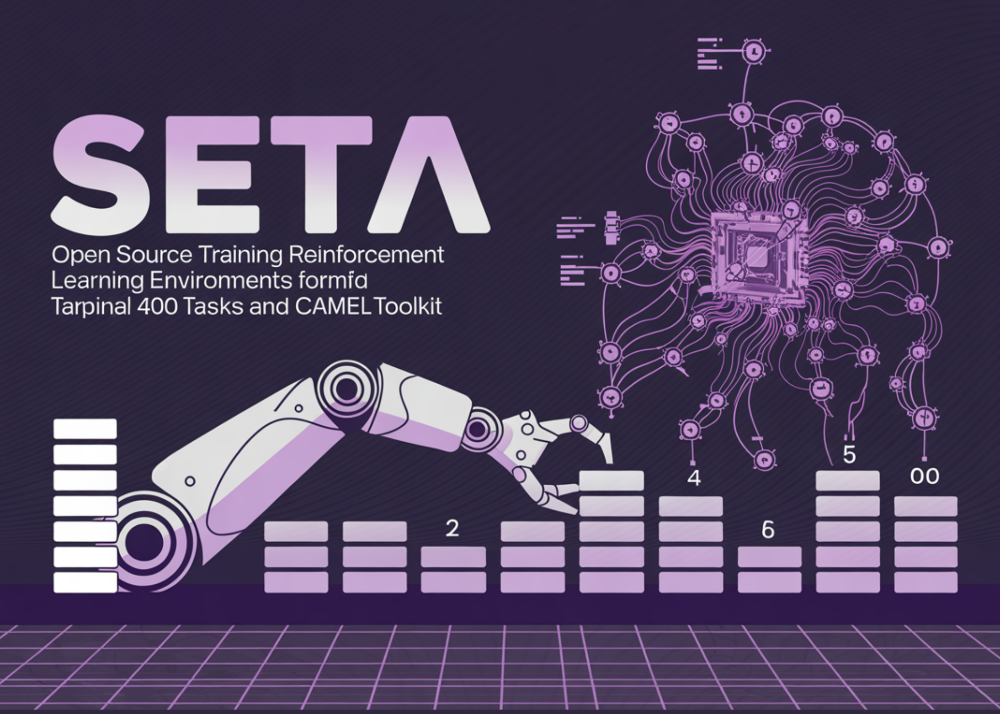

# Meet SETA: Open Source Training Reinforcement Learning Environments for Terminal Agents with 400 Tasks and CAMEL Toolkit

> What does an end to end stack for terminal agents look like when you combine structured toolkits, synthetic RL environments, and benchmark aligned evaluation? A team of researchers from CAMEL AI, Eigent AI and other collaborators have released SETA, a toolkit and environment stack that focuses on reinforcement learning for terminal agents. The project targets […]

What does an end to end stack for terminal agents look like when you combine structured toolkits, synthetic RL environments, and benchmark aligned evaluation? A team of researchers from CAMEL AI, Eigent AI and other collaborators have released **[SETA](https://github.com/camel-ai/seta-env)**, a toolkit and environment stack that focuses on reinforcement learning for terminal agents. The project targets agents that operate inside a Unix style shell and must complete verifiable tasks under a benchmark harness such as Terminal Bench.

### Three main contributions:

- A state of the art terminal agent on Terminal Bench: They achieve state of the art performance with a Claude Sonnet 4.5 based agent on Terminal Bench 2.0 and with a GPT 4.1 based agent on Terminal Bench 1.0. The comparison is restricted to agents that use the same base model.

- Scalable RL training with synthetic terminal environments: The research team release an initial synthetic dataset with 400 terminal tasks that cover a range of difficulty levels. Out of these, 260 tasks are used for RLVR finetuning of a Qwen3-8B model.

- A clean agent design that generalizes across training and evaluation frameworks: The same agent implementation is used for both local task runs and the official Terminal Bench evaluation harness.

### Terminal Toolkit and log structure

The SETA code repository showcases a Terminal Toolkit that turns a language model into an executable terminal agent. For each task run, the framework creates a structured log directory under `evaluation/terminal_bench_run`. The README page shows a concrete layout for a task called `play-zork`.

**Key files include:**

- `chatagent.log` which records the full history of agent messages and tool calls including test results.

- A `sessions` directory with `session_logs` that capture terminal interactions from the toolkit.

- Within `session_logs`, files such as `blocking_commands.log`, `session_run_zork_1_correct_path.log`, `session_zork-1.log`, and `session_zork_start.log` store command output for different sessions and modes.

- `tests.log` and `tests.log.strip` which record the test run output, with the latter removing terminal control characters.

This structure gives a concrete way to debug an agent. You can trace from high level chat decisions in `chatagent.log` down to individual shell commands in the session logs and confirm success or failure from the test logs.

For official Terminal Bench evaluation, the GitHub repository provides a separate entry point under `evaluation/terminal_bench_eval`. A developer moves into that directory and runs `run_eval.sh` for Terminal Bench 1.0 and `run_tb2.sh` for Terminal Bench 2.0.

Results are written into `evaluation/terminal_bench_eval/run/{run_id}/results.json`. Task specific session logs are placed under `evaluation/terminal_bench_eval/logs/camel_logs/{task_id}`. The agent class that binds the CAMEL agent to the benchmark is implemented in `tbench_camel_agent.py`.

### Note Taking Toolkit as persistent memory

The research team also introduces a Note Taking Toolkit described as persistent memory for long horizon tasks. They show example note taking tool calls where the agent writes and reads notes in a structured way while solving terminal tasks. The current public material focuses on the existence of this toolkit and the examples of use. It does not yet describe a full training objective for note usage.

The important point is that the agent has an explicit channel where it can externalize intermediate results and hints, separate from the raw terminal buffer.

### Understanding the performance

SETA’s agent harness achieves leading results on Terminal Bench. With Claude Sonnet-4.5 as the backbone, the CAMEL terminal agent reaches 46.5% accuracy on Terminal Bench 2.0 across 89 real world tasks, ranking first and outperforming the second system by 3 percentage points, with especially strong results in git workflows, DevOps automation, and code security tasks. On Terminal Bench 1.0, a GPT 4.1 based agent attains 35% accuracy, which is 4.7 percentage points above the next entry, again within the same model family. In comparison, a supervised Qwen3 8B baseline attains 3.4% on Terminal Bench 2.0, and the Qwen3 8B terminal agent trained with the SETA RL pipeline improves over this baseline on the curated synthetic environments.

### Key Takeaways

- SETA is a joint community project that provides both agent toolkits and synthetic RL environments specifically for terminal agents, aligned with the Terminal Bench evaluation format.

- The framework reports state of the art performance for CAMEL terminal agents on Terminal Bench 1.0 and 2.0 when using Claude Sonnet 4.5 and GPT 4.1 as the base models, evaluated against agents built on the same model families.

- The SETA RL dataset on Hugging Face contains 400 synthetic terminal tasks, each packaged as `task.yaml`, `Dockerfile`, and `run-tests.sh`, with 260 tasks used for RLVR finetuning of a Qwen3-8B based agent.

- The open source SETA codebase exposes a Terminal Toolkit with structured logging and a Note Taking Toolkit for long horizon memory, and integrates directly with Terminal Bench evaluation scripts and logging paths in the `seta` GitHub repository.

- The overall design demonstrates a clean path from synthetic RL environments to benchmark verified agents, giving developers a reproducible stack to train, debug, and evaluate terminal agents rather than relying on ad hoc tool calling examples.

---

Check out the **[Blog](https://eigent-ai.notion.site/SETA-Scaling-Environments-for-Terminal-Agents-2d2511c70ba280a9b7c0fe3e7f1b6ab8), [Technical details](https://x.com/CamelAIOrg/status/2009675880503599571), [GitHub Repo](https://github.com/camel-ai/seta-env)** and** [Weights](https://huggingface.co/datasets/camel-ai/seta-env)**. Also, feel free to follow us on **[Twitter](https://x.com/intent/follow?screen_name=marktechpost)** and don’t forget to join our **[100k+ ML SubReddit](https://www.reddit.com/r/machinelearningnews/)** and Subscribe to **[our Newsletter](https://www.aidevsignals.com/)**. Wait! are you on telegram? **[now you can join us on telegram as well.](https://t.me/machinelearningresearchnews)**

Check out our latest release of [**ai2025.dev**](https://ai2025.dev/), a 2025-focused analytics platform that turns model launches, benchmarks, and ecosystem activity into a structured dataset you can filter, compare, and export.
