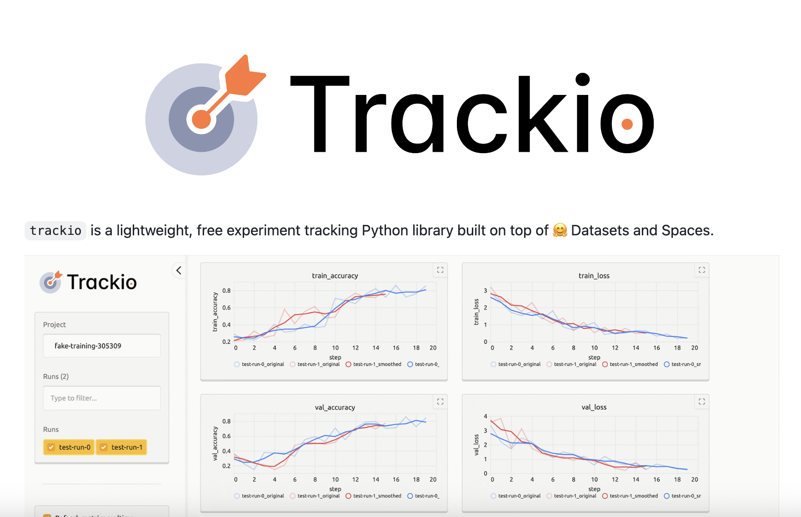

# Meet Trackio: The Free, Local-First, Open-Source Experiment Tracker Python Library that Simplifies and Enhances Machine Learning Workflows

> Experiment tracking is an essential part of modern machine learning workflows. Whether you’re tweaking hyperparameters, monitoring training metrics, or collaborating with colleagues, it’s crucial to have robust, flexible tools that make tracking experiments straightforward and insightful. However, many existing experiment tracking solutions require complex setup, come with licensing fees, or lock user data into proprietary […]

Experiment tracking is an essential part of modern machine learning workflows. Whether you’re tweaking hyperparameters, monitoring training metrics, or collaborating with colleagues, it’s crucial to have robust, flexible tools that make tracking experiments straightforward and insightful. However, many existing experiment tracking solutions require complex setup, come with licensing fees, or lock user data into proprietary formats, making them less accessible to individual researchers and smaller teams.

**Meet Trackio — a new open-source experiment tracking library developed by Hugging Face and Gradio. Trackio is a local-first, lightweight, and fully free tracker engineered for today’s rapid-paced research environments and open collaborations**.

### What Is Trackio?

Trackio is a Python package designed as a **drop-in replacement** for widely used libraries like wandb, with compatibility for foundational API calls (`wandb.init`, `wandb.log`, `wandb.finish`). This puts Trackio in a league where switching over or running legacy scripts requires little to no code changes—simply import Trackio as wandb and continue working as before.

### Key Features

- **Local-First Design:** By default, experiments run and persist locally, providing privacy and fast access. Sharing is optional, not the default.

- **Free and Open Source:** There are no paywalls and no feature limitations—everything, including collaboration and online dashboards, is available to everyone at no cost.

- **Lightweight and Extensible:** The entire codebase is under 1,000 lines of Python, ensuring it’s easy to audit, extend, or adapt.

- **Integrated with Hugging Face Ecosystem:** Out-of-the-box support with `Transformers`, `Sentence Transformers`, and `Accelerate`, lets users begin tracking metrics with minimal setup.

- **Data Portability:** Unlike some established tracking tools, Trackio makes all experiment data easily exportable and accessible, empowering custom analytics and seamless integration into research pipelines.

### Seamless Experiment Tracking: Local or Shared

One standout feature of Trackio is its **shareability**. Researchers can monitor metrics on a local Gradio-powered dashboard or, by simply syncing with Hugging Face Spaces, migrate a dashboard online for sharing with colleagues (or the public, if you wish). Spaces can be set private or public—no complex authentication or onboarding required for viewers.

For example, to view your experiment dashboard locally:

Copy CodeCopiedUse a different Browser
```
trackio show

```

Or, from Python:

Copy CodeCopiedUse a different Browser
```
import trackio
trackio.show()

```

To launch dashboards on Spaces:

- **Sync your logs to Hugging Face Spaces** and instantly share or embed experiment dashboards with a simple URL.

Importantly, when running on Spaces, Trackio automatically backs up metrics from the ephemeral Sqlite DB to a Hugging Face Dataset (as Parquet files) every 5 minutes, ensuring your experimental data is never lost—even if the public Space restarts.

### Plug-and-Play Integration with Your ML Workflow

The integration with the Hugging Face ecosystem is as simple as it gets:

- With `transformers.Trainer` or `accelerate`, you can log and visualize metrics by specifying Trackio as your logger.

For example, using Accelerate:

Copy CodeCopiedUse a different Browser
```
from accelerate import Accelerator
accelerator = Accelerator(log_with="trackio")
accelerator.init_trackers("my-experiment")
...
accelerator.log({"training_loss": loss}, step=step)

```

This low-friction approach means anyone using Transformers, Sentence Transformers, or Accelerate can immediately start tracking and sharing experiments with zero extra setup.

### Transparency, Sustainability, and Data Freedom

Trackio goes further than standard metrics, encouraging transparency in computational resource use. It supports tracking metrics like **GPU energy usage** (by reading from `nvidia-smi`), a feature aligned with Hugging Face’s emphasis on environmental responsibility and reproducibility in model card documentation.

Unlike closed platforms, **your data is always accessible**: Trackio’s logs are stored in standard formats, and dashboards are built using open tools like Gradio and Hugging Face Datasets, making everything easy to remix, analyze, or share.

### Quick Start

To get started:

Copy CodeCopiedUse a different Browser
```
pip install trackio
# or
uv pip install trackio

```

Or, swap the import in your codebase:

Copy CodeCopiedUse a different Browser
```
import trackio as wandb

```

### Conclusion

**Trackio** is positioned to empower **individual researchers and open collaboration** in [ML](https://www.marktechpost.com/2025/01/14/what-is-machine-learning-ml/) by offering a transparent, and fully free experiment tracker. Local-first by default, easily sharable, and tightly integrated with Hugging Face tools, it brings the promise of robust tracking without the friction or cost of traditional solutions.

---

Check out the **[Technical details](https://huggingface.co/blog/trackio) **and** [GitHub Page](https://github.com/gradio-app/trackio)_._** Feel free to check out our **[GitHub Page for Tutorials, Codes and Notebooks](https://github.com/Marktechpost/AI-Tutorial-Codes-Included)**. Also, feel free to follow us on **[Twitter](https://x.com/intent/follow?screen_name=marktechpost)** and don’t forget to join our **[100k+ ML SubReddit](https://www.reddit.com/r/machinelearningnews/)** and Subscribe to **[our Newsletter](https://www.aidevsignals.com/)**.
