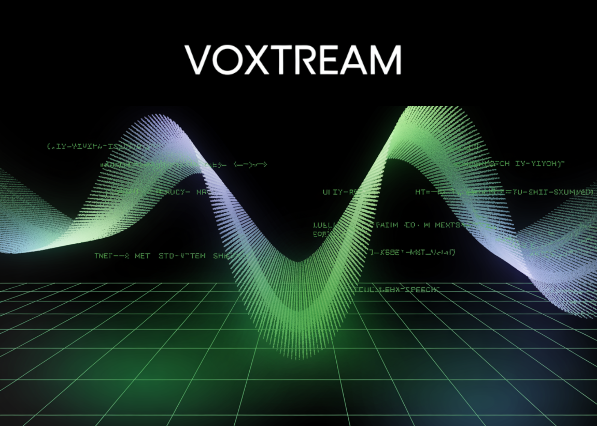

# Meet VoXtream: An Open-Sourced Full-Stream Zero-Shot TTS Model for Real-Time Use that Begins Speaking from the First Word

> Real-time agents, live dubbing, and simultaneous translation die by a thousand milliseconds. Most “streaming” TTS (Text to Speech) stacks still wait for a chunk of text before they emit sound, so the human hears a beat of silence before the voice starts. VoXtream—released by KTH’s Speech, Music and Hearing group—attacks this head-on: it begins speaking […]

Real-time agents, live dubbing, and simultaneous translation die by a thousand milliseconds. Most “streaming” TTS (Text to Speech) stacks still wait for a chunk of text before they emit sound, so the human hears a beat of silence before the voice starts. VoXtream—released by KTH’s Speech, Music and Hearing group—attacks this head-on: it begins speaking **after the first word**, outputs audio in **80 ms frames**, and reports **102 ms first-packet latency (FPL)** on a modern GPU (with PyTorch compile).

### What exactly is “full-stream” TTS and how is it different from “output streaming”?

Output-streaming systems decode speech in chunks but still require the **entire input text** upfront; the clock starts late. **Full-stream** systems consume text **as it arrives** (word-by-word from an LLM) and emit audio in lockstep. VoXtream implements the latter: it ingests a word stream and generates audio frames continuously, eliminating input-side buffering while maintaining low per-frame compute. The architecture explicitly targets first-word onset rather than only steady-state throughput.

*https://arxiv.org/pdf/2509.15969*

### How does VoXtream start speaking without waiting for future words?

The core trick is a **dynamic phoneme look-ahead** inside an **incremental Phoneme Transformer (PT)**. PT _may_ peek up to **10 phonemes** to stabilize prosody, but **it does not wait** for that context; generation can start immediately after the first word enters the buffer. This avoids fixed look-ahead windows that add onset delay.

### What’s the model stack under the hood?

VoXtream is a **single, fully-autoregressive (AR)** pipeline with three transformers:

- **Phoneme Transformer (PT):** decoder-only, incremental; dynamic look-ahead ≤ 10 phonemes; phonemization via g2pE at the word level.

- **Temporal Transformer (TT):** AR predictor over **Mimi** codec **semantic tokens** plus a **duration token** that encodes a monotonic phoneme-to-audio alignment (“stay/go” and {1, 2} phonemes per frame). Mimi runs at **12.5 Hz** (→ **80 ms** frames).

- **Depth Transformer (DT):** AR generator for the remaining Mimi **acoustic codebooks**, conditioned on TT outputs and a **ReDimNet** speaker embedding for **zero-shot** voice prompting. The Mimi decoder reconstructs the waveform frame-by-frame, enabling continuous emission.

Mimi’s streaming codec design and dual-stream tokenization are well documented; VoXtream uses its first codebook as “semantic” context and the rest for high-fidelity reconstruction.

### Is it actually fast in practice—or just “fast on paper”?

The repository includes a **benchmark script** that measures both **FPL** and **real-time factor (RTF)**. On **A100**, the research team report **171 ms / 1.00 RTF** without compile and **102 ms / 0.17 RTF** with compile; on **RTX 3090**, **205 ms / 1.19 RTF** uncompiled and **123 ms / 0.19 RTF** compiled.

### How does it compare to today’s popular streaming baselines?

The research team evaluates **short-form output streaming** and **full-stream** scenarios. On **LibriSpeech-long** full-stream (where text arrives word-by-word), VoXtream shows **lower WER (3.24 %) than CosyVoice2 (6.11 %)** and a **significant naturalness preference** for VoXtream in listener studies (**p ≤ 5e-10**), while CosyVoice2 scores higher on speaker-similarity—consistent with its flow-matching decoder. In runtime, **VoXtream has the lowest FPL among the compared public streaming systems**, and with compile it operates **>5× faster than real time** (RTF ≈ 0.17).

*https://arxiv.org/pdf/2509.15969*

*https://arxiv.org/pdf/2509.15969*

### Why does this AR design beat diffusion/flow stacks on onset?

Diffusion/flow vocoders typically generate audio in **chunks**, so even if the text-audio interleaving is clever, the vocoder imposes a floor on first-packet latency. VoXtream keeps **every stage AR and frame-synchronous**—PT→TT→DT→Mimi decoder—so the first **80 ms** packet emerges after one pass through the stack rather than a multi-step sampler. The introduction surveys prior interleaved and chunked approaches and explains how **NAR flow-matching decoders** used in IST-LM and **CosyVoice2** impede low FPL despite strong offline quality.

### Did they get here with huge data—or something smaller and cleaner?

VoXtream trains on a **~9k-hour mid-scale corpus**: roughly **4.5k h Emilia** and **4.5k h HiFiTTS-2 (22 kHz subset)**. The team **diarized** to remove multi-speaker clips, **filtered transcripts** using ASR, and applied **NISQA** to drop low-quality audio. Everything is resampled to **24 kHz**, and the dataset card spells out the preprocessing pipeline and alignment artifacts (Mimi tokens, MFA alignments, duration labels, and speaker templates).

### Are the headline quality metrics holding up outside cherry-picked clips?

Table 1 (zero-shot TTS) shows VoXtream is competitive on **WER**, **UTMOS** (MOS predictor), and **speaker similarity** across **SEED-TTS test-en** and **LibriSpeech test-clean**; the research team also runs an **ablation**: adding the **CSM Depth Transformer** and **speaker encoder** notably improves similarity without a significant WER penalty relative to a stripped baseline. The subjective study uses a MUSHRA-like protocol and a second-stage preference test tailored to full-stream generation.

*source: marktechpost.com*

### Where does this land in the TTS landscape?

As per the research paper, it positions VoXtream among recent **interleaved AR + NAR vocoder** approaches and **LM-codec** stacks. The core contribution isn’t a new codec or a giant model—it’s a **latency-focused AR arrangement** plus a **duration-token alignment** that preserves **input-side streaming**. If you build live agents, the important trade-off is explicit: a small drop in speaker similarity vs. **order-of-magnitude lower FPL** than chunked NAR vocoders in full-stream conditions.

---

Check out the **[PAPER](https://arxiv.org/pdf/2509.15969), [Model on Hugging](https://huggingface.co/herimor/voxtream), [GitHub Page](https://github.com/herimor/voxtream) **and **[Project Page](https://herimor.github.io/voxtream/)**. Feel free to check out our **[GitHub Page for Tutorials, Codes and Notebooks](https://github.com/Marktechpost/AI-Tutorial-Codes-Included)**. Also, feel free to follow us on **[Twitter](https://x.com/intent/follow?screen_name=marktechpost)** and don’t forget to join our **[100k+ ML SubReddit](https://www.reddit.com/r/machinelearningnews/)** and Subscribe to **[our Newsletter](https://www.aidevsignals.com/)**.

**For content partnership/promotions on marktechpost.com, please [TALK to us](https://calendly.com/marktechpost/marktechpost-promotion-call)**
