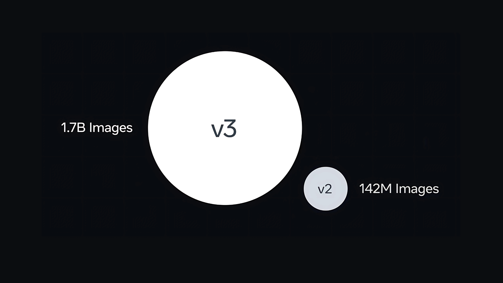

# Meta AI Just Released DINOv3: A State-of-the-Art Computer Vision Model Trained with Self-Supervised Learning, Generating High-Resolution Image Features

> Meta AI has just released DINOv3, a breakthrough self-supervised computer vision model that sets new standards for versatility and accuracy across dense prediction tasks, all without the need for labeled data. DINOv3 employs self-supervised learning (SSL) at an unprecedented scale, training on 1.7 billion images with a 7 billion parameter architecture. For the first time, […]

Meta AI has just released **DINOv3**, a breakthrough self-supervised computer vision model that sets new standards for versatility and accuracy across dense prediction tasks, all without the need for labeled data. DINOv3 employs **self-supervised learning (SSL)** at an unprecedented scale, training on **1.7 billion images** with a **7 billion parameter** architecture. For the first time, a **single frozen vision backbone** outperforms domain-specialized solutions across multiple visual tasks, such as **object detection, semantic segmentation, and video tracking**—requiring no fine-tuning for adaptation.

### Key Innovations and Technical Highlights

- **Label-free SSL Training**: DINOv3 is trained entirely without human annotations, making it ideal for domains where labels are scarce or expensive, including **satellite imagery, biomedical applications**, and remote sensing.

- **Scalable Backbone**: DINOv3’s backbone is universal and frozen, producing **high-resolution image features** that are directly usable with lightweight adapters for diverse downstream applications. It outperforms leading benchmarks of both domain-specific and previous self-supervised models on dense tasks.

- **Model Variants for Deployment**: Meta is releasing not only the massive ViT-G backbone but also **distilled versions (ViT-B, ViT-L) and ConvNeXt variants** to support a spectrum of deployment scenarios, from large-scale research to resource-limited edge devices.

- **Commercial & Open Release**: DINOv3 is distributed under a **commercial license** along with full training and evaluation code, pre-trained backbones, downstream adapters, and sample notebooks to accelerate research, innovation, and commercial product integration.

- **Real-world Impact**: Already, organizations such as the **World Resources Institute** and **NASA’s Jet Propulsion Laboratory** are using DINOv3: it has dramatically improved the accuracy of forestry monitoring (reducing tree canopy height error from 4.1m to 1.2m in Kenya) and supported vision for Mars exploration robots with minimal compute overhead.

- **Generalization & Annotation Scarcity**: By employing SSL at scale, DINOv3 closes the gap between general and task-specific vision models. It eliminates reliance on web captions or curation, leveraging unlabeled data for universal feature learning and enabling applications in fields where annotation is bottlenecked.

### Comparison of DINOv3 Capabilities

AttributeDINO/DINOv2DINOv3 (New)Training DataUp to 142M images**1.7B images**ParametersUp to 1.1B**7B**Backbone Fine-tuningNot requiredNot requiredDense Prediction TasksStrong performance**Outperforms specialists**Model VariantsViT-S/B/L/g**ViT-B/L/G, ConvNeXt**Open Source ReleaseYes**Commercial license, full suite**

### Conclusion

DINOv3 represents a major leap in computer vision: its **frozen universal backbone and SSL approach** enable researchers and developers to tackle annotation-scarce tasks, deploy high-performance models quickly, and adapt to new domains simply by swapping lightweight adapters. Meta’s release includes everything needed for academic or industrial use, fostering broad collaboration in the AI and computer vision community.

The DINOv3 package—models and code—is now available for commercial research and deployment, marking a new chapter for robust, scalable AI vision systems.

---

Check out the **[Paper](https://ai.meta.com/research/publications/dinov3/), Models on [Hugging Face](https://huggingface.co/collections/facebook/dinov3-68924841bd6b561778e31009)** and **[GitHub Page](https://github.com/facebookresearch/dinov3?tab=readme-ov-file)**. Feel free to check out our **[GitHub Page for Tutorials, Codes and Notebooks](https://github.com/Marktechpost/AI-Tutorial-Codes-Included)**. Also, feel free to follow us on **[Twitter](https://x.com/intent/follow?screen_name=marktechpost)** and don’t forget to join our **[100k+ ML SubReddit](https://www.reddit.com/r/machinelearningnews/)** and Subscribe to **[our Newsletter](https://www.aidevsignals.com/)**.

[🇬 Star us on GitHub](https://github.com/Marktechpost/AI-Tutorial-Codes-Included)

[**🇸 Sponsor**ship Details](https://95xaxi6d7td.typeform.com/to/jhs8ftBd)
