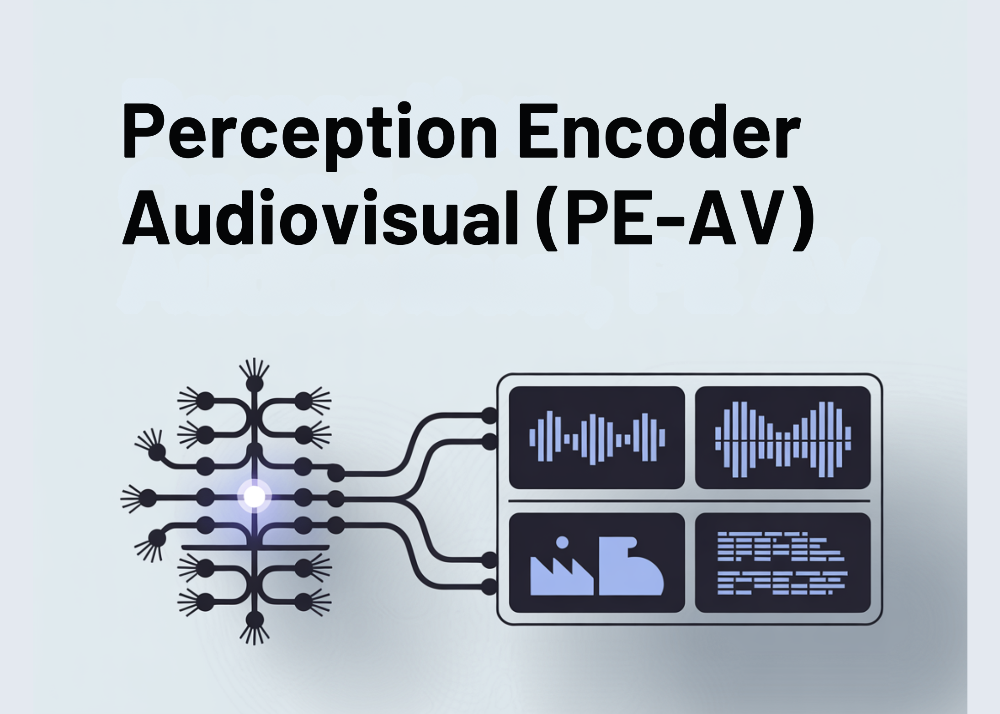

# Meta AI Open-Sourced Perception Encoder Audiovisual (PE-AV): The Audiovisual Encoder Powering SAM Audio And Large Scale Multimodal Retrieval

> Meta researchers have introduced Perception Encoder Audiovisual, PEAV, as a new family of encoders for joint audio and video understanding. The model learns aligned audio, video, and text representations in a single embedding space using large scale contrastive training on about 100M audio video pairs with text captions. From Perception Encoder to PEAV Perception Encoder, […]

Meta researchers have introduced Perception Encoder Audiovisual, PEAV, as a new family of encoders for joint audio and video understanding. The model learns aligned audio, video, and text representations in a single embedding space using large scale contrastive training on about 100M audio video pairs with text captions.

### From Perception Encoder to PEAV

Perception Encoder, PE, is the core vision stack in Meta’s Perception Models project. It is a family of encoders for images, video, and audio that reaches state of the art on many vision and audio benchmarks using a unified contrastive pretraining recipe. PE core surpasses SigLIP2 on image tasks and InternVideo2 on video tasks. PE lang powers Perception Language Model for multimodal reasoning. PE spatial is tuned for dense prediction tasks such as detection and depth estimation.

PEAV builds on this backbone and extends it to full audio video text alignment. In the Perception Models repository, PE audio visual is listed as the branch that embeds audio, video, audio video, and text into a single joint embedding space for cross modal understanding.

*https://ai.meta.com/research/publications/pushing-the-frontier-of-audiovisual-perception-with-large-scale-multimodal-correspondence-learning/*

### Architecture, Separate Towers and Fusion

The PEAV architecture is composed of a frame encoder, a video encoder, an audio encoder, an audio video fusion encoder, and a text encoder.

- The video path uses the existing PE frame encoder on RGB frames, then applies a temporal video encoder on top of frame level features.

- The audio path uses DAC VAE as a codec to convert raw waveforms into discrete audio tokens at fixed frame rate, about one embedding every 40 milliseconds.

These towers feed an audio video fusion encoder that learns a shared representation for both streams. The text encoder projects text queries into several specialized spaces. In practice this gives you a single backbone that can be queried in many ways. You can retrieve video from text, audio from text, audio from video, or retrieve text descriptions conditioned on any combination of modalities without retraining task specific heads.

*https://ai.meta.com/research/publications/pushing-the-frontier-of-audiovisual-perception-with-large-scale-multimodal-correspondence-learning/*

### Data Engine, Synthetic Audiovisual Captions At Scale

The research team proposed a two stage audiovisual data engine that generates high quality synthetic captions for unlabeled clips. The team describes a pipeline that first uses several weak audio caption models, their confidence scores, and separate video captioners as input to a large language model. This LLM produces three caption types per clip, one for audio content, one for visual content, and one for joint audio visual content. An initial PE AV model is trained on this synthetic supervision.

In the second stage, this initial PEAV is paired with a Perception Language Model decoder. Together they refine the captions to better exploit audiovisual correspondences. The two stage engine yields reliable captions for about 100M audio video pairs and uses about 92M unique clips for stage 1 pretraining and 32M additional unique clips for stage 2 fine tuning.

Compared to prior work that often focuses on speech or narrow sound domains, this corpus is designed to be balanced across speech, general sounds, music, and diverse video domains, which is important for general audio visual retrieval and understanding.

### Contrastive Objective Across Ten Modality Pairs

PEAV uses a sigmoid based contrastive loss across audio, video, text, and fused representations. The research team explains that the model uses eight contrastive loss pairs during pretraining. These cover combinations such as audio text, video text, audio video text, and fusion related pairs. During fine tuning, two extra pairs are added, which brings the total to ten loss pairs among the different modality and caption types.

This objective is similar in form to contrastive objectives used in recent vision language encoders but generalized to audio video text tri modal training. By aligning all these views in one space, the same encoder can support classification, retrieval, and correspondence tasks with simple dot product similarities.

### Performance Across Audio, Speech, Music And Video

On benchmarks, PEAV targets zero shot retrieval and classification for multiple domains. PE AV achieves state of the art performance on several audio and video benchmarks compared to recent audio text and audio video text models from works such as CLAP, Audio Flamingo, ImageBind, and LanguageBind.

**Concrete gains include:**

- On AudioCaps, text to audio retrieval improves from 35.4 R at 1 to 45.8 R at 1.

- On VGGSound, clip level classification accuracy improves from 36.0 to 47.1.

- For speech retrieval on VCTK style tasks, PE AV reaches 85.6 accuracy while earlier models are near 0.

- On ActivityNet, text to video retrieval improves from 60.4 R at 1 to 66.5 R at 1.

- On Kinetics 400, zero shot video classification improves from 76.9 to 78.9, beating models 2 to 4 times larger.

*https://ai.meta.com/research/publications/pushing-the-frontier-of-audiovisual-perception-with-large-scale-multimodal-correspondence-learning/*

### PEA-Frame, Frame Level Audio Text Alignment

Alongside PEAV, Meta releases Perception Encoder Audio Frame, PEA-Frame, for sound event localization. PE A Frame is an audio text embedding model that outputs one audio embedding per 40 milliseconds frame and a single text embedding per query. The model can return temporal spans that mark where in the audio each described event occurs.

PEA-Frame uses frame level contrastive learning to align audio frames with text. This enables precise localization of events such as specific speakers, instruments, or transient sounds in long audio sequences.

### Role In The Perception Models And SAM Audio Ecosystem

PEAV and PEA-Frame sit inside the broader Perception Models stack, which combines PE encoders with Perception Language Model for multimodal generation and reasoning.

PEAV is also the core perception engine behind Meta’s new SAM Audio model and its Judge evaluator. SAM Audio uses PEAV embeddings to connect visual prompts and text prompts to sound sources in complex mixtures and to score the quality of separated audio tracks.

### Key Takeaways

- PEAV is a unified encoder for audio, video, and text, trained with contrastive learning on over 100M videos, and embeds audio, video, audio video, and text into a single joint space for cross modal retrieval and understanding.

- The architecture uses separate video and audio towers, with PE based visual encoding and DAC VAE audio tokenization, followed by an audio visual fusion encoder and specialized text heads aligned to different modality pairs.

- A 2 stage data engine generates synthetic audio, visual, and audio visual captions using weaker captioners plus an LLM in stage 1 and PEAV plus Perception Language Model in stage 2, enabling large scale multimodal supervision without manual labels.

- PEAV establishes new state of the art on a wide range of audio and video benchmarks through a sigmoid contrastive objective over multiple modality pairs, with six public checkpoints from small 16 frame to large all frame variants, where average retrieval improves from about 45 to 51.6.

- PEAV, together with the frame level PEA-Frame variant, forms the perception backbone for Meta’s SAM Audio system, providing the embeddings used for prompt based audio separation and fine grained sound event localization across speech, music, and general sounds.

---

Check out the **[Paper](https://ai.meta.com/research/publications/pushing-the-frontier-of-audiovisual-perception-with-large-scale-multimodal-correspondence-learning/),[ Repo](https://github.com/facebookresearch/perception_models) and [Model Weights](https://huggingface.co/collections/facebook/perception-encoder-audio-visual)**. Also, feel free to follow us on **[Twitter](https://x.com/intent/follow?screen_name=marktechpost)** and don’t forget to join our **[100k+ ML SubReddit](https://www.reddit.com/r/machinelearningnews/)** and Subscribe to **[our Newsletter](https://www.aidevsignals.com/)**. Wait! are you on telegram? **[now you can join us on telegram as well.](https://t.me/machinelearningresearchnews)**
