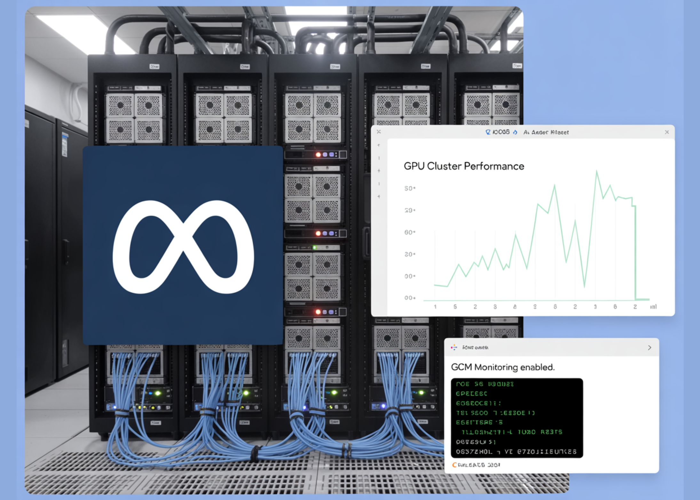

# Meta AI Open Sources GCM for Better GPU Cluster Monitoring to Ensure High Performance AI Training and Hardware Reliability

> While the tech folks obsesses over the latest Llama checkpoints, a much grittier battle is being fought in the basements of data centers. As AI models scale to trillions of parameters, the clusters required to train them have become some of the most complex—and fragile—machines on the planet. Meta AI Research team just released GCM […]

While the tech folks obsesses over the latest Llama checkpoints, a much grittier battle is being fought in the basements of data centers. As AI models scale to trillions of parameters, the clusters required to train them have become some of the most complex—and fragile—machines on the planet.

Meta AI Research team just released **GCM (GPU Cluster Monitoring)**, a specialized toolkit designed to solve the ‘silent killer’ of AI progress: hardware instability at scale. GCM is a blueprint for how to manage the hardware-to-software handshake in High-Performance Computing (HPC).

*https://facebookresearch.github.io/gcm/docs/getting_started/*

### The Problem: When ‘Standard’ Observability Isn’t Enough

In traditional web development, if a microservice lags, you check your dashboard and scale horizontally. In AI training, the rules are different. A single GPU in a 4,096-card cluster can experience a ‘silent failure’—where it technically stays ‘up’ but its performance degrades—effectively poisoning the gradients for the entire training run.

Standard monitoring tools are often too high-level to catch these nuances. Meta’s [GCM](https://github.com/facebookresearch/gcm/tree/main) acts as a specialized bridge, connecting the raw hardware telemetry of NVIDIA GPUs with the orchestration logic of the cluster.

#### 1. Monitoring the ‘Slurm’ Way

For devs, **Slurm** is the ubiquitous (if occasionally frustrating) workload manager. GCM integrates directly with Slurm to provide context-aware monitoring.

- **Job-Level Attribution:** Instead of seeing a generic spike in power consumption, GCM allows you to attribute metrics to specific **Job IDs**.

- **State Tracking:** It pulls data from `sacct`, `sinfo`, and `squeue` to create a real-time map of cluster health. If a node is marked as `DRAIN`, GCM helps you understand _why_ before it ruins a researcher’s weekend.

#### 2. The ‘Prolog’ and ‘Epilog’ Strategy

One of the most technically vital parts of the GCM framework is its suite of **Health Checks**. In an HPC environment, timing is everything. **GCM utilizes two critical windows:**

- **Prolog:** These are scripts run _before_ a job starts. GCM checks if the InfiniBand network is healthy and if the GPUs are actually reachable. If a node fails a pre-check, the job is diverted, saving hours of ‘dead’ compute time.

- **Epilog:** These run _after_ a job completes. GCM uses this window to run deep diagnostics using **NVIDIA’s DCGM (Data Center GPU Manager)** to ensure the hardware wasn’t damaged during the heavy lifting.

#### 3. Telemetry and the OTLP Bridge

For devs and AI researchers who need to justify their compute budgets, GCM’s **Telemetry Processor** is the star of the show. It converts raw cluster data into **OpenTelemetry (OTLP)** formats.

By standardizing telemetry, GCM allows teams to pipe hardware-specific data (like GPU temperature, NVLink errors, and XID events) into modern observability stacks. This means you can finally correlate a dip in training throughput with a specific hardware throttled event, moving from ‘the model is slow’ to ‘GPU 3 on Node 50 is overheating.’

### Under the Hood: The Tech Stack

Meta’s implementation is a masterclass in pragmatic engineering. The repository is primarily **Python** (94%), making it highly extensible for AI devs, with performance-critical logic handled in **Go**.

- **Collectors:** Modular components that gather telemetry from sources like `nvidia-smi` and the Slurm API.

- **Sinks:** The ‘output’ layer. GCM supports multiple sinks, including `stdout` for local debugging and **OTLP** for production-grade monitoring.

- **DCGM & NVML:** GCM leverages the **NVIDIA Management Library (NVML)** to talk directly to the hardware, bypassing high-level abstractions that might hide errors.

### Key Takeaways

- **Bridging the ‘Silent Failure’ Gap:** GCM solves a critical AI infrastructure problem: identifying ‘zombie’ GPUs that appear online but cause training runs to crash or produce corrupted gradients due to hardware instability.

- **Deep Slurm Integration:** Unlike general cloud monitoring, GCM is purpose-built for High-Performance Computing (HPC). It anchors hardware metrics to specific **Slurm Job IDs**, allowing engineers to attribute performance dips or power spikes to specific models and users.

- **Automated Health ‘Prolog’ and ‘Epilog’:** The framework uses a proactive diagnostic strategy, running specialized health checks via **NVIDIA DCGM** before a job starts (Prolog) and after it ends (Epilog) to ensure faulty nodes are drained before they waste expensive compute time.

- **Standardized Telemetry via OTLP:** GCM converts low-level hardware data (temperature, NVLink errors, XID events) into the **OpenTelemetry (OTLP)** format. This allows teams to pipe complex cluster data into modern observability stacks like Prometheus or Grafana for real-time visualization.

- **Modular, Language-Agnostic Design:** While the core logic is written in **Python** for accessibility, GCM uses **Go** for performance-critical sections. Its ‘Collector-and-Sink’ architecture allows developers to easily plug in new data sources or export metrics to custom backend systems.

---

Check out the **[Repo](https://github.com/facebookresearch/gcm/tree/main) **and** [Project Page](https://facebookresearch.github.io/gcm/). **Also, feel free to follow us on **[Twitter](https://x.com/intent/follow?screen_name=marktechpost)** and don’t forget to join our **[120k+ ML SubReddit](https://www.reddit.com/r/machinelearningnews/)** and Subscribe to **[our Newsletter](https://www.aidevsignals.com/)**. Wait! are you on telegram? **[now you can join us on telegram as well.](https://t.me/machinelearningresearchnews)**
