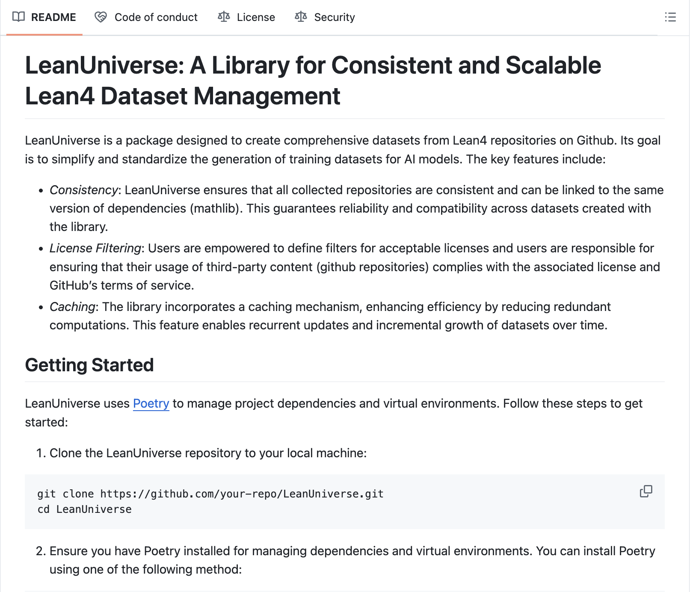

# Meta AI Open-Sources LeanUniverse: A Machine Learning Library for Consistent and Scalable Lean4 Dataset Management

> Managing datasets effectively has become a pressing challenge as machine learning (ML) continues to grow in scale and complexity. As datasets expand, researchers and engineers often struggle with maintaining consistency, scalability, and interoperability. Without standardized workflows, errors and inefficiencies creep in, slowing progress and increasing costs. These challenges are particularly acute in large-scale ML projects, […]

Managing datasets effectively has become a pressing challenge as machine learning (ML) continues to grow in scale and complexity. As datasets expand, researchers and engineers often struggle with maintaining consistency, scalability, and interoperability. Without standardized workflows, errors and inefficiencies creep in, slowing progress and increasing costs. These challenges are particularly acute in large-scale ML projects, where proper data curation and version control are essential to ensure reliable results. Finding tools that simplify dataset management while maintaining accuracy and flexibility has become a top priority.

Meta AI has introduced **[LeanUniverse](https://github.com/facebookresearch/LeanUniverse)**, an open-source library designed to streamline dataset management. Built on the Lean4 theorem prover, LeanUniverse offers a structured approach that emphasizes consistency, scalability, and correctness. Lean4 provides the foundation for this library, combining logical reasoning with practical dataset management tools. The result is a system that ensures datasets are organized and adhere to strict verification standards.

LeanUniverse addresses the common pain points of dataset management by offering a unified, scalable framework. With features like dataset versioning and dependency tracking, the library simplifies processes and ensures correctness, making it a valuable resource for modern ML pipelines.

### Technical Details and Benefits of LeanUniverse

LeanUniverse leverages Lean4 to create a robust and formalized environment for managing datasets. Its key features include:

- **Consistency and Formal Verification:** By following predefined logical rules, LeanUniverse reduces inconsistencies and errors in datasets and their transformations.

- **Scalability:** It is designed to handle complex datasets with intricate interdependencies, making it suitable for large-scale projects.

- **Modularity and Reusability:** LeanUniverse structures datasets as modular components, encouraging reuse across projects and reducing redundancy.

- **Interoperability:** The library integrates smoothly with existing ML tools and frameworks, enabling easy adoption without major changes to current workflows.

This combination of logical rigor and practical functionality ensures datasets remain accurate, adaptable, and easy to manage. Additionally, as an open-source tool, LeanUniverse benefits from community input and ongoing improvements.

### Conclusion

LeanUniverse by Meta AI offers a thoughtful solution to the challenges of dataset management, combining practical tools with a strong emphasis on formal verification. Its open-source nature and adaptable design make it a useful resource for researchers and engineers seeking to improve efficiency and collaboration.

---

Check out **_the [GitHub Page](https://github.com/facebookresearch/LeanUniverse)._** All credit for this research goes to the researchers of this project. Also, don’t forget to follow us on **[Twitter](https://x.com/intent/follow?screen_name=marktechpost)** and join our **[Telegram Channel](https://arxiv.org/abs/2406.09406)** and [**LinkedIn Gr**](https://www.linkedin.com/groups/13668564/)[**oup**](https://www.linkedin.com/groups/13668564/). Don’t Forget to join our **[60k+ ML SubReddit](https://www.reddit.com/r/machinelearningnews/)**.

**🚨 FREE UPCOMING AI WEBINAR (JAN 15, 2025): [Boost LLM Accuracy with Synthetic Data and Evaluation Intelligence](https://info.gretel.ai/boost-llm-accuracy-with-sd-and-evaluation-intelligence?utm_source=marktechpost&utm_medium=newsletter&utm_campaign=202501_gretel_galileo_webinar)**–**[Join this webinar to gain actionable insights into boosting LLM model performance and accuracy while safeguarding data privacy](https://info.gretel.ai/boost-llm-accuracy-with-sd-and-evaluation-intelligence?utm_source=marktechpost&utm_medium=newsletter&utm_campaign=202501_gretel_galileo_webinar).**
