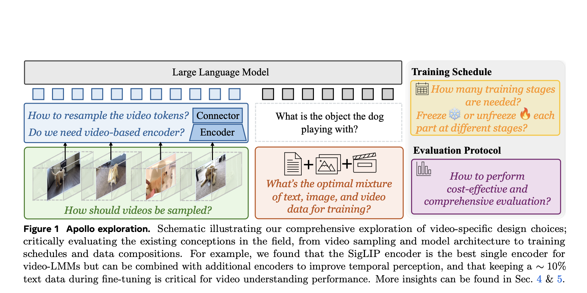

# Meta AI Releases Apollo: A New Family of Video-LMMs Large Multimodal Models for Video Understanding

> While multimodal models (LMMs) have advanced significantly for text and image tasks, video-based models remain underdeveloped. Videos are inherently complex, combining spatial and temporal dimensions that demand more from computational resources. Existing methods often adapt image-based approaches directly or rely on uniform frame sampling, which poorly captures motion and temporal patterns. Moreover, training large-scale video […]

While multimodal models (LMMs) have advanced significantly for text and image tasks, video-based models remain underdeveloped. Videos are inherently complex, combining spatial and temporal dimensions that demand more from computational resources. Existing methods often adapt image-based approaches directly or rely on uniform frame sampling, which poorly captures motion and temporal patterns. Moreover, training large-scale video models is computationally expensive, making it difficult to explore design choices efficiently.

To tackle these issues, researchers from Meta AI and Stanford developed **_[Apollo](https://huggingface.co/Apollo-LMMs)_**, a family of video-focused LMMs designed to push the boundaries of video understanding. Apollo addresses these challenges through thoughtful design decisions, improving efficiency, and setting a new benchmark for tasks like temporal reasoning and video-based question answering.

### Meta AI Introduces Apollo: A Family of Scalable Video-LMMs

Meta AI’s **Apollo** models are designed to process videos up to an hour long while achieving strong performance across key video-language tasks. Apollo comes in three sizes – **1.5B**, **3B**, and **7B parameters** – offering flexibility to accommodate various computational constraints and real-world needs.

**Key innovations include:**

- **Scaling Consistency**: Design choices made on smaller models are shown to transfer effectively to larger ones, reducing the need for large-scale experiments.

- **Frame-Per-Second (fps) Sampling**: A more efficient video sampling technique compared to uniform frame sampling, ensuring better temporal consistency.

- **Dual Vision Encoders**: Combining SigLIP for spatial understanding with InternVideo2 for temporal reasoning enables a balanced representation of video data.

- **ApolloBench**: A curated benchmark suite that reduces redundancy in evaluation while providing detailed insights into model performance.

### Technical Highlights and Advantages

The Apollo models are built on a series of well-researched design choices aimed at overcoming the challenges of video-based LMMs:

- **Frame-Per-Second Sampling**: Unlike uniform frame sampling, fps sampling maintains a consistent temporal flow, allowing Apollo to better understand motion, speed, and sequence of events in videos.

- **Scaling Consistency**: Experiments show that model design choices made on moderately sized models (2B-4B parameters) generalize well to larger models. This approach reduces computational costs while maintaining performance gains.

- **Dual Vision Encoders**: Apollo uses two complementary encoders: SigLIP, which excels at spatial understanding, and InternVideo2, which enhances temporal reasoning. Their combined strengths produce more accurate video representations.

- **Token Resampling**: By using a Perceiver Resampler, Apollo efficiently reduces video tokens without losing information. This allows the models to process long videos without excessive computational overhead.

- **Optimized Training**: Apollo employs a three-stage training process where video encoders are initially fine-tuned on video data before integrating with text and image datasets. This staged approach ensures stable and effective learning.

- **Multi-Turn Conversations**: Apollo models can support interactive, multi-turn conversations grounded in video content, making them ideal for applications like video-based chat systems or content analysis.

### Performance Insights

Apollo’s capabilities are validated through strong results on multiple benchmarks, often outperforming larger models:

- **Apollo-1.5B**:

Surpasses models like Phi-3.5-Vision (4.2B) and LongVA-7B.

- Scores: **60.8** on Video-MME, **63.3** on MLVU, **57.0** on ApolloBench.

- **Apollo-3B**:

Competes with and outperforms many 7B models.

- Scores: **58.4** on Video-MME, **68.7** on MLVU, **62.7** on ApolloBench.

- Achieves **55.1** on LongVideoBench.

- **Apollo-7B**:

Matches and even surpasses models with over 30B parameters, such as Oryx-34B and VILA1.5-40B.

- Scores: **61.2** on Video-MME, **70.9** on MLVU, **66.3** on ApolloBench.

**Benchmark Summary**:

### Conclusion

Apollo marks a significant step forward in video-LMM development. By addressing key challenges such as efficient video sampling and model scalability, Apollo provides a practical and powerful solution for understanding video content. Its ability to outperform larger models highlights the importance of well-researched design and training strategies.

The Apollo family offers practical solutions for real-world applications, from video-based question answering to content analysis and interactive systems. Importantly, Meta AI’s introduction of **ApolloBench** provides a more streamlined and effective benchmark for evaluating video-LMMs, paving the way for future research.

---

Check out **the _[Paper](https://arxiv.org/abs/2412.10360)_**, **_[Website](https://apollo-lmms.github.io/)_**, **_[Demo](https://huggingface.co/spaces/Apollo-LMMs/Apollo-3B)_**, **_[Code](https://github.com/Apollo-LMMs/Apollo/),_** and **[Models](https://huggingface.co/Apollo-LMMs)**. All credit for this research goes to the researchers of this project. Also, don’t forget to follow us on **[Twitter](https://twitter.com/Marktechpost)** and join our **[Telegram Channel](https://github.com/XGenerationLab/XiYan-SQL)** and [**LinkedIn Gr**](https://www.linkedin.com/groups/13668564/)[**oup**](https://www.linkedin.com/groups/13668564/). Don’t Forget to join our **[60k+ ML SubReddit](https://www.reddit.com/r/machinelearningnews/)**.

**[🚨 Trending: LG AI Research Releases EXAONE 3.5: Three Open-Source Bilingual Frontier AI-level Models Delivering Unmatched Instruction Following and Long Context Understanding for Global Leadership in Generative AI Excellence….](https://www.marktechpost.com/2024/12/11/lg-ai-research-releases-exaone-3-5-three-open-source-bilingual-frontier-ai-level-models-delivering-unmatched-instruction-following-and-long-context-understanding-for-global-leadership-in-generative-a/)**
