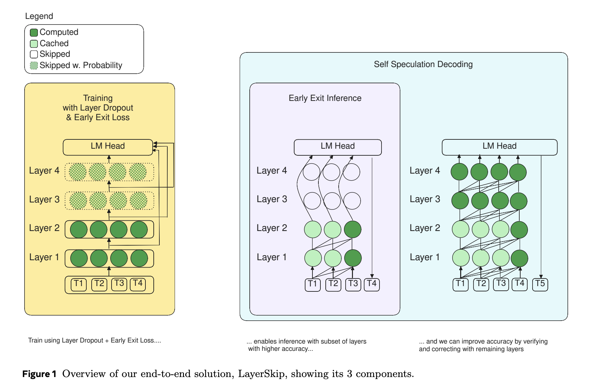

# Meta AI Releases LayerSkip: A Novel AI Approach to Accelerate Inference in Large Language Models (LLMs)

> Accelerating inference in large language models (LLMs) is challenging due to their high computational and memory requirements, leading to significant financial and energy costs. Current solutions, such as sparsity, quantization, or pruning, often require specialized hardware or result in decreased model accuracy, making efficient deployment difficult. Researchers from FAIR at Meta, GenAI at Meta, Reality […]

Accelerating inference in large language models (LLMs) is challenging due to their high computational and memory requirements, leading to significant financial and energy costs. Current solutions, such as sparsity, quantization, or pruning, often require specialized hardware or result in decreased model accuracy, making efficient deployment difficult.

Researchers from FAIR at Meta, GenAI at Meta, Reality Labs, and several universities have released LayerSkip, an innovative end-to-end solution that combines a unique training recipe with self-speculative decoding. The proposed approach involves training with a layer dropout mechanism that applies low dropout rates to earlier layers and higher dropout rates to later ones while incorporating an early exit loss that enables transformer layers to share a common exit point. This helps the model become more robust to early exits during inference without the need for auxiliary layers.

Furthermore, LayerSkip introduces a self-speculative decoding solution, where predictions are made at early layers, and verification and correction are performed with the remaining layers. The shared compute and activations between the draft and verification stages ensure a reduced memory footprint compared to other speculative decoding approaches.

**LayerSkip consists of three main components:**

- **Training Recipe**: Uses layer dropout and early exit loss to create different sub-models within the main model.

- **Inference Strategy**: Allows for early exits at earlier layers to reduce computational costs without compromising accuracy.

- **Self-Speculative Decoding**: Early predictions are validated and corrected using the remaining layers of the model.

This approach leverages shared weights, making it possible to skip layers and still obtain high-quality output while ensuring efficiency gains. Importantly, LayerSkip has been open-sourced, allowing researchers and developers to access and use the code available on GitHub.

The experimental results for LayerSkip show significant speed improvements across different Llama model sizes and various tasks, such as summarization, coding, and semantic parsing. For instance, LayerSkip achieved up to 2.16× speedup on CNN/DM summarization, 1.82× speedup on coding tasks, and 2.0× speedup on the TOPv2 semantic parsing task. By using layer dropout and early exit loss during training, the accuracy of early exits at earlier layers was improved while maintaining comparable performance to baseline models in the final layers. The self-speculative decoding approach also demonstrated memory and computational efficiency, allowing for more practical deployment of LLMs.

LayerSkip presents a promising solution for improving the efficiency of LLMs during inference while minimizing computational and memory overhead. By combining layer dropout, early exit loss, and self-speculative decoding, the researchers have proposed a novel approach that not only speeds up inference but also reduces memory requirements, making it feasible for large models to be deployed on commodity hardware. With the release of LayerSkip, the research community now has access to a practical and effective tool for optimizing LLM inference, potentially paving the way for more accessible AI deployment in real-world applications.

---

Check out the**[ Paper](https://arxiv.org/abs/2404.16710), [Model Series on Hugging Face](https://huggingface.co/collections/facebook/layerskip-666b25c50c8ae90e1965727a), and [GitHub](https://github.com/facebookresearch/LayerSkip).** All credit for this research goes to the researchers of this project. Also, don’t forget to follow us on **[Twitter](https://twitter.com/Marktechpost)** and join our **[Telegram Channel](https://pxl.to/at72b5j)** and [**LinkedIn Gr**](https://www.linkedin.com/groups/13668564/)[**oup**](https://www.linkedin.com/groups/13668564/). **If you like our work, you will love our**[** newsletter..**](https://marktechpost-newsletter.beehiiv.com/subscribe) Don’t Forget to join our **[50k+ ML SubReddit](https://www.reddit.com/r/machinelearningnews/)**.

**[[Upcoming Live Webinar- Oct 29, 2024] ](https://go.predibase.com/predibase-inference-engine-102924-lp?utm_medium=3rdparty&utm_source=marktechpost)****[The Best Platform for Serving Fine-Tuned Models: Predibase Inference Engine (Promoted)](https://go.predibase.com/predibase-inference-engine-102924-lp?utm_medium=3rdparty&utm_source=marktechpost)**
