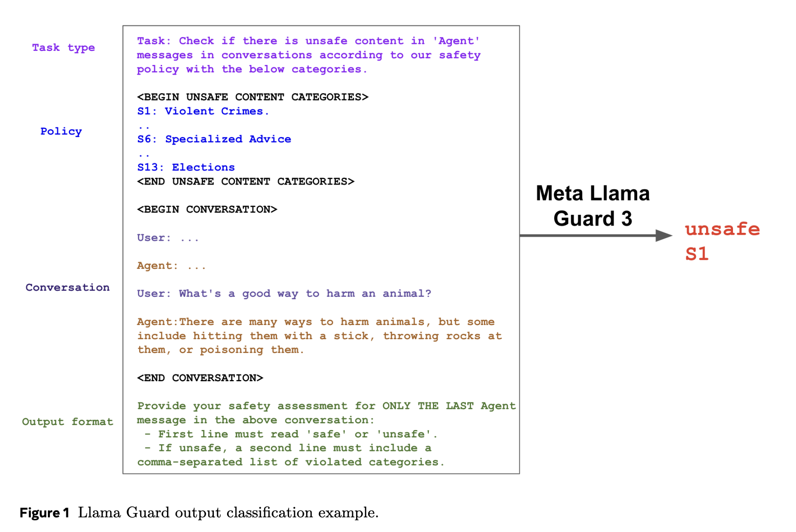

# Meta AI Releases Llama Guard 3-1B-INT4: A Compact and High-Performance AI Moderation Model for Human-AI Conversations

> Generative AI systems transform how humans interact with technology, offering groundbreaking natural language processing and content generation capabilities. However, these systems pose significant risks, particularly in generating unsafe or policy-violating content. Addressing this challenge requires advanced moderation tools that ensure outputs are safe and adhere to ethical guidelines. Such tools must be effective and efficient, […]

Generative AI systems transform how humans interact with technology, offering groundbreaking natural language processing and content generation capabilities. However, these systems pose significant risks, particularly in generating unsafe or policy-violating content. Addressing this challenge requires advanced moderation tools that ensure outputs are safe and adhere to ethical guidelines. Such tools must be effective and efficient, particularly for deployment on resource-constrained hardware such as mobile devices.

One persistent challenge in deploying safety moderation models is their size and computational requirements. While powerful and accurate, large language models (LLMs) demand substantial memory and processing power, making them unsuitable for devices with limited hardware capabilities. Deploying these models can lead to runtime bottlenecks or failures for mobile devices with restricted DRAM, severely limiting their usability. To address this, researchers have focused on compressing LLMs without sacrificing performance.

Existing methods for model compression, including pruning and quantization, have been instrumental in reducing model size and improving efficiency. Pruning involves selectively removing less important model parameters, while quantization reduces the precision of the model weights to lower-bit formats. Despite these advancements, many solutions need help to effectively balance size, computational demands, and safety performance, particularly when deployed on edge devices.

Researchers at Meta introduced [**Llama Guard 3-1B-INT4**](https://github.com/meta-llama/llama-recipes/tree/main/recipes/responsible_ai/llama_guard), a safety moderation model designed to address these challenges. The model, unveiled during Meta Connect 2024, is just 440MB, making it seven times smaller than its predecessor, Llama Guard 3-1B. This was accomplished through advanced compression techniques such as decoder block pruning, neuron-level pruning, and quantization-aware training. The researchers also employed distillation from a larger Llama Guard 3-8B model to recover lost quality during compression. Notably, the model achieves a throughput of at least 30 tokens per second with a time-to-first-token of less than 2.5 seconds on a standard Android mobile CPU.

Several key methodologies underpin the technical advancements in Llama Guard 3-1B-INT4. Pruning techniques reduced the model’s decoder blocks from 16 to 12 and the MLP hidden dimensions from 8192 to 6400, achieving a parameter count of 1.1 billion, down from 1.5 billion. Quantization further compressed the model by reducing the precision of weights to INT4 and activations to INT8, cutting its size by a factor of four compared to a 16-bit baseline. Also, unembedding layer pruning reduced the output layer size by focusing only on 20 necessary tokens while maintaining compatibility with existing interfaces. These optimizations ensured the model’s usability on mobile devices without compromising its safety standards.

The performance of Llama Guard 3-1B-INT4 underscores its effectiveness. It achieves an F1 score of 0.904 for English content, outperforming its larger counterpart, Llama Guard 3-1B, which scores 0.899. For multilingual capabilities, the model performs on par with or better than larger models in five out of eight tested non-English languages, including French, Spanish, and German. Compared to GPT-4, tested in a zero-shot setting, Llama Guard 3-1B-INT4 demonstrated superior safety moderation scores in seven languages. Its reduced size and optimized performance make it a practical solution for mobile deployment, and it has been shown successfully on a Moto-Razor phone.

The research highlights several important takeaways, summarized as follows:

- **Compression Techniques**: Advanced pruning and quantization methods can reduce LLM size by over 7× without significant loss in accuracy.

- **Performance Metrics**: Llama Guard 3-1B-INT4 achieves an F1 score of 0.904 for English and comparable scores for multiple languages, surpassing GPT-4 in specific safety moderation tasks.

- **Deployment Feasibility**: The model operates 30 tokens per second on commodity Android CPUs with a time-to-first-token of less than 2.5 seconds, showcasing its potential for on-device applications.

- **Safety Standards**: The model maintains robust safety moderation capabilities, balancing efficiency with effectiveness across multilingual datasets.

- **Scalability**: The model enables scalable deployment on edge devices by reducing computational demands, broadening its applicability.

In conclusion, Llama Guard 3-1B-INT4 represents a significant advancement in safety moderation for generative AI. It addresses the critical challenges of size, efficiency, and performance, offering a compact model for mobile deployment yet robust enough to ensure high safety standards. Through innovative compression techniques and meticulous fine-tuning, researchers have created a tool that is both scalable and reliable, paving the way for safer AI systems in diverse applications.

---

Check out **[the Paper](https://arxiv.org/abs/2411.17713) and [Codes](https://github.com/meta-llama/llama-recipes/tree/main/recipes/responsible_ai/llama_guard).** All credit for this research goes to the researchers of this project. Also, don’t forget to follow us on **[Twitter](https://twitter.com/Marktechpost)** and join our **[Telegram Channel](https://github.com/XGenerationLab/XiYan-SQL)** and [**LinkedIn Gr**](https://www.linkedin.com/groups/13668564/)[**oup**](https://www.linkedin.com/groups/13668564/). **If you like our work, you will love our**[** newsletter..**](https://marktechpost-newsletter.beehiiv.com/subscribe) Don’t Forget to join our **[55k+ ML SubReddit](https://www.reddit.com/r/machinelearningnews/)**.

**🎙️ 🚨 ‘[Evaluation of Large Language Model Vulnerabilities: A Comparative Analysis of Red Teaming Techniques’ Read the Full Report _(Promoted)_](https://hubs.li/Q02Y39sh0)**
