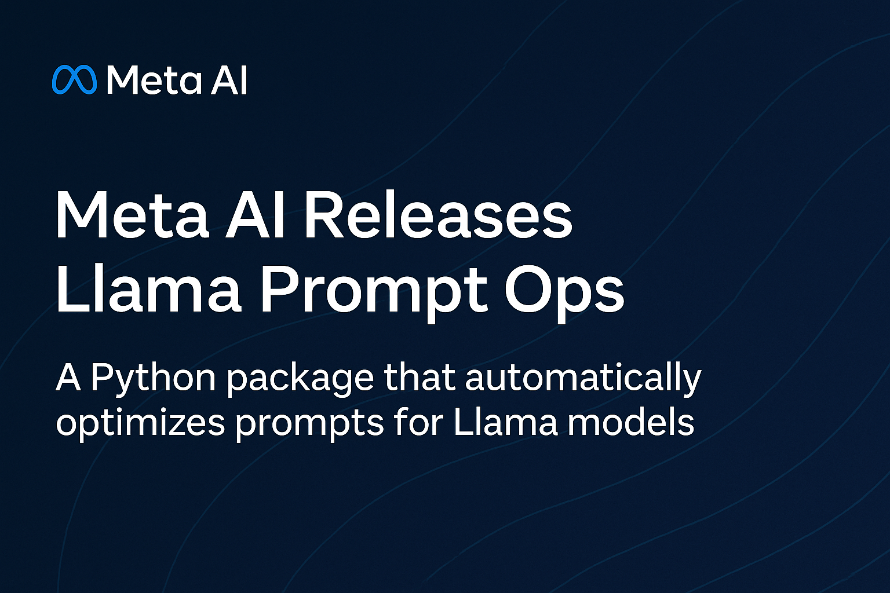

# Meta AI Releases Llama Prompt Ops: A Python Toolkit for Prompt Optimization on Llama Models

> Meta AI has released Llama Prompt Ops, a Python package designed to streamline the process of adapting prompts for Llama models. This open-source tool is built to help developers and researchers improve prompt effectiveness by transforming inputs that work well with other large language models (LLMs) into forms that are better optimized for Llama. As […]

Meta AI has released **Llama Prompt Ops**, a Python package designed to streamline the process of adapting prompts for Llama models. This open-source tool is built to help developers and researchers improve prompt effectiveness by transforming inputs that work well with other large language models (LLMs) into forms that are better optimized for Llama. As the Llama ecosystem continues to grow, Llama Prompt Ops addresses a critical gap: enabling smoother and more efficient cross-model prompt migration while enhancing performance and reliability.

### Why Prompt Optimization Matters

Prompt engineering plays a crucial role in the effectiveness of any LLM interaction. However, prompts that perform well on one model—such as GPT, Claude, or PaLM—may not yield similar results on another. This discrepancy is due to architectural and training differences across models. Without tailored optimization, prompt outputs can be inconsistent, incomplete, or misaligned with user expectations.

**Llama Prompt Ops** solves this challenge by introducing automated and structured prompt transformations. The package makes it easier to fine-tune prompts for Llama models, helping developers unlock their full potential without relying on trial-and-error tuning or domain-specific knowledge.

### What Is Llama Prompt Ops?

At its core, Llama Prompt Ops is a library for **systematic prompt transformation**. It applies a set of heuristics and rewriting techniques to existing prompts, optimizing them for better compatibility with Llama-based LLMs. The transformations consider how different models interpret prompt elements such as system messages, task instructions, and conversation history.

**This tool is particularly useful for:**

- Migrating prompts from proprietary or incompatible models to open Llama models.

- Benchmarking prompt performance across different LLM families.

- Fine-tuning prompt formatting for improved output consistency and relevance.

### Features and Design

Llama Prompt Ops is built with flexibility and usability in mind. Its key features include:

- **Prompt Transformation Pipeline**: The core functionality is organized into a transformation pipeline. Users can specify the source model (e.g., `gpt-3.5-turbo`) and target model (e.g., `llama-3`) to generate an optimized version of a prompt. These transformations are model-aware and encode best practices that have been observed in community benchmarks and internal evaluations.

- **Support for Multiple Source Models**: While optimized for Llama as the output model, Llama Prompt Ops supports inputs from a wide range of common LLMs, including OpenAI’s GPT series, Google’s Gemini (formerly Bard), and Anthropic’s Claude.

- **Test Coverage and Reliability**: The repository includes a suite of prompt transformation tests that ensure transformations are robust and reproducible. This ensures confidence for developers integrating it into their workflows.

- **Documentation and Examples**: Clear documentation accompanies the package, making it easy for developers to understand how to apply transformations and extend the functionality as needed.

### How It Works

The tool applies modular transformations to the prompt’s structure. Each transformation rewrites parts of the prompt, such as:

- Replacing or removing proprietary system message formats.

- Reformatting task instructions to suit Llama’s conversational logic.

- Adapting multi-turn histories into formats more natural for Llama models.

The modular nature of these transformations allows users to understand what changes are made and why, making it easier to iterate and debug prompt modifications.

### Conclusion

As large language models continue to evolve, the need for prompt interoperability and optimization grows. Meta’s Llama Prompt Ops offers a practical, lightweight, and effective solution for improving prompt performance on Llama models. By bridging the formatting gap between Llama and other LLMs, it simplifies adoption for developers while promoting consistency and best practices in prompt engineering.

---

Check out the **[GitHub Page](https://github.com/meta-llama/llama-prompt-ops)**. Also, don’t forget to follow us on **[Twitter](https://x.com/intent/follow?screen_name=marktechpost)** and join our **[Telegram Channel](https://arxiv.org/abs/2406.09406)** and [**LinkedIn Gr**](https://www.linkedin.com/groups/13668564/)[**oup**](https://www.linkedin.com/groups/13668564/). Don’t Forget to join our **[90k+ ML SubReddit](https://www.reddit.com/r/machinelearningnews/)**. For Promotion and Partnerships, **[please talk us](https://calendly.com/marktechpost/marktechpost-sponsorship-call).**

[**🔥 [Register Now] miniCON Virtual Conference on AGENTIC AI: FREE REGISTRATION + Certificate of Attendance + 4 Hour Short Event (May 21, 9 am- 1 pm PST) + Hands on Workshop**](https://minicon.marktechpost.com/)
