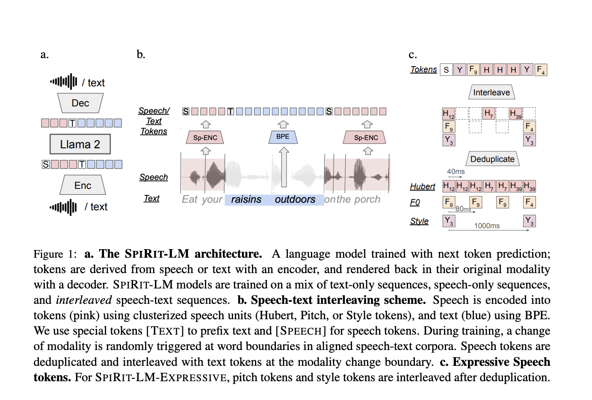

# Meta AI Releases Meta Spirit LM: An Open Source Multimodal Language Model Mixing Text and Speech

> One of the primary challenges in developing advanced text-to-speech (TTS) systems is the lack of expressivity when transcribing and generating speech. Traditionally, large language models (LLMs) used for building TTS pipelines convert speech to text using automatic speech recognition (ASR), process it using an LLM, and then convert the output back to speech via TTS. […]

One of the primary challenges in developing advanced text-to-speech (TTS) systems is the lack of expressivity when transcribing and generating speech. Traditionally, large language models (LLMs) used for building TTS pipelines convert speech to text using automatic speech recognition (ASR), process it using an LLM, and then convert the output back to speech via TTS. However, this approach often leads to a loss in expressive quality, as nuances such as tone, emotion, and pitch are stripped away during the ASR process. As a result, the synthesized speech tends to sound monotonic or unnatural, unable to adequately convey emotions like excitement, anger, or surprise.

Meta AI recently released Meta Spirit LM, an innovative open-source multimodal language model capable of freely mixing text and speech to address these limitations. Meta Spirit LM addresses the limitations of existing TTS systems by integrating both text and speech at the word level, allowing the model to cross modalities more seamlessly. This model was trained on both speech and text datasets using a word-level interleaving method, effectively capturing the expressive characteristics of spoken language while maintaining the strong semantic capabilities of text-based models.

Meta Spirit LM comes in two versions: Spirit LM Base and Spirit LM Expressive. Spirit LM Base uses phonetic tokens to encode speech, allowing for efficient representation of words, while Spirit LM Expressive goes a step further by incorporating pitch and style tokens to capture details of tone, such as excitement or anger, and generate expressive speech that reflects these emotions. This makes Meta Spirit LM a powerful tool for integrating text and speech modalities to produce coherent and natural-sounding speech.

Meta Spirit LM employs a unique word-level interleaving method to train on a mix of text and speech datasets. The model’s architecture is designed to freely transition between text and speech by encoding both modalities into a single set of tokens. Spirit LM Base utilizes phonetic tokens derived from speech representations, whereas Spirit LM Expressive incorporates pitch and style tokens that add layers of expressivity, such as tone or emotional nuances.

This architecture enables Meta Spirit LM to generate more natural and contextually rich speech. The model is capable of few-shot learning for tasks across modalities, such as automatic speech recognition (ASR), text-to-speech (TTS), and speech classification. This versatility positions Meta Spirit LM as a significant improvement over traditional multimodal AI models that typically operate in isolated domains. By learning representations that span text and speech, the model can also be used for complex applications, including expressive storytelling, emotion-driven virtual assistants, and enhanced interactive dialogue systems.

The importance of Meta Spirit LM lies in its ability to freely transition between speech and text, significantly enhancing the multimodal AI experience. The Expressive version of the model (Spirit LM Expressive) goes beyond standard speech models by allowing for the preservation of sentiment and tone across different modalities. Evaluation results on the Speech-Text Sentiment Preservation (STSP) benchmark indicate that Spirit LM Expressive effectively retains emotional intent, delivering more natural and emotive outputs than standard LLMs using ASR and TTS cascades.

Another key aspect of Meta Spirit LM’s contribution is its few-shot learning capabilities across different modalities. The model has demonstrated the ability to handle cross-modal tasks, such as converting text to expressive speech, with a competitive accuracy that showcases its generalized understanding across modalities. This makes Meta Spirit LM a significant leap forward in the development of conversational agents, accessible communication tools for those with disabilities, and educational technologies that require natural, expressive dialogue. The open-source nature of the model also invites the broader research community to explore and improve upon its multimodal capabilities.

Meta Spirit LM represents a groundbreaking step towards integrating speech and text modalities in AI systems without sacrificing expressivity. Meta Spirit LM Base and Spirit LM Expressive demonstrate a powerful combination of semantic understanding and expressive speech generation by using an interleaving approach to train on speech and text datasets. Whether it’s generating emotive virtual assistants or improving conversational AI, Meta Spirit LM’s open-source approach opens the door for more innovative and expressive uses of multimodal AI technology. Meta AI’s contributions to this model are expected to inspire further research and development at the intersection of text and speech, ultimately leading to more natural and capable AI communication systems.

---

Check out the** [GitHub ](https://github.com/facebookresearch/spiritlm)and [Details](https://ai.meta.com/blog/fair-news-segment-anything-2-1-meta-spirit-lm-layer-skip-salsa-lingua/?utm_source=twitter&utm_medium=organic_social&utm_content=thread&utm_campaign=fair).** All credit for this research goes to the researchers of this project. Also, don’t forget to follow us on **[Twitter](https://twitter.com/Marktechpost)** and join our **[Telegram Channel](https://pxl.to/at72b5j)** and [**LinkedIn Gr**](https://www.linkedin.com/groups/13668564/)[**oup**](https://www.linkedin.com/groups/13668564/). **If you like our work, you will love our**[** newsletter..**](https://marktechpost-newsletter.beehiiv.com/subscribe) Don’t Forget to join our **[50k+ ML SubReddit](https://www.reddit.com/r/machinelearningnews/)**.

**[[Upcoming Live Webinar- Oct 29, 2024] ](https://go.predibase.com/predibase-inference-engine-102924-lp?utm_medium=3rdparty&utm_source=marktechpost)****[The Best Platform for Serving Fine-Tuned Models: Predibase Inference Engine (Promoted)](https://go.predibase.com/predibase-inference-engine-102924-lp?utm_medium=3rdparty&utm_source=marktechpost)**
