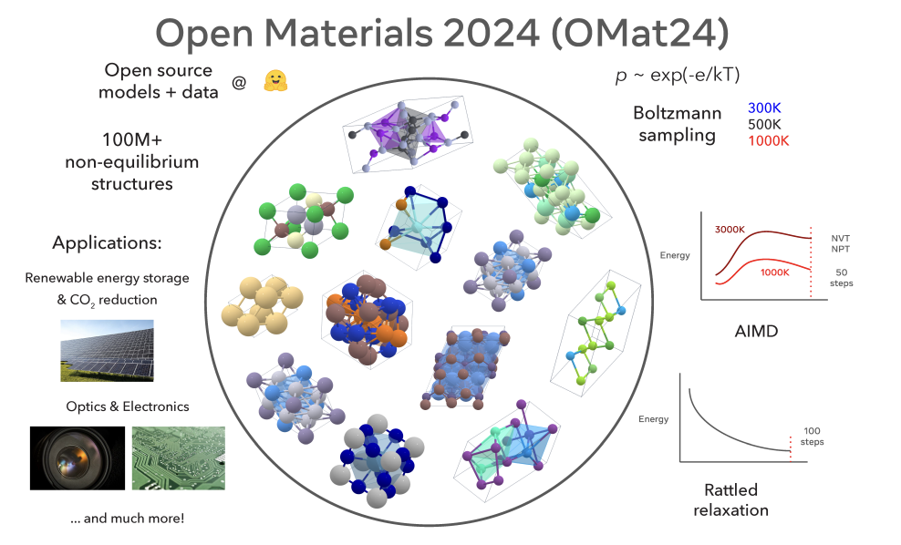

# Meta AI Releases Meta’s Open Materials 2024 (OMat24) Inorganic Materials Dataset and Models

> The discovery of new materials is crucial to addressing pressing global challenges such as climate change and advancements in next-generation computing. However, existing computational and experimental approaches face significant limitations in efficiently exploring the vast chemical space. While AI has emerged as a powerful tool for materials discovery, the lack of publicly available data and […]

The discovery of new materials is crucial to addressing pressing global challenges such as climate change and advancements in next-generation computing. However, existing computational and experimental approaches face significant limitations in efficiently exploring the vast chemical space. While AI has emerged as a powerful tool for materials discovery, the lack of publicly available data and open, pre-trained models has become a major bottleneck. Density Functional Theory (DFT) calculations, essential for studying material stability and properties, are computationally expensive, restricting their utility in exploring large material search spaces.

Researchers from Meta Fundamental AI Research (FAIR) have introduced the Open Materials 2024 (OMat24) dataset, which contains over 110 million DFT calculations, making it one of the largest publicly available datasets in this domain. They also present the EquiformerV2 model, a state-of-the-art Graph Neural Network (GNN) trained on the OMat24 dataset, achieving leading results on the Matbench Discovery leaderboard. The dataset includes diverse atomic configurations sampled from both equilibrium and non-equilibrium structures. The accompanying pre-trained models are capable of predicting properties such as ground-state stability and formation energies with high accuracy, providing a robust foundation for the broader research community.

The OMat24 dataset comprises over 118 million atomic structures labeled with energies, forces, and cell stresses. These structures were generated using techniques like Boltzmann sampling, ab-initio molecular dynamics (AIMD), and relaxation of rattled structures. The dataset emphasizes non-equilibrium structures, ensuring that models trained on OMat24 are well-suited for dynamic and far-from-equilibrium properties. The elemental composition of the dataset spans much of the periodic table, with a focus on inorganic bulk materials. EquiformerV2 models, trained on OMat24 and other datasets such as MPtraj and Alexandria, have demonstrated high effectiveness. For instance, models trained with additional denoising objectives exhibited improvements in predictive performance.

When evaluated on the Matbench Discovery benchmark, the EquiformerV2 model trained using OMat24 achieved an F1 score of 0.916 and a mean absolute error (MAE) of 20 meV/atom, setting new benchmarks for predicting material stability. These results were significantly better compared to other models in the same category, highlighting the advantage of pre-training on a large, diverse dataset like OMat24. Moreover, models trained solely on the MPtraj dataset, a relatively smaller dataset, also performed well due to effective data augmentation strategies, such as denoising non-equilibrium structures (DeNS). The detailed metrics showed that OMat24 pre-trained models outperform conventional models in terms of accuracy, particularly for non-equilibrium configurations.

The introduction of the OMat24 dataset and the corresponding models represents a significant leap forward in AI-assisted materials science. The models provide the capability to predict critical properties, such as formation energies, with a high degree of accuracy, making them highly useful for accelerating materials discovery. Importantly, this open-source release allows the research community to build upon these advances, further enhancing AI’s role in addressing global challenges through new material discoveries.

The OMat24 dataset and models, available on [Hugging Face](https://huggingface.co/datasets/fairchem/OMAT24), along with checkpoints for [pre-trained models](https://huggingface.co/fairchem/OMAT24), provide an essential resource for AI researchers in materials science. Meta’s FAIR Chem team has made these resources available under permissive licenses, enabling broader adoption and use. Additionally, an update from the OpenCatalyst team on X can be found [here](https://x.com/OpenCatalyst/status/1847323490547876324), providing more context on how the models are pushing the limits of material stability prediction.

---

Check out the** [Paper](https://arxiv.org/abs/2410.12771).** All credit for this research goes to the researchers of this project. Also, don’t forget to follow us on **[Twitter](https://twitter.com/Marktechpost)** and join our **[Telegram Channel](https://pxl.to/at72b5j)** and [**LinkedIn Gr**](https://www.linkedin.com/groups/13668564/)[**oup**](https://www.linkedin.com/groups/13668564/). **If you like our work, you will love our**[** newsletter..**](https://marktechpost-newsletter.beehiiv.com/subscribe) Don’t Forget to join our **[50k+ ML SubReddit](https://www.reddit.com/r/machinelearningnews/)**.

**[[Upcoming Live Webinar- Oct 29, 2024] ](https://go.predibase.com/predibase-inference-engine-102924-lp?utm_medium=3rdparty&utm_source=marktechpost)****[The Best Platform for Serving Fine-Tuned Models: Predibase Inference Engine (Promoted)](https://go.predibase.com/predibase-inference-engine-102924-lp?utm_medium=3rdparty&utm_source=marktechpost)**
