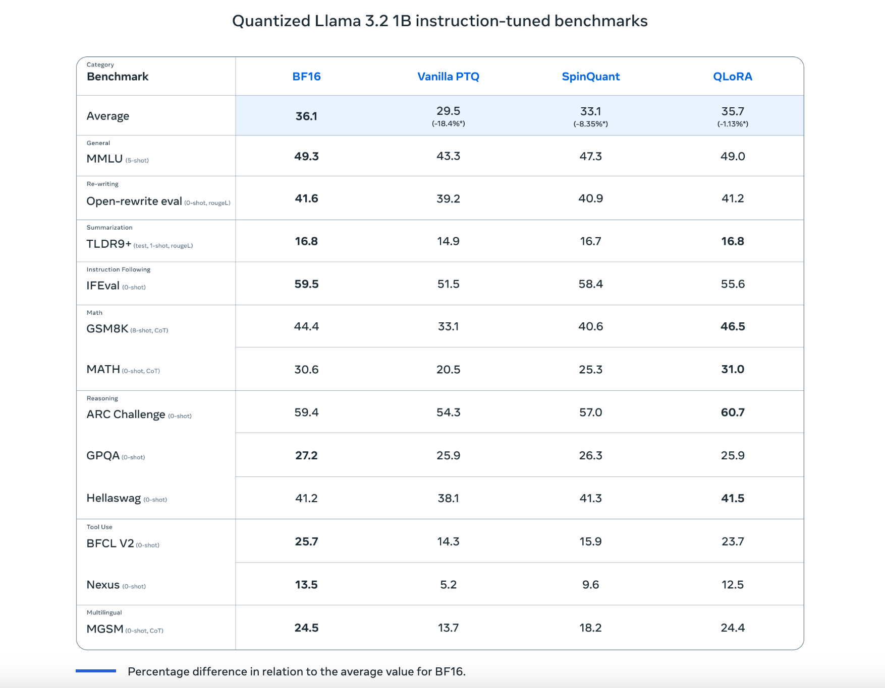

# Meta AI Releases New Quantized Versions of Llama 3.2 (1B & 3B): Delivering Up To 2-4x Increases in Inference Speed and 56% Reduction in Model Size

> The rapid growth of large language models (LLMs) has brought significant advancements across various sectors, but it has also presented considerable challenges. Models such as Llama 3 have made impressive strides in natural language understanding and generation, yet their size and computational requirements have often limited their practicality. High energy costs, lengthy training times, and […]

The rapid growth of large language models (LLMs) has brought significant advancements across various sectors, but it has also presented considerable challenges. Models such as Llama 3 have made impressive strides in natural language understanding and generation, yet their size and computational requirements have often limited their practicality. High energy costs, lengthy training times, and the need for expensive hardware are barriers to accessibility for many organizations and researchers. These challenges not only impact the environment but also widen the gap between tech giants and smaller entities trying to leverage AI capabilities.

**Meta AI’s Quantized Llama 3.2 Models** **(1B and 3B)**

Meta AI recently released Quantized Llama 3.2 Models (1B and 3B), a significant step forward in making state-of-the-art AI technology accessible to a broader range of users. These are the first lightweight quantized Llama models that are small and performant enough to run on many popular mobile devices. The research team employed two distinct techniques to quantize these models: Quantization-Aware Training (QAT) with LoRA adapters, which prioritizes accuracy, and SpinQuant, a state-of-the-art post-training quantization method that focuses on portability. Both versions are available for download as part of this release. These models represent a quantized version of the original Llama 3 series, designed to optimize computational efficiency and significantly reduce the hardware footprint required to operate them. By doing so, Meta AI aims to enhance the performance of large models while reducing the computational resources needed for deployment. This makes it feasible for both researchers and businesses to utilize powerful AI models without needing specialized, costly infrastructure, thereby democratizing access to cutting-edge AI technologies.

Meta AI is uniquely positioned to provide these quantized models due to its access to extensive compute resources, training data, comprehensive evaluations, and a focus on safety. These models apply the same quality and safety requirements as the original Llama 3 models while achieving a significant 2-4x speedup. They also achieved an average reduction of 56% in model size and a 41% average reduction in memory usage compared to the original BF16 format. These impressive optimizations are part of Meta’s efforts to make advanced AI more accessible while maintaining high performance and safety standards.

**Technical Details and Benefits**

The core of Quantized Llama 3.2 is based on quantization—a technique that reduces the precision of the model’s weights and activations from 32-bit floating-point numbers to lower-bit representations. Specifically, Meta AI utilizes 8-bit and even 4-bit quantization strategies, which allows the models to operate effectively with significantly reduced memory and computational power. This quantization approach retains the critical features and capabilities of Llama 3, such as its ability to perform advanced natural language processing (NLP) tasks, while making the models much more lightweight. The benefits are clear: Quantized Llama 3.2 can be run on less powerful hardware, such as consumer-grade GPUs and even CPUs, without a substantial loss in performance. This also makes these models more suitable for real-time applications, as lower computational requirements lead to faster inference times.

Inference using both quantization techniques is supported in the Llama Stack reference implementation via PyTorch’s ExecuTorch framework. Additionally, Meta AI has collaborated with industry-leading partners to make these models available on Qualcomm and MediaTek System on Chips (SoCs) with Arm CPUs. This partnership ensures that the models can be efficiently deployed on a wide range of devices, including popular mobile platforms, further extending the reach and impact of Llama 3.2.

**Importance and Early Results**

Quantized Llama 3.2 is important because it directly addresses the scalability issues associated with LLMs. By reducing the model size while maintaining a high level of performance, Meta AI has made these models more applicable for edge computing environments, where computational resources are limited. Early benchmarking results indicate that Quantized Llama 3.2 performs at approximately 95% of the full Llama 3 model’s effectiveness on key NLP benchmarks but with a reduction in memory usage by nearly 60%. This kind of efficiency is critical for businesses and researchers who want to implement AI without investing in high-end infrastructure. Additionally, the ability to deploy these models on commodity hardware aligns well with current trends in sustainable AI, reducing the environmental impact of training and deploying LLMs.

**Conclusion**

Meta AI’s release of Quantized Llama 3.2 marks a significant step forward in the evolution of efficient AI models. By focusing on quantization, Meta has provided a solution that balances performance with accessibility, enabling a wider audience to benefit from advanced NLP capabilities. These quantized models address the key barriers to the adoption of LLMs, such as cost, energy consumption, and infrastructure requirements. The broader implications of this technology could lead to more equitable access to AI, fostering innovation in areas previously out of reach for smaller enterprises and researchers. Meta AI’s effort to push the boundaries of efficient AI modeling highlights the growing emphasis on sustainable, inclusive AI development—a trend that is sure to shape the future of AI research and application.

---

Check out the** [Details](https://ai.meta.com/blog/meta-llama-quantized-lightweight-models/) and [Try the model here](https://www.llama.com/).** All credit for this research goes to the researchers of this project. Also, don’t forget to follow us on **[Twitter](https://twitter.com/Marktechpost)** and join our **[Telegram Channel](https://pxl.to/at72b5j)** and [**LinkedIn Gr**](https://www.linkedin.com/groups/13668564/)[**oup**](https://www.linkedin.com/groups/13668564/). **If you like our work, you will love our**[** newsletter..**](https://marktechpost-newsletter.beehiiv.com/subscribe) Don’t Forget to join our **[55k+ ML SubReddit](https://www.reddit.com/r/machinelearningnews/)**.

**[[Upcoming Live Webinar- Oct 29, 2024] ](https://go.predibase.com/predibase-inference-engine-102924-lp?utm_medium=3rdparty&utm_source=marktechpost)****[The Best Platform for Serving Fine-Tuned Models: Predibase Inference Engine (Promoted)](https://go.predibase.com/predibase-inference-engine-102924-lp?utm_medium=3rdparty&utm_source=marktechpost)**
