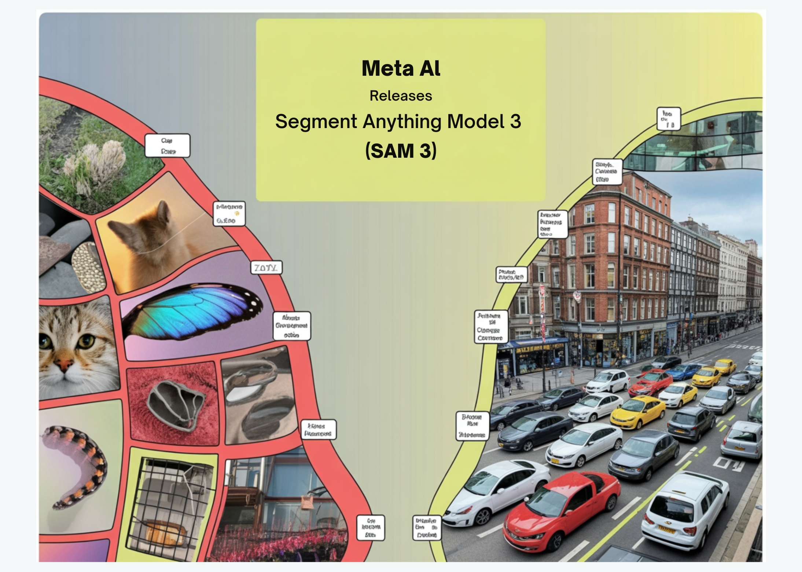

# Meta AI Releases Segment Anything Model 3 (SAM 3) for Promptable Concept Segmentation in Images and Videos

> How do you reliably find, segment and track every instance of any concept across large image and video collections using simple prompts? Meta AI Team has just released Meta Segment Anything Model 3, or SAM 3, an open-sourced unified foundation model for promptable segmentation in images and videos that operates directly on visual concepts instead […]

How do you reliably find, segment and track every instance of any concept across large image and video collections using simple prompts? Meta AI Team has just released Meta Segment Anything Model 3, or SAM 3, an open-sourced unified foundation model for promptable segmentation in images and videos that operates directly on visual concepts instead of only pixels. It detects, segments and tracks objects from both text prompts and visual prompts such as points, boxes and masks. Compared with SAM 2, SAM 3 can exhaustively find all instances of an open vocabulary concept, for example every ‘red baseball cap’ in a long video, using a single model.

### From Visual Prompts to Promptable Concept Segmentation

Earlier SAM models focused on interactive segmentation. A user clicked or drew a box and the model produced a single mask. That workflow did not scale to tasks where a system must find all instances of a concept across large image or video collections. SAM 3 formalizes Promptable Concept Segmentation (PCS), which takes concept prompts and returns instance masks and stable identities for every matching object in images and videos.

Concept prompts combine short noun phrases with visual exemplars. The model supports detailed phrases such as ‘yellow school bus’ or ‘player in red’ and can also use exemplar crops as positive or negative examples. Text prompts describe the concept, while exemplar crops help disambiguate fine grained visual differences. SAM 3 can also be used as a vision tool inside multimodal large language models that generate longer referring expressions and then call SAM 3 with distilled concept prompts.

*https://ai.meta.com/blog/segment-anything-model-3/?*

### Architecture, Presence Token and Tracking Design

The SAM 3 model has 848M parameters and consists of a detector and a tracker that share a single vision encoder. The detector is a DETR based architecture that is conditioned on three inputs, text prompts, geometric prompts and image exemplars. This separates the core image representation from the prompting interfaces and lets the same backbone serve many segmentation tasks.

A key change in SAM 3 is the presence token. This component predicts whether each candidate box or mask actually corresponds to the requested concept. It is especially important when the text prompts describe related entities, such as ‘a player in white’ and ‘a player in red’. The presence token reduces confusion between such prompts and improves open vocabulary precision. Recognition, meaning classifying a candidate as the concept, is decoupled from localization, meaning predicting the box and mask shape.

For video, SAM 3 reuses the transformer encoder decoder tracker from SAM 2, but connects it tightly to the new detector. The tracker propagates instance identities across frames and supports interactive refinement. The decoupled detector and tracker design minimizes task interference, scales cleanly with more data and concepts, and still exposes an interactive interface similar to earlier Segment Anything models for point based refinement.

*https://ai.meta.com/research/publications/sam-3-segment-anything-with-concepts/*

### SA-Co Dataset and Benchmark Suite

To train and evaluate Promptable Concept Segmentation (PCS), Meta introduces the SA-Co family of datasets and benchmarks. The SA-Co benchmark contains 270K unique concepts, which is more than 50 times the number of concepts in previous open vocabulary segmentation benchmarks. Every image or video is paired with noun phrases and dense instance masks for all objects that match each phrase, including negative prompts where no objects should match.

The associated data engine has automatically annotated more than 4M unique concepts, which makes SA-Co the largest high quality open vocabulary segmentation corpus as mentioned by Meta. The engine combines large ontologies with automated checks and supports hard negative mining, for example phrases that are visually similar but semantically distinct. This scale is essential for learning a model that can respond robustly to diverse text prompts in real world scenes.

### Image and Video Performance

On the SA-Co image benchmarks, SAM 3 reaches between 75 percent and 80 percent of human performance measured with the cgF1 metric. Competing systems such as OWLv2, DINO-X and Gemini 2.5 lag significantly behind. For example, on SA-Co Gold box detection, SAM 3 reports cgF1 of 55.7, while OWLv2 reaches 24.5, DINO-X reaches 22.5 and Gemini 2.5 reaches 14.4. This shows that a single unified model can outperform specialized detectors on open vocabulary segmentation.

In videos, SAM 3 is evaluated on SA-V, YT-Temporal 1B, SmartGlasses, LVVIS and BURST. On SA-V test it reaches 30.3 cgF1 and 58.0 pHOTA. On YT-Temporal 1B test it reaches 50.8 cgF1 and 69.9 pHOTA. On SmartGlasses test it reaches 36.4 cgF1 and 63.6 pHOTA, while on LVVIS and BURST it reaches 36.3 mAP and 44.5 HOTA respectively. These results confirm that a single architecture can handle both image PCS and long horizon video tracking.

*https://ai.meta.com/research/publications/sam-3-segment-anything-with-concepts/*

### SAM 3 as a Data-Centric Benchmarking Opportunity for Annotation Platforms

For data-centric platforms like Encord, SAM 3 is a natural next step after their existing integrations of SAM and SAM 2 for auto-labeling and video tracking, which already let customers auto-annotate more than 90 percent of images with high mask accuracy using foundation models inside Encord’s QA driven workflows. Similar platforms such as CVAT, SuperAnnotate and Picsellia are standardizing on Segment Anything style models for zero shot labeling, model in the loop annotation and MLOps pipelines. SAM 3’s promptable concept segmentation and unified image video tracking create clear editorial and benchmarking opportunities here, for example, quantifying label cost reductions and quality gains when Encord like stacks move from SAM 2 to SAM 3 in dense video datasets or multimodal settings.

### Key Takeaways

- SAM 3 unifies image and video segmentation into a single 848M parameter foundation model that supports text prompts, exemplars, points and boxes for Promptable Concept Segmentation.

- The SA-Co data engine and benchmark introduce about 270K evaluated concepts and over 4M automatically annotated concepts, making SAM 3’s training and evaluation stack one of the largest open vocabulary segmentation resources available.

- SAM 3 substantially outperforms prior open vocabulary systems, reaching around 75 to 80 percent of human cgF1 on SA Co and more than doubling OWLv2 and DINO-X on key SA-Co Gold detection metrics.

- The architecture decouples a DETR based detector from a SAM 2 style video tracker with a presence head, enabling stable instance tracking across long videos while keeping interactive SAM style refinement.

### Editorial Comments

SAM 3 advances Segment Anything from Promptable Visual Segmentation to Promptable Concept Segmentation in a single 848M parameter model that unifies image and video. It leverages the SA-Co benchmark with about 270K evaluated concepts and over 4M automatically annotated concepts to approximate 75 to 80 percent of human performance on cgF1. The decoupled DETR based detector and SAM 2 style tracker with a presence head makes SAM 3 a practical vision foundation model for agents and products. Overall, SAM 3 is now a reference point for open vocabulary segmentation at production scale.

---

Check out the[ ](https://arxiv.org/pdf/2511.12609)**[Paper](https://ai.meta.com/research/publications/sam-3-segment-anything-with-concepts/), [Repo](https://github.com/facebookresearch/sam3) and [Model Weights](https://huggingface.co/facebook/sam3)**. Feel free to check out our **[GitHub Page for Tutorials, Codes and Notebooks](https://github.com/Marktechpost/AI-Tutorial-Codes-Included)**. Also, feel free to follow us on **[Twitter](https://x.com/intent/follow?screen_name=marktechpost)** and don’t forget to join our **[100k+ ML SubReddit](https://www.reddit.com/r/machinelearningnews/)** and Subscribe to **[our Newsletter](https://www.aidevsignals.com/)**. Wait! are you on telegram? **[now you can join us on telegram as well.](https://t.me/machinelearningresearchnews)**
