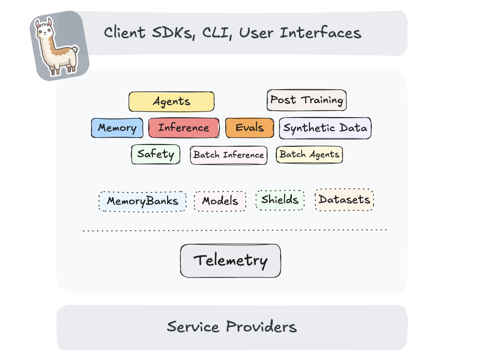

# Meta AI Releases the First Stable Version of Llama Stack: A Unified Platform Transforming Generative AI Development with Backward Compatibility, Safety, and Seamless Multi-Environment Deployment

> As the adoption of generative AI continues to expand, developers face mounting challenges in building and deploying robust applications. The complexity of managing diverse infrastructure, ensuring compliance and safety, and maintaining flexibility in provider choices has created a pressing need for unified solutions. Traditional approaches often involve tight coupling with specific platforms, significant rework during […]

As the adoption of generative [AI](https://www.marktechpost.com/2025/01/13/what-is-artificial-intelligence-ai-2/) continues to expand, developers face mounting challenges in building and deploying robust applications. The complexity of managing diverse infrastructure, ensuring compliance and safety, and maintaining flexibility in provider choices has created a pressing need for unified solutions. Traditional approaches often involve tight coupling with specific platforms, significant rework during deployment transitions, and a lack of standardized tools for key capabilities like retrieval, safety, and monitoring.

The launch of [**_Llama Stack 0.1.0_**](https://github.com/meta-llama/llama-stack), the platform’s first stable release, designed to simplify the complexities of building and deploying AI solutions, introduces a unified framework with features like streamlined upgrades and automated provider verification. These capabilities empower developers to seamlessly transition from development to production, ensuring reliability and scalability at every stage. At the center of Llama Stack’s design is its commitment to providing a consistent and versatile developer experience. The platform offers a one-stop solution for building production-grade applications, supporting APIs covering inference, Retrieval-Augmented Generation ([RAG](https://www.marktechpost.com/2024/11/25/retrieval-augmented-generation-rag-deep-dive-into-25-different-types-of-rag/)), agents, safety, and telemetry. Its ability to operate uniformly across local, cloud, and edge environments makes it a standout in AI development.

*[**Image Source**](https://github.com/meta-llama/llama-stack)*

### Key Features of Llama Stack 0.1.0

**The stable release introduces several features that simplify AI application development:**

- Backward-Compatible Upgrades: Developers can integrate future API versions without modifying their existing implementations, preserving functionality and reducing the risk of disruptions.

- Automated Provider Verification: Llama Stack eliminates the guesswork in onboarding new services by automating compatibility checks for supported providers, enabling faster and error-free integration.

These features and the platform’s modular architecture set the stage for creating scalable and production-ready applications.

### Building Production-Grade Applications

One of Llama Stack’s core strengths is its ability to simplify the transition from development to production. The platform offers prepackaged distributions that allow developers to deploy applications in diverse and complex environments, such as local systems, GPU-accelerated cloud setups, or edge devices. This versatility ensures that applications can be scaled up or down based on specific needs. Llama Stack provides essential tools like safety guardrails, telemetry, monitoring systems, and robust evaluation capabilities in production environments. These features enable developers to maintain high performance and security standards while delivering reliable AI solutions.

*[**Image Source**](https://github.com/meta-llama/llama-stack)*

### Addressing Industry Challenges

The platform was designed to overcome three major hurdles in AI application development:

- Infrastructure Complexity: Managing large-scale models across different environments can be challenging. Llama Stack’s uniform APIs abstract infrastructure details, allowing developers to focus on their application logic.

- Essential Capabilities: Beyond inference, modern AI applications require multi-step workflows, safety features, and evaluation tools. Llama Stack integrates these capabilities seamlessly, ensuring that applications are robust and compliant.

- Flexibility and Choice: By decoupling applications from specific providers, Llama Stack enables developers to mix and match tools like NVIDIA NIM, AWS Bedrock, FAISS, and Weaviate without vendor lock-in.

### A Developer-Centric Ecosystem

Llama Stack offers SDKs for Python, Node.js, Swift, and Kotlin to support developers, catering to various programming preferences. These SDKs have tools and templates to streamline the integration process, reducing development time. The platform’s Playground is an experimental environment where developers can interactively explore Llama Stack’s capabilities. With features like:

- Interactive Demos: End-to-end application workflows to guide development.

- Evaluation Tools: Predefined scoring configurations to benchmark model performance.

The Playground ensures that developers of all levels can quickly get up to speed with Llama Stack’s features.

### Conclusion

The stable release of [**_Llama Stack 0.1.0_**](https://github.com/meta-llama/llama-stack) delivers a robust framework for creating, deploying, and managing generative AI applications. By addressing critical challenges like infrastructure complexity, safety, and vendor independence, the platform empowers developers to focus on innovation. With its user-friendly tools, comprehensive ecosystem, and vision for future enhancements, Llama Stack is poised to become an essential ally for developers navigating the generative AI landscape. Also, Llama Stack is set to expand its API offerings in upcoming releases. Planned enhancements include batch processing for inference and agents, synthetic data generation, and post-training tools.

---

Check out **_the [GitHub Page](https://github.com/meta-llama/llama-stack)._** All credit for this research goes to the researchers of this project. Also, don’t forget to follow us on **[Twitter](https://x.com/intent/follow?screen_name=marktechpost)** and join our **[Telegram Channel](https://arxiv.org/abs/2406.09406)** and [**LinkedIn Gr**](https://www.linkedin.com/groups/13668564/)[**oup**](https://www.linkedin.com/groups/13668564/). Don’t Forget to join our **[70k+ ML SubReddit](https://www.reddit.com/r/machinelearningnews/)**.

**🚨[ [Recommended Read] Nebius AI Studio expands with vision models, new language models, embeddings and LoRA](https://nebius.com/blog/posts/studio-embeddings-vision-and-language-models?utm_medium=newsletter&utm_source=marktechpost&utm_campaign=embedding-post-ai-studio) **_(Promoted)_
