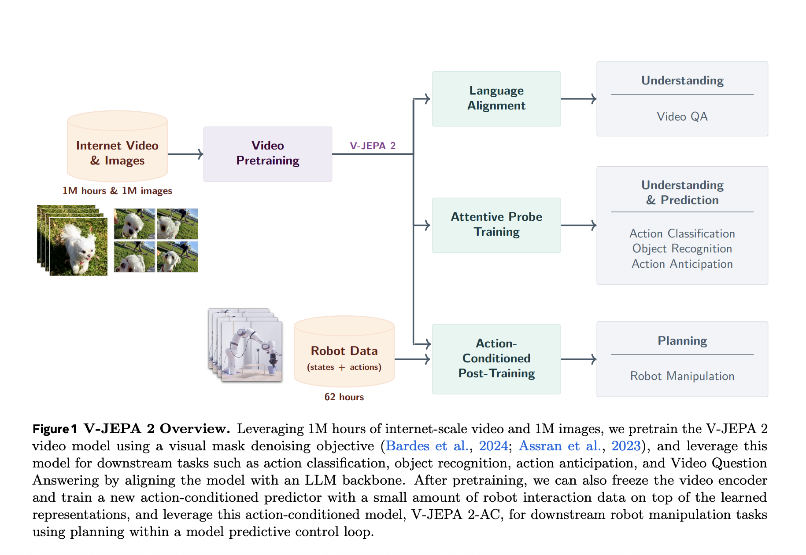

# Meta AI Releases V-JEPA 2: Open-Source Self-Supervised World Models for Understanding, Prediction, and Planning

> Meta AI has introduced V-JEPA 2, a scalable open-source world model designed to learn from video at internet scale and enable robust visual understanding, future state prediction, and zero-shot planning. Building upon the joint-embedding predictive architecture (JEPA), V-JEPA 2 demonstrates how self-supervised learning from passive internet video, combined with minimal robot interaction data, can yield […]

Meta AI has introduced V-JEPA 2, a scalable open-source world model designed to learn from video at internet scale and enable robust visual understanding, future state prediction, and zero-shot planning. Building upon the joint-embedding predictive architecture (JEPA), V-JEPA 2 demonstrates how self-supervised learning from passive internet video, combined with minimal robot interaction data, can yield a modular foundation for intelligent physical agents.

### Scalable Self-Supervised Pretraining from 1M Hours of Video

V-JEPA 2 is pretrained on over 1 million hours of internet-scale video combined with 1 million images. Using a visual mask denoising objective, the model learns to reconstruct masked spatiotemporal patches in a latent representation space. This approach avoids the inefficiencies of pixel-level prediction by focusing on predictable scene dynamics while disregarding irrelevant noise.

**To scale JEPA pretraining to this level, Meta researchers introduced four key techniques:**

- **Data scaling:** Constructed a 22M-sample dataset (VideoMix22M) from public sources like SSv2, Kinetics, HowTo100M, YT-Temporal-1B, and ImageNet.

- **Model scaling:** Expanded the encoder capacity to over 1B parameters using ViT-g.

- **Training schedule:** Adopted a progressive resolution strategy and extended pretraining to 252K iterations.

- **Spatial-temporal augmentation:** Trained on progressively longer and higher-resolution clips, reaching 64 frames at 384×384 resolution.

These design choices led to an 88.2% average accuracy across six benchmark tasks—including SSv2, Diving-48, Jester, Kinetics, COIN, and ImageNet—surpassing previous baselines.

### Understanding via Masked Representation Learning

V-JEPA 2 exhibits strong motion understanding capabilities. On the Something-Something v2 benchmark, it achieves 77.3% top-1 accuracy, outperforming models like InternVideo and VideoMAEv2. For appearance understanding, it remains competitive with state-of-the-art image-text pretraining models like DINOv2 and PEcoreG.

The encoder’s representations were evaluated using attentive probes, verifying that self-supervised learning alone can yield transferable and domain-agnostic visual features applicable across diverse classification tasks.

### Temporal Reasoning via Video Question Answering

To assess temporal reasoning, the V-JEPA 2 encoder is aligned with a multimodal [large language model](https://www.marktechpost.com/2025/01/11/what-are-large-language-model-llms/) and evaluated on multiple video question-answering tasks. Despite lacking language supervision during pretraining, the model achieves:

- 84.0% on PerceptionTest

- 76.9% on TempCompass

- 44.5% on MVP

- 36.7% on TemporalBench

- 40.3% on TOMATO

These results challenge the assumption that visual-language alignment requires co-training from the start, demonstrating that a pretrained video encoder can be aligned post hoc with strong generalization.

### V-JEPA 2-AC: Learning Latent World Models for Robotic Planning

A key innovation in this release is V-JEPA 2-AC, an action-conditioned variant of the pretrained encoder. Fine-tuned using only 62 hours of unlabeled robot video from the Droid dataset, V-JEPA 2-AC learns to predict future video embeddings conditioned on robot actions and poses. The architecture is a 300M parameter transformer with block-causal attention, trained using a teacher-forcing and rollout objective.

This allows zero-shot planning through model-predictive control. The model infers action sequences by minimizing the distance between imagined future states and visual goals using the Cross-Entropy Method (CEM). It achieves high success in tasks such as reaching, grasping, and pick-and-place on unseen robot arms in different labs—without any reward supervision or additional data collection.

### Benchmarks: Robust Performance and Planning Efficiency

Compared to baselines like Octo (behavior cloning) and Cosmos (latent diffusion world models), V-JEPA 2-AC:

- Executes plans in ~16 seconds per step (versus 4 minutes for Cosmos).

- Reaches a 100% success rate on reach tasks.

- Outperforms others in grasp and manipulation tasks across object types.

Notably, it operates using a monocular RGB camera without calibration or environment-specific fine-tuning, reinforcing the generalization capability of the learned world model.

### Conclusion

Meta’s V-JEPA 2 represents a significant advancement in scalable self-supervised learning for physical intelligence. By decoupling observation learning from action conditioning and leveraging large-scale passive video, V-JEPA 2 demonstrates that general-purpose visual representations can be harnessed for both perception and control in the real world.

---

Check out the** [Paper](https://arxiv.org/abs/2506.09985)**, **[Models on Hugging Face](https://huggingface.co/collections/facebook/v-jepa-2-6841bad8413014e185b497a6)** and **[GitHub Page](https://github.com/facebookresearch/vjepa2?tab=readme-ov-file)_._** All credit for this research goes to the researchers of this project. Also, feel free to follow us on **[Twitter](https://x.com/intent/follow?screen_name=marktechpost)** and don’t forget to join our **[99k+ ML SubReddit](https://www.reddit.com/r/machinelearningnews/)** and Subscribe to **[our Newsletter](https://www.airesearchinsights.com/subscribe)**.
