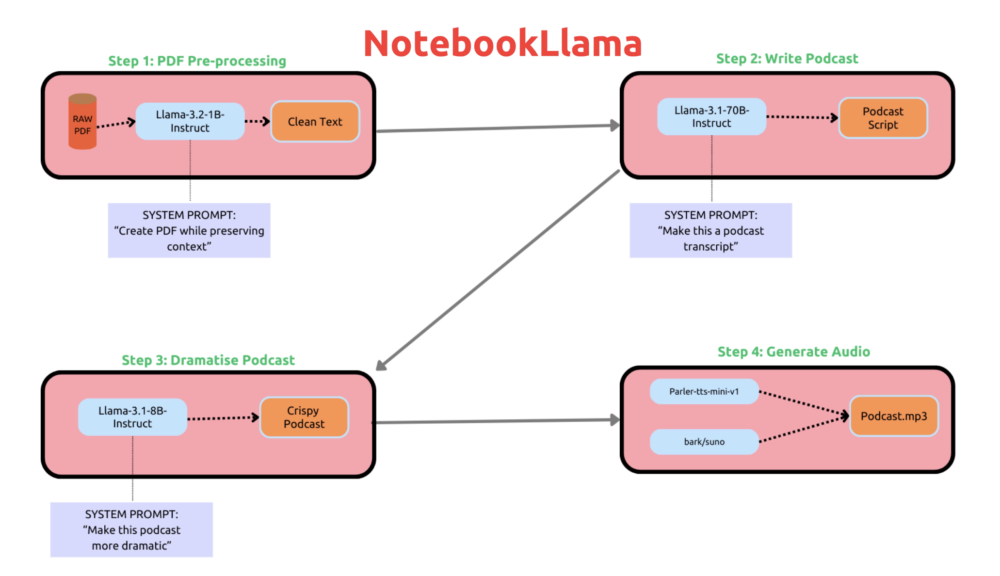

# Meta AI Silently Releases NotebookLlama: An Open Version of Google’s NotebookLM

> Meta has recently released NotebookLlama, an open version of Google’s NotebookLM that empowers researchers and developers with accessible, scalable solutions for interactive data analysis and documentation. NotebookLlama integrates large language models directly into an open-source notebook interface, similar to Jupyter or Google Colab, allowing users to interact with a trained LLM as they would with […]

Meta has recently released NotebookLlama, an open version of Google’s NotebookLM that empowers researchers and developers with accessible, scalable solutions for interactive data analysis and documentation. NotebookLlama integrates large language models directly into an open-source notebook interface, similar to Jupyter or Google Colab, allowing users to interact with a trained LLM as they would with any other cell in a notebook environment. By providing tools to enhance both code writing and documentation, Meta’s NotebookLlama supports a community-driven model that emphasizes transparency, openness, and flexibility—qualities often lacking in proprietary AI-driven software.

### Technical Details and Benefits

NotebookLlama is powered by a highly optimized version of Meta’s Llama language models, tailored for interactive document and code generation. The model employs parameter-efficient fine-tuning, enabling developers to create personalized models suited to their specific project needs. Meta has also provided the foundational model and a set of recipes for deploying NotebookLlama across various environments, whether on local servers or cloud infrastructure, significantly lowering entry barriers for smaller institutions and individual users. NotebookLlama supports multi-turn conversations, allowing for in-depth interaction between the user and the AI—ideal for debugging, code optimization, and comprehensive explanations of both code and complex concepts.

### Significance of NotebookLlama

NotebookLlama’s importance extends beyond its open-source nature; it is a crucial step toward creating accessible, community-driven alternatives in a space dominated by major corporations. Google’s NotebookLM, while powerful, is restricted to limited users and lacks advanced customization options that many users seek, particularly for deploying models on their own infrastructure. In contrast, NotebookLlama offers full control over data usage and model interaction. Early reports from beta testers have shown promising results, especially in data science education and software development. In tests involving coding tasks and explanatory documentation, NotebookLlama demonstrated impressive results, producing code and documentation on par with, or even superior to, closed models. A community-driven benchmark on Reddit highlights NotebookLlama’s effectiveness in generating insightful commentary for complex Python scripts, achieving over 90% accuracy in generating meaningful docstrings.

### Conclusion

Meta’s NotebookLlama is a significant step forward in the world of open-source AI tools. By releasing an open version of Google’s NotebookLM, Meta is democratizing access to AI-powered documentation and coding. NotebookLlama is vital for those needing flexible, secure, and customizable tools for interactive analysis, bridging the gap between proprietary AI and open access. Its open-source nature fosters collaboration and lays the groundwork for future innovations across diverse fields. With NotebookLlama, the AI community gains a more inclusive and adaptable tool, empowering users to harness AI without limitations.

---

Check out the** [GitHub Repo](https://github.com/meta-llama/llama-recipes/tree/main/recipes/quickstart/NotebookLlama).** All credit for this research goes to the researchers of this project. Also, don’t forget to follow us on **[Twitter](https://twitter.com/Marktechpost)** and join our **[Telegram Channel](https://pxl.to/at72b5j)** and [**LinkedIn Gr**](https://www.linkedin.com/groups/13668564/)[**oup**](https://www.linkedin.com/groups/13668564/). **If you like our work, you will love our**[** newsletter..**](https://marktechpost-newsletter.beehiiv.com/subscribe) Don’t Forget to join our **[55k+ ML SubReddit](https://www.reddit.com/r/machinelearningnews/)**.

**[[Upcoming Live Webinar- Oct 29, 2024] ](https://go.predibase.com/predibase-inference-engine-102924-lp?utm_medium=3rdparty&utm_source=marktechpost)****[The Best Platform for Serving Fine-Tuned Models: Predibase Inference Engine (Promoted)](https://go.predibase.com/predibase-inference-engine-102924-lp?utm_medium=3rdparty&utm_source=marktechpost)**
