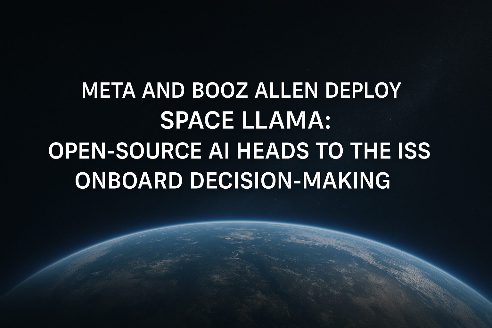

# Meta and Booz Allen Deploy Space Llama: Open-Source AI Heads to the ISS for Onboard Decision-Making

> In a significant step toward enabling autonomous AI systems in space, Meta and Booz Allen Hamilton have announced the deployment of Space Llama, a customized instance of Meta’s open-source large language model, Llama 3.2, aboard the International Space Station (ISS) U.S. National Laboratory. This initiative marks one of the first practical integrations of an LLM […]

In a significant step toward enabling autonomous AI systems in space, Meta and Booz Allen Hamilton have announced the deployment of **Space Llama**, a customized instance of Meta’s open-source [large language model](https://www.marktechpost.com/2025/01/11/what-are-large-language-model-llms/), Llama 3.2, aboard the International Space Station (ISS) U.S. National Laboratory. This initiative marks one of the first practical integrations of an LLM in a remote, bandwidth-limited, space-based environment.

### Addressing Disconnection and Autonomy Challenges

Unlike terrestrial applications, AI systems deployed in orbit face strict constraints—limited compute resources, constrained bandwidth, and high-latency communication links with ground stations. Space Llama has been designed to function entirely offline, allowing astronauts to access technical assistance, documentation, and maintenance protocols without requiring live support from mission control.

To address these constraints, the AI model had to be optimized for onboard deployment, incorporating the ability to reason over mission-specific queries, retrieve context from local data stores, and interact with astronauts in natural language—all without internet connectivity.

### Technical Framework and Integration Stack

The deployment leverages a combination of commercially available and mission-adapted technologies:

- **Llama 3.2**: Meta’s latest open-source LLM serves as the foundation, fine-tuned for contextual understanding and general reasoning tasks in edge environments. Its open architecture enables modular adaptation for aerospace-grade applications.

- **A2E2™ (AI for Edge Environments)**: Booz Allen’s AI framework provides containerized deployment and modular orchestration tailored to constrained environments like the ISS. It abstracts complexity in model serving and resource allocation across diverse compute layers.

- **HPE Spaceborne Computer-2**: This edge computing platform, developed by Hewlett Packard Enterprise, provides reliable high-performance processing hardware for space. It supports real-time inference workloads and model updates when necessary.

- **NVIDIA CUDA-capable GPUs**: These enable the accelerated execution of transformer-based inference tasks while staying within the ISS’s strict power and thermal budgets.

This integrated stack ensures that the model operates within the limits of orbital infrastructure, delivering utility without compromising reliability.

### Open-Source Strategy for Aerospace AI

The selection of an open-source model like Llama 3.2 aligns with growing momentum around transparency and adaptability in mission-critical AI. The benefits include:

- **Modifiability**: Engineers can tailor the model to meet specific operational requirements, such as natural language understanding in mission terminology or handling multi-modal astronaut inputs.

- **Data Sovereignty**: With all inference running locally, sensitive data never needs to leave the ISS, ensuring compliance with NASA and partner agency privacy standards.

- **Resource Optimization**: Open access to the model’s architecture allows for fine-grained control over memory and compute use—critical for environments where system uptime and resilience are prioritized.

- **Community-Based Validation**: Using a widely studied open-source model promotes reproducibility, transparency in behavior, and better testing under mission simulation conditions.

### Toward Long-Duration and Autonomous Missions

Space Llama is not just a research demonstration—it lays the groundwork for embedding AI systems into longer-term missions. In future scenarios like lunar outposts or deep-space habitats, where round-trip communication latency with Earth spans minutes or hours, onboard intelligent systems must assist with diagnostics, operations planning, and real-time problem-solving.

Furthermore, the modular nature of Booz Allen’s A2E2 platform opens up the potential for expanding the use of LLMs to non-space environments with similar constraints—such as polar research stations, underwater facilities, or forward operating bases in military applications.

### Conclusion

The Space Llama initiative represents a methodical advancement in deploying AI systems to operational environments beyond Earth. By combining Meta’s open-source LLMs with Booz Allen’s edge deployment expertise and proven space computing hardware, the collaboration demonstrates a viable approach to AI autonomy in space.

Rather than aiming for generalized intelligence, the model is engineered for bounded, reliable utility in mission-relevant contexts—an important distinction in environments where robustness and interpretability take precedence over novelty.

As space systems become more software-defined and AI-assisted, efforts like Space Llama will serve as reference points for future AI deployments in autonomous exploration and off-Earth habitation.

---

Check out the **[Details here](https://about.fb.com/news/2025/04/space-llama-metas-open-source-ai-model-heading-into-orbit/)**. Also, don’t forget to follow us on **[Twitter](https://x.com/intent/follow?screen_name=marktechpost)** and join our **[Telegram Channel](https://arxiv.org/abs/2406.09406)** and [**LinkedIn Gr**](https://www.linkedin.com/groups/13668564/)[**oup**](https://www.linkedin.com/groups/13668564/). Don’t Forget to join our **[90k+ ML SubReddit](https://www.reddit.com/r/machinelearningnews/)**.

[**🔥 [Register Now] miniCON Virtual Conference on AGENTIC AI: FREE REGISTRATION + Certificate of Attendance + 4 Hour Short Event (May 21, 9 am- 1 pm PST) + Hands on Workshop**](https://minicon.marktechpost.com/)
