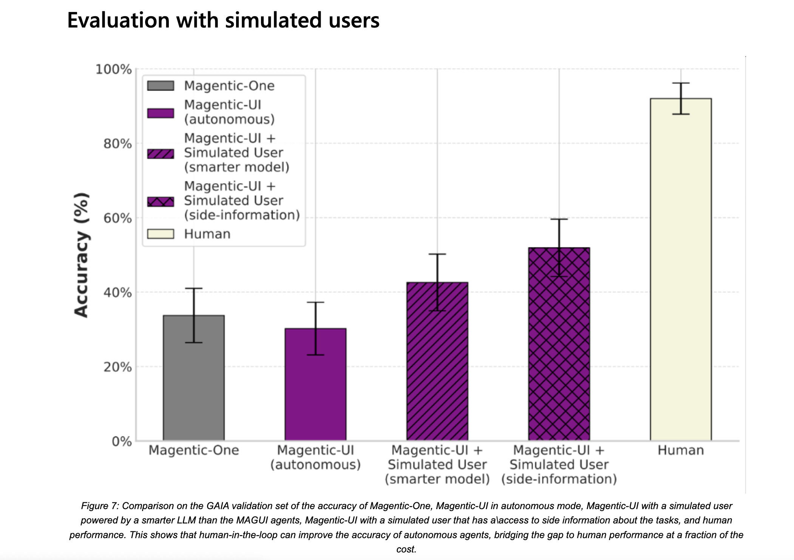

# Microsoft AI Introduces Magentic-UI: An Open-Source Agent Prototype that Works with People to Complete Complex Tasks that Require Multi-Step Planning and Browser Use

> Modern web usage spans many digital interactions, from filling out forms and managing accounts to executing data queries and navigating complex dashboards. Despite the web being deeply intertwined with productivity and work processes, many of these actions still demand repetitive human input. This scenario is especially true for environments that require detailed instructions or decisions […]

Modern web usage spans many digital interactions, from filling out forms and managing accounts to executing data queries and navigating complex dashboards. Despite the web being deeply intertwined with productivity and work processes, many of these actions still demand repetitive human input. This scenario is especially true for environments that require detailed instructions or decisions beyond mere searches. While artificial intelligence agents have emerged to support task automation, many prioritize complete autonomy. However, this frequently sidelines user control, leading to outcomes that diverge from user expectations. The next leap forward in productivity-enhancing AI involves agents designed not to replace users but to collaborate with them, blending automation with continuous, real-time human input for more accurate and trusted results.

A key challenge in deploying AI agents for web-based tasks is the lack of visibility and intervention. Users often cannot see what steps the agent is planning, how it intends to execute them, or when it might go off track. In scenarios that involve complex decisions, like entering payment information, interpreting dynamic content, or running scripts, users need mechanisms to step in and redirect the process. Without these capabilities, systems risk making irreversible mistakes or misaligning with user goals. This highlights a significant limitation in current AI automation: the absence of structured human-in-the-loop design, where users dynamically guide and supervise agent behavior, without acting merely as spectators.

Previous solutions approached web automation through rule-based scripts or general-purpose AI agents driven by language models. These systems interpret user commands and attempt to carry them out autonomously. However, they often execute plans without surfacing intermediate decisions or allowing meaningful user feedback. A few offer command-line-like interactions, which are inaccessible to the average user and rarely include layered safety mechanisms. Moreover, minimal support for task reuse or performance learning across sessions limits long-term value. These systems also tend to lack adaptability when the context changes mid-task or errors must be corrected collaboratively.

Researchers at Microsoft introduced [**Magentic-UI**](https://github.com/microsoft/Magentic-UI), an open-source prototype that emphasizes collaborative human-AI interaction for web-based tasks. Unlike previous systems aiming for full independence, this tool promotes real-time co-planning, execution sharing, and step-by-step user oversight. Magentic-UI is built on Microsoft’s AutoGen framework and is tightly integrated with Azure AI Foundry Labs. It’s a direct evolution from the previously introduced Magentic-One system. With its launch, Microsoft Research aims to address fundamental questions about human oversight, safety mechanisms, and learning in agentic systems by offering an experimental platform for researchers and developers.

Magentic-UI includes four core interactive features: co-planning, co-tasking, action guards, and plan learning. Co-planning lets users view and adjust the agent’s proposed steps before execution begins, offering full control over what the AI will do. Co-tasking enables real-time visibility during operation, letting users pause, edit, or take over specific actions. Action guards are customizable confirmations for high-risk activities like closing browser tabs or clicking “submit” on a form, actions that could have unintended consequences. Plan learning allows Magentic-UI to remember and refine steps for future tasks, improving over time through experience. These capabilities are supported by a modular team of agents: the Orchestrator leads planning and decision-making, WebSurfer handles browser interactions, Coder executes code in a sandbox, and FileSurfer interprets files and data.

*[**Image Source**](https://www.microsoft.com/en-us/research/blog/magentic-ui-an-experimental-human-centered-web-agent/)*

Technically, when a user submits a request, the Orchestrator agent generates a step-by-step plan. Users can modify it through a graphical interface by editing, deleting, or regenerating steps. Once finalized, the plan is delegated across specialized agents. Each agent reports after performing its task, and the Orchestrator determines whether to proceed, repeat, or request user feedback. All actions are visible on the interface, and users can halt execution at any point. This architecture not only ensures transparency but also allows for adaptive task flows. For example, if a step fails due to a broken link, the Orchestrator can dynamically adjust the plan with user consent.

In controlled evaluations using the GAIA benchmark, which includes complex tasks like navigating the web and interpreting documents, Magentic-UI’s performance was rigorously tested. GAIA consists of 162 tasks requiring multimodal understanding. When operating autonomously, Magentic-UI completed 30.3% of tasks successfully. However, when supported by a simulated user with access to additional task information, success jumped to 51.9%, a 71% improvement. Another configuration using a smarter simulated user improved the rate to 42.6%. Interestingly, Magentic-UI requested help in only 10% of the enhanced tasks and asked for final answers in 18%. In those cases, the system asked for help an average of just 1.1 times. This shows how minimal but well-timed human intervention significantly boosts task completion without high oversight costs.

*[**Image Source**](https://www.microsoft.com/en-us/research/blog/magentic-ui-an-experimental-human-centered-web-agent/)*

Magentic-UI also features a “Saved Plans” gallery that displays strategies reused from past tasks. Retrieval from this gallery is approximately three times faster than generating a new plan. A predictive mechanism surfaces these plans while users type, streamlining repeated tasks like flight searches or form submissions. Safety mechanisms are robust. Every browser or code action runs inside a Docker container, ensuring that no user credentials are exposed. Users can define allow-lists for site access, and every action can be gated behind approval prompts. A red-team evaluation further tested it against phishing attacks and prompt injections, where the system either sought user clarification or blocked execution, reinforcing its layered defense model.

*[**Image Source**](https://www.microsoft.com/en-us/research/blog/magentic-ui-an-experimental-human-centered-web-agent/)*

**Several Key Takeaways from the Research on Magentic-UI:**

- With simple human input, magentic-UI boosts task completion by 71% (from 30.3% to 51.9%).

- Requests user help in only 10% of enhanced tasks and averages 1.1 help requests per task.

- It features a co-planning UI that allows full user control before execution.

- Executes tasks via four modular agents: Orchestrator, WebSurfer, Coder, and FileSurfer.

- Stores and reuses plans, reducing repeat task latency by up to 3x.

- All actions are sandboxed via Docker containers; no user credentials are ever exposed.

- Passed red-team evaluations against phishing and injection threats.

- Supports fully user-configurable “action guards” for high-risk steps.

- Fully open-source and integrated with Azure AI Foundry Labs.

In conclusion, Magentic-UI addresses a long-standing problem in AI automation, the lack of transparency and controllability. Rather than replacing users, it enables them to remain central to the process. The system performs well even with minimal help and learns to improve each time. The modular design, robust safeguards, and detailed interaction model create a strong foundation for future intelligent assistants.

---

**Check out the [Technical details](https://www.microsoft.com/en-us/research/blog/magentic-ui-an-experimental-human-centered-web-agent/) and [GitHub Page](https://github.com/microsoft/Magentic-UI)_._** All credit for this research goes to the researchers of this project. Also, feel free to follow us on **[Twitter](https://x.com/intent/follow?screen_name=marktechpost)** and don’t forget to join our **[95k+ ML SubReddit](https://www.reddit.com/r/machinelearningnews/)** and Subscribe to **[our Newsletter](https://www.airesearchinsights.com/subscribe)**.
