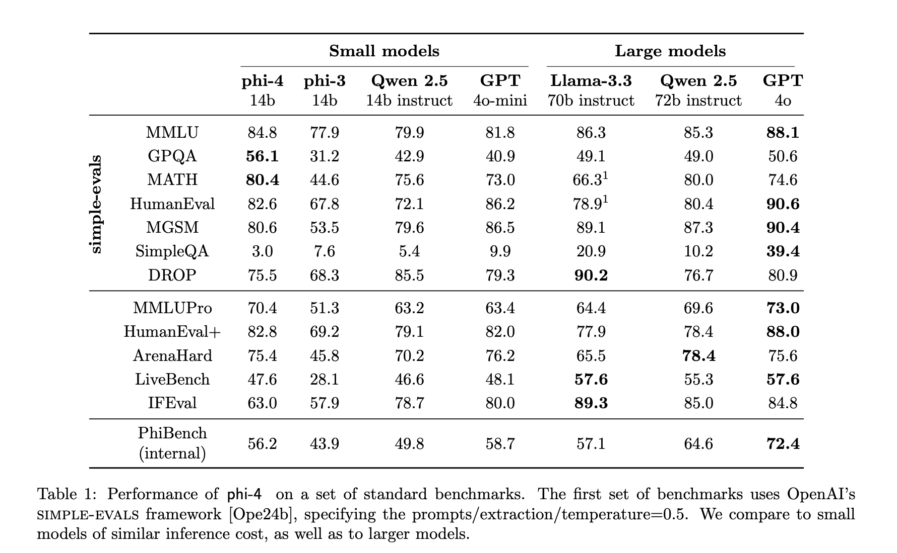

# Microsoft AI Just Released Phi-4: A Small Language Model Available on Hugging Face Under the MIT License

> Microsoft has released Phi-4, a compact and efficient small language model, on Hugging Face under the MIT license. This decision highlights a shift towards transparency and collaboration in the AI community, offering developers and researchers new opportunities. What Is Microsoft Phi-4? Phi-4 is a 14-billion-parameter language model developed with a focus on data quality and […]

**Microsoft has _[released Phi-4, a compact and efficient small language model, on Hugging Face under the MIT license](https://huggingface.co/microsoft/phi-4)_**. This decision highlights a shift towards transparency and collaboration in the AI community, offering developers and researchers new opportunities.

#### What Is Microsoft Phi-4?

Phi-4 is a 14-billion-parameter language model developed with a focus on data quality and efficiency. Unlike many models relying heavily on organic data sources, Phi-4 incorporates high-quality synthetic data generated through innovative methods such as multi-agent prompting, instruction reversal, and self-revision workflows. These techniques enhance its reasoning and problem-solving capabilities, making it suitable for tasks requiring nuanced understanding.

Phi-4 is built on a decoder-only Transformer architecture with an extended context length of 16k tokens, ensuring versatility for applications involving large inputs. Its pretraining involved approximately 10 trillion tokens, leveraging a mix of synthetic and highly curated organic data to achieve strong performance on benchmarks like MMLU and HumanEval.

#### Features and Benefits

- **Compact and Accessible**: Runs effectively on consumer-grade hardware.

- **Reasoning-Enhanced**: Outperforms its predecessor and larger models on STEM-focused tasks.

- **Customizable**: Supports fine-tuning with diverse synthetic datasets tailored for domain-specific needs.

- **Easy Integration**: Available on Hugging Face with detailed documentation and APIs.

#### Why Open Source?

Open-sourcing Phi-4 fosters collaboration, transparency, and wider adoption. Key motivations include:

- **Collaborative Improvement**: Researchers and developers can refine the model’s performance.

- **Educational Access**: Freely available tools enable learning and experimentation.

- **Versatility for Developers**: Phi-4’s performance and accessibility make it an attractive choice for real-world applications.

#### Technical Innovations in Phi-4

Phi-4’s development was guided by three pillars:

- **Synthetic Data**: Generated using multi-agent and self-revision techniques, synthetic data forms the core of Phi-4’s training process, enhancing reasoning capabilities and reducing dependency on organic data.

- **Post-Training Enhancements**: Techniques such as rejection sampling and Direct Preference Optimization (DPO) improve output quality and alignment with human preferences.

- **Decontaminated Training Data**: Rigorous filtering processes ensured the exclusion of overlapping data with benchmarks, improving generalization.

Phi-4 also leverages Pivotal Token Search (PTS) to identify critical decision-making points in its responses, refining its ability to handle reasoning-heavy tasks efficiently.

#### Accessing Phi-4

**Phi-4 is hosted on [Hugging Face under the MIT license](https://huggingface.co/microsoft/phi-4). Users can:**

- Access the model’s code and documentation.

- Fine-tune it for specific tasks using provided datasets and tools.

- Leverage APIs for seamless integration into projects.

#### Impact on AI

By lowering barriers to advanced AI tools, Phi-4 promotes:

- **Research Growth**: Facilitates experimentation in areas like STEM and multilingual tasks.

- **Enhanced Education**: Provides a practical learning resource for students and educators.

- **Industry Applications**: Enables cost-effective solutions for challenges like customer support, translation, and document summarization.

#### Community and Future

Phi-4’s release has been well-received, with developers sharing fine-tuned adaptations and innovative applications. Its ability to excel in STEM reasoning benchmarks demonstrates its potential to redefine what small language models can achieve. Microsoft’s collaboration with Hugging Face is expected to lead to more open-source initiatives, furthering innovation in AI.

#### Conclusion

The open-sourcing of Phi-4 reflects Microsoft’s commitment to democratizing AI. By making a powerful language model freely available, the company enables a global community to innovate and collaborate. As Phi-4 continues to find diverse applications, it exemplifies the transformative potential of open-source AI in advancing research, education, and industry.

> Thanks to everyone who asked Microsoft to open-source Phi4, it worked!What other model is currently kept secret/closed-source/behind an API and should be released to the world for maximum positive impact? [pic.twitter.com/CTrd899mCo](https://t.co/CTrd899mCo)— clem 🤗 (@ClementDelangue) [January 8, 2025](https://twitter.com/ClementDelangue/status/1877034697445839358?ref_src=twsrc%5Etfw)

---

Check out **_the [Paper](https://arxiv.org/pdf/2412.08905) and [Model on Hugging Face](https://huggingface.co/microsoft/phi-4)._** All credit for this research goes to the researchers of this project. Also, don’t forget to follow us on **[Twitter](https://twitter.com/Marktechpost)** and join our **[Telegram Channel](https://arxiv.org/abs/2406.09406)** and [**LinkedIn Gr**](https://www.linkedin.com/groups/13668564/)[**oup**](https://www.linkedin.com/groups/13668564/). Don’t Forget to join our **[60k+ ML SubReddit](https://www.reddit.com/r/machinelearningnews/)**.

**🚨 FREE UPCOMING AI WEBINAR (JAN 15, 2025): [Boost LLM Accuracy with Synthetic Data and Evaluation Intelligence](https://info.gretel.ai/boost-llm-accuracy-with-sd-and-evaluation-intelligence?utm_source=marktechpost&utm_medium=newsletter&utm_campaign=202501_gretel_galileo_webinar)**–**[Join this webinar to gain actionable insights into boosting LLM model performance and accuracy while safeguarding data privacy](https://info.gretel.ai/boost-llm-accuracy-with-sd-and-evaluation-intelligence?utm_source=marktechpost&utm_medium=newsletter&utm_campaign=202501_gretel_galileo_webinar).**
