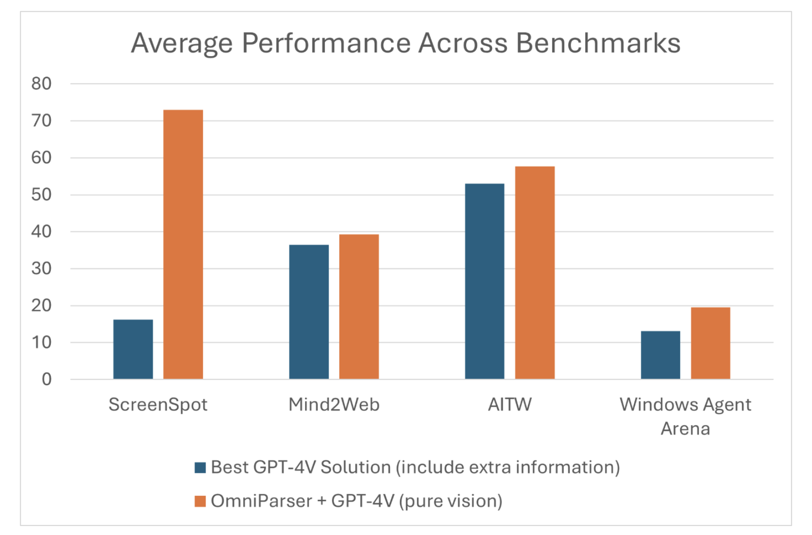

# Microsoft AI Releases OmniParser Model on HuggingFace: A Compact Screen Parsing Module that can Convert UI Screenshots into Structured Elements

> Graphical User Interfaces (GUIs) are ubiquitous, whether on desktop computers, mobile devices, or embedded systems, providing an intuitive bridge between users and digital functions. However, automated interaction with these GUIs presents a significant challenge. This gap becomes particularly evident in building intelligent agents that can comprehend and execute tasks based on visual information alone. Traditional […]

Graphical User Interfaces (GUIs) are ubiquitous, whether on desktop computers, mobile devices, or embedded systems, providing an intuitive bridge between users and digital functions. However, automated interaction with these GUIs presents a significant challenge. This gap becomes particularly evident in building intelligent agents that can comprehend and execute tasks based on visual information alone. Traditional methods rely on parsing underlying HTML or view hierarchies, which limits their applicability to web-based environments or those with accessible metadata. Moreover, existing Vision-Language Models (VLMs) like GPT-4V struggle to accurately interpret complex GUI elements, often resulting in inaccurate action grounding.

To overcome these hurdles, Microsoft introduces OmniParser, a pure vision-based tool aimed at bridging the gaps in current screen parsing techniques, allowing for more sophisticated GUI understanding without relying on additional contextual data. This model, available [here on Hugging Face](https://huggingface.co/microsoft/OmniParser), represents an exciting development in intelligent GUI automation. Built to improve the accuracy of parsing user interfaces, OmniParser is designed to work across platforms—desktop, mobile, and web—without requiring explicit underlying data such as HTML tags or view hierarchies. With OmniParser, Microsoft has made significant strides in enabling automated agents to identify actionable elements like buttons and icons purely based on screenshots, broadening the possibilities for developers working with multimodal AI systems.

OmniParser combines several specialized components to achieve robust GUI parsing. Its architecture integrates a fine-tuned interactable region detection model, an icon description model, and an OCR module. The region detection model is responsible for identifying actionable elements on the UI, such as buttons and icons, while the icon description model captures the functional semantics of these elements. Additionally, the OCR module extracts any text elements from the screen. Together, these models output a structured representation akin to a Document Object Model (DOM), but directly from visual input. One key advantage is the overlaying of bounding boxes and functional labels on the screen, which effectively guides the language model in making more accurate predictions about user actions. This design alleviates the need for additional data sources, which is particularly beneficial in environments without accessible metadata, thus extending the range of applications.

OmniParser is a vital advancement for several reasons. It addresses the limitations of prior multimodal systems by offering an adaptable, vision-only solution that can parse any type of UI, regardless of the underlying architecture. This approach results in enhanced cross-platform usability, making it valuable for both desktop and mobile applications. Furthermore, OmniParser’s performance benchmarks speak of its strength and effectiveness. In the ScreenSpot, Mind2Web, and AITW benchmarks, OmniParser demonstrated significant improvements over baseline GPT-4V setups. For example, on the ScreenSpot dataset, OmniParser achieved an accuracy improvement of up to 73%, surpassing models that rely on underlying HTML parsing. Notably, incorporating local semantics of UI elements led to an impressive boost in predictive accuracy—GPT-4V’s correct labeling of icons improved from 70.5% to 93.8% when using OmniParser’s outputs. Such improvements highlight how better parsing can lead to more accurate action grounding, addressing a fundamental shortcoming in current GUI interaction models.

Microsoft’s OmniParser is a significant step forward in the development of intelligent agents that interact with GUIs. By focusing purely on vision-based parsing, OmniParser eliminates the need for additional metadata, making it a versatile tool for any digital environment. This enhancement not only broadens the usability of models like GPT-4V but also paves the way for the creation of more general-purpose AI agents that can reliably navigate across a multitude of digital interfaces. By releasing OmniParser on Hugging Face, Microsoft has democratized access to cutting-edge technology, providing developers with a powerful tool to create smarter and more efficient UI-driven agents. This move opens up new possibilities for applications in accessibility, automation, and intelligent user assistance, ensuring that the promise of multimodal AI reaches new heights.

---

Check out the** [Paper](https://arxiv.org/pdf/2408.00203), [Details](https://www.microsoft.com/en-us/research/articles/omniparser-for-pure-vision-based-gui-agent/), and [Try the model here](https://huggingface.co/microsoft/OmniParser).** All credit for this research goes to the researchers of this project. Also, don’t forget to follow us on **[Twitter](https://twitter.com/Marktechpost)** and join our **[Telegram Channel](https://pxl.to/at72b5j)** and [**LinkedIn Gr**](https://www.linkedin.com/groups/13668564/)[**oup**](https://www.linkedin.com/groups/13668564/). **If you like our work, you will love our**[** newsletter..**](https://marktechpost-newsletter.beehiiv.com/subscribe) Don’t Forget to join our **[55k+ ML SubReddit](https://www.reddit.com/r/machinelearningnews/)**.

**[[Upcoming Live Webinar- Oct 29, 2024] ](https://go.predibase.com/predibase-inference-engine-102924-lp?utm_medium=3rdparty&utm_source=marktechpost)****[The Best Platform for Serving Fine-Tuned Models: Predibase Inference Engine (Promoted)](https://go.predibase.com/predibase-inference-engine-102924-lp?utm_medium=3rdparty&utm_source=marktechpost)**
