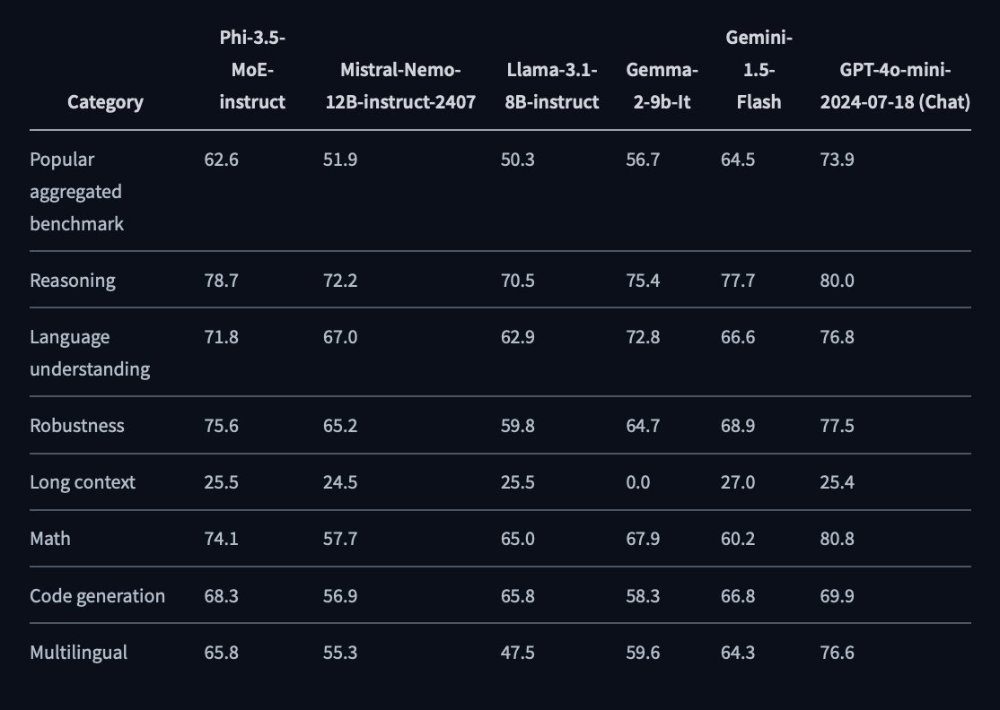

# Microsoft AI Releases Phi 3.5 mini, MoE and Vision with 128K context, Multilingual and MIT License

> Microsoft has recently expanded its artificial intelligence capabilities by introducing three sophisticated models: Phi 3.5 Mini Instruct, Phi 3.5 MoE (Mixture of Experts), and Phi 3.5 Vision Instruct. These models represent significant advancements in natural language processing, multimodal AI, and high-performance computing, each designed to address specific challenges and optimize various AI-driven tasks. Let’s examine […]

Microsoft has recently expanded its artificial intelligence capabilities by introducing three sophisticated models: Phi 3.5 Mini Instruct, Phi 3.5 MoE (Mixture of Experts), and Phi 3.5 Vision Instruct. These models represent significant advancements in natural language processing, multimodal AI, and high-performance computing, each designed to address specific challenges and optimize various AI-driven tasks. Let’s examine these models in depth, highlighting their architecture, training methodologies, and potential applications.

### Phi 3.5 Mini Instruct: Balancing Power and Efficiency

**Model Overview and Architecture **

Phi 3.5 Mini Instruct is a dense decoder-only Transformer model with 3.8 billion parameters, making it one of the most compact models in Microsoft’s Phi 3.5 series. Despite its relatively small parameter count, this model supports an impressive 128K context length, enabling it to handle tasks involving long documents, extended conversations, and complex reasoning scenarios. The model is built upon the advancements made in the Phi 3 series, incorporating state-of-the-art techniques in model training and optimization.

**Training Data and Process  **

Phi 3.5 Mini Instruct was trained on a diverse dataset totaling 3.4 trillion tokens. The dataset includes publicly available documents rigorously filtered for quality, synthetic textbook-like data designed to enhance reasoning and problem-solving capabilities, and high-quality chat format supervised data. The model underwent a series of optimizations, including supervised fine-tuning and direct preference optimization, to ensure high adherence to instructions and robust performance across various tasks.

**Technical Features and Capabilities**

The model’s architecture allows it to excel in environments with constrained computational resources while delivering high-performance levels. Its 128K context length is particularly notable, surpassing the typical context lengths supported by most other models. This enables Phi 3.5 Mini Instruct to manage and process extensive sequences of tokens without losing coherence or accuracy.

In benchmarks, Phi 3.5 Mini Instruct demonstrated strong performance in reasoning tasks, particularly those involving code generation, mathematical problem-solving, and logical inference. The model’s ability to handle complex, multi-turn conversations in various languages makes it an invaluable tool for applications ranging from automated customer support to advanced research in natural language processing.

*[**Image Source**](https://huggingface.co/microsoft/Phi-3.5-mini-instruct)*

### Phi 3.5 MoE: Unlocking the Potential of Mixture of Experts

**Model Overview and Architecture  **

The Phi 3.5 MoE model represents a significant leap in AI architecture with its Mixture of Expert design. The model is built with 42 billion parameters, divided into 16 experts, and has 6.6 billion active parameters during inference. This architecture allows the model to dynamically select and activate different subsets of experts depending on the input data, optimizing computational efficiency and performance.

**Training Methodology  **

The training of Phi 3.5 MoE involved 4.9 trillion tokens, with the model being fine-tuned to optimize its reasoning capabilities, particularly in tasks that require logical inference, mathematical calculations, and code generation. The mixture-of-experts approach significantly reduces the computational load during inference by selectively engaging only the necessary experts, making it possible to scale the model’s capabilities without a proportional increase in resource consumption.

**Key Technical Features**

One of the most critical aspects of Phi 3.5 MoE is its ability to handle long context tasks, with support for up to 128K tokens in a single context. This makes it suitable for document summarization, legal analysis, and extensive dialogue systems. The model’s architecture also allows it to outperform larger models in reasoning tasks while maintaining competitive performance across various NLP benchmarks.

Phi 3.5 MoE is particularly adept at handling multilingual tasks, with extensive fine-tuning across multiple languages to ensure accuracy and relevance in diverse linguistic contexts. The model’s ability to manage long context lengths and its robust reasoning capabilities make it a powerful tool for commercial and research applications.

*[**Image Source**](https://huggingface.co/microsoft/Phi-3.5-MoE-instruct)*

### Phi 3.5 Vision Instruct: Pioneering Multimodal AI

**Model Overview and Architecture**

The Phi 3.5 Vision Instruct model is a multimodal AI that handles tasks requiring textual and visual inputs. With 4.15 billion parameters and a context length of 128K tokens, this model excels in scenarios where a deep understanding of images and text is necessary. The model’s architecture integrates an image encoder, a connector, a projector, and a Phi-3 Mini language model, creating a seamless pipeline for processing and generating content based on visual and textual data.

**Training Data and Process**

The training dataset for Phi 3.5 Vision Instruct includes a mix of synthetic data, high-quality educational content, and carefully filtered publicly available images and text. The model has been fine-tuned to optimize its performance in optical character recognition (OCR) tasks, image comparison, and video summarization. This training has enabled the model to develop a strong reasoning and contextual understanding capability in multimodal contexts.

**Technical Capabilities and Applications**

Phi 3.5 Vision Instruct is designed to push the boundaries of what is possible in multimodal AI. The model can handle complex tasks such as multi-image comparison, chart and table understanding, and video clip summarization. It also shows significant improvements over previous benchmarks, with enhanced performance in tasks requiring detailed visual analysis and reasoning.

The model’s ability to integrate and process large amounts of visual and textual data makes it ideal for applications in fields such as medical imaging, autonomous vehicles, and advanced human-computer interaction systems. For instance, in medical imaging, Phi 3.5 Vision Instruct can assist in diagnosing conditions by comparing multiple images and providing a detailed summary of findings. In autonomous vehicles, the model could enhance the understanding of visual data captured by cameras, improving decision-making processes in real-time.

*[**Image Source**](https://huggingface.co/microsoft/Phi-3.5-vision-instruct)*

### Conclusion: A Comprehensive Suite for Advanced AI Applications

The Phi 3.5 series—Mini Instruct, MoE, and Vision Instruct—marks a significant milestone in Microsoft’s AI development efforts. Each model is tailored to address specific needs within the AI ecosystem, from the efficient processing of extensive textual data to the sophisticated analysis of multimodal inputs. These models showcase Microsoft’s commitment to advancing AI technology and provide powerful tools that can be leveraged across various industries.

Phi 3.5 Mini Instruct stands out for its balance of power and efficiency, making it suitable for tasks where computational resources are limited but performance demands remain high. Phi 3.5 MoE, with its innovative Mixture of Experts architecture, offers unparalleled reasoning capabilities while optimizing resource usage. Finally, Phi 3.5 Vision Instruct sets a new standard in multimodal AI, enabling advanced visual and textual data integration for complex tasks.

---

Check out the **[microsoft/Phi-3.5-vision-instruct](https://huggingface.co/microsoft/Phi-3.5-vision-instruct), [microsoft/Phi-3.5-mini-instruct](https://huggingface.co/microsoft/Phi-3.5-mini-instruct), and [microsoft/Phi-3.5-MoE-instruct](https://huggingface.co/microsoft/Phi-3.5-MoE-instruct).** All credit for this research goes to the researchers of this project. Also, don’t forget to follow us on **[Twitter](https://twitter.com/Marktechpost)** and join our **[Telegram Channel](https://github.com/ShengranHu/ADAS)** and [**LinkedIn Gr**](https://www.linkedin.com/groups/13668564/)[**oup**](https://www.linkedin.com/groups/13668564/). **If you like our work, you will love our**[** newsletter..**](https://marktechpost-newsletter.beehiiv.com/subscribe)

Don’t Forget to join our **[48k+ ML SubReddit](https://www.reddit.com/r/machinelearningnews/)**

**Find Upcoming [AI Webinars here](https://www.marktechpost.com/ai-webinars-list-llms-rag-generative-ai-ml-vector-database/)**
