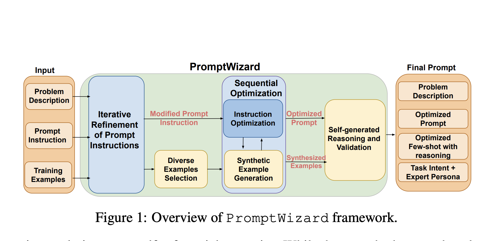

# Microsoft AI Research Open-Sources PromptWizard: A Feedback-Driven AI Framework for Efficient and Scalable LLM Prompt Optimization

> One of the crucial factors in achieving high-quality outputs from these models lies in the design of prompts—carefully crafted input instructions that guide the model to produce the desired responses. Despite their importance, prompt creation is a labor-intensive process that often requires domain-specific knowledge and significant human effort. These limitations have spurred the development of […]

One of the crucial factors in achieving high-quality outputs from these models lies in the design of prompts—carefully crafted input instructions that guide the model to produce the desired responses. Despite their importance, prompt creation is a labor-intensive process that often requires domain-specific knowledge and significant human effort. These limitations have spurred the development of automated systems to refine and optimize prompts efficiently.

One of the significant challenges in prompt engineering is the reliance on manual expertise to tailor prompts for each unique task. This approach is time-consuming and needs to scale more effectively for complex or domain-specific applications. Furthermore, existing methods for optimizing prompts are often restricted to open-source models that provide access to internal computations. Black-box systems, such as proprietary models accessible only via APIs, present an additional hurdle, as their internal workings are opaque, making traditional gradient-based techniques impractical. These constraints highlight the urgent need for solutions that work efficiently with limited resources while remaining effective across diverse tasks.

Currently, methods for prompt optimization can be broadly classified into two categories: continuous and discrete approaches. Continuous techniques, such as soft prompts, rely on auxiliary models to refine instructions but require substantial computational resources and are not directly applicable to black-box systems. Discrete methods, including approaches like PromptBreeder and EvoPrompt, focus on generating variations of prompts and selecting the best-performing ones based on evaluation metrics. While these approaches have shown promise, they often need more structured feedback mechanisms to improve. They need to balance exploration with task-specific refinements, leading to suboptimal results.

Researchers from Microsoft Research India have developed and open-sourced PromptWizard, an innovative AI framework for optimizing prompts in black-box LLMs. This framework employs a feedback-driven critique-and-synthesis mechanism to iteratively refine prompt instructions and in-context examples iteratively, enhancing task performance. PromptWizard stands out by combining guided exploration with structured critiques to ensure the holistic improvement of prompts. Unlike earlier methods, it aligns task-specific requirements with a systematic optimization process, offering an efficient and scalable solution for diverse NLP applications.

PromptWizard operates through two primary phases: a generation phase and a test-time inference phase. During the generation phase, the system uses LLMs to create multiple variations of a base prompt by applying cognitive heuristics. These variations are evaluated against training examples to identify high-performing candidates. The framework integrates a critique mechanism that analyzes the strengths and weaknesses of each prompt, generating feedback that informs subsequent iterations of refinement. By synthesizing new examples and leveraging reasoning chains, the system enhances both the diversity and quality of prompts. The optimized prompts and examples are applied to unseen tasks at test time, ensuring consistent performance improvements. This approach significantly reduces computational overhead by focusing on meaningful refinements rather than random mutations, making it suitable for resource-constrained environments.

The framework’s effectiveness is demonstrated through extensive experiments across 45 tasks, including datasets like Big Bench Instruction Induction (BBII) and arithmetic reasoning benchmarks such as GSM8K, AQUARAT, and SVAMP. PromptWizard achieved the highest accuracy in zero-shot settings on 13 out of 19 tasks, outperforming baseline methods like Instinct and EvoPrompt. It further improved accuracy in one-shot scenarios, leading to 16 out of 19 tasks. For example, it achieved a zero-shot accuracy of 90% on GSM8K and 82.3% on SVAMP, showcasing its ability to handle complex reasoning tasks effectively. Further, PromptWizard reduced token usage and API calls by up to 60 times compared to discrete methods like PromptBreeder, with a total cost of only $0.05 per task, making it one of the most cost-efficient solutions available.

PromptWizard’s success lies in its innovative combination of sequential optimization, guided critiques, and expert persona integration, ensuring task-specific alignment and interpretability. The results highlight its potential to transform prompt engineering, offering a scalable, efficient, and accessible solution for optimizing LLMs across diverse domains. This advancement underscores the importance of integrating automated frameworks into NLP workflows, paving the way for more effective and affordable utilization of advanced AI technologies.

---

Check out **the _[Paper](https://www.microsoft.com/en-us/research/publication/promptwizard-task-aware-agent-driven-prompt-optimization-framework/)_**, **_[Blog](https://www.microsoft.com/en-us/research/blog/promptwizard-the-future-of-prompt-optimization-through-feedback-driven-self-evolving-prompts/)_**, and **_[GitHub Page](https://github.com/microsoft/PromptWizard?tab=readme-ov-file)_**. All credit for this research goes to the researchers of this project. Also, don’t forget to follow us on **[Twitter](https://twitter.com/Marktechpost)** and join our **[Telegram Channel](https://github.com/XGenerationLab/XiYan-SQL)** and [**LinkedIn Gr**](https://www.linkedin.com/groups/13668564/)[**oup**](https://www.linkedin.com/groups/13668564/). Don’t Forget to join our **[60k+ ML SubReddit](https://www.reddit.com/r/machinelearningnews/)**.

**[🚨 Trending: LG AI Research Releases EXAONE 3.5: Three Open-Source Bilingual Frontier AI-level Models Delivering Unmatched Instruction Following and Long Context Understanding for Global Leadership in Generative AI Excellence….](https://www.marktechpost.com/2024/12/11/lg-ai-research-releases-exaone-3-5-three-open-source-bilingual-frontier-ai-level-models-delivering-unmatched-instruction-following-and-long-context-understanding-for-global-leadership-in-generative-a/)**
