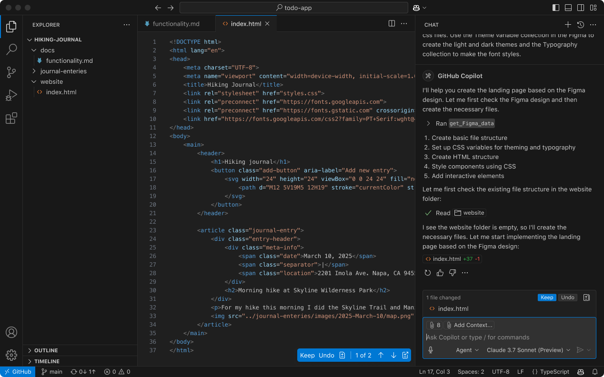

# Microsoft Open-Sources GitHub Copilot Chat Extension for VS Code—Now Free for All Developers

> Microsoft has officially open-sourced the GitHub Copilot Chat extension for Visual Studio Code (VS Code), placing a previously premium AI-powered coding assistant into the hands of developers—free of charge. Released under the permissive MIT license, the entire feature set that once required a subscription is now accessible to everyone. This shift represents a major milestone […]

Microsoft has officially open-sourced the GitHub Copilot Chat extension for Visual Studio Code (VS Code), placing a previously premium AI-powered coding assistant into the hands of developers—free of charge. Released under the permissive MIT license, the entire feature set that once required a subscription is now accessible to everyone. This shift represents a major milestone in making AI-enhanced developer tools widely available and paves the way for increased customization, transparency, and innovation in coding environments.

Hosted on GitHub at [microsoft/vscode-copilot-chat](https://github.com/microsoft/vscode-copilot-chat), the extension includes four core components: Agent Mode, Edit Mode, Code Suggestions, and Chat Integration. These components work together to create a highly interactive, context-aware coding assistant that goes beyond simple code completion.

#### 1. Agent Mode: Automating Complex Coding Tasks

The Agent Mode is designed to handle multi-step coding workflows autonomously. It goes far beyond autocompletion or static suggestions—it actively assists developers by diagnosing compile-time errors, rerunning tests, and even iterating on changes until the desired output is achieved.

For example, if a developer requests, “Implement a caching layer for this API call,” the agent can break this into subtasks: creating a cache interface, integrating a caching library, and wiring it into the existing service logic. If errors occur or tests fail, it responds accordingly—without manual intervention.

This mode essentially acts as a co-developer capable of self-correcting and adapting to dynamic coding environments.

#### 2. Edit Mode: Natural Language-Powered Multi-File Editing

Edit Mode transforms how developers interact with their codebase. It enables natural language commands to perform structured edits—across multiple files—without writing a single line of boilerplate or navigation code.

For instance, a prompt like “Add logging to all HTTP requests” can be translated into consistent modifications across different modules, complete with function wrappers or instrumentation logic.

The integration also includes a live preview of changes, allowing developers to review diffs and apply them selectively. This conversational editing flow significantly speeds up repetitive or cross-cutting changes and reduces cognitive overhead.

#### 3. Code Suggestions: Context-Aware, Predictive Completions

While traditional autocomplete tools offer basic token prediction, GitHub Copilot Chat’s Code Suggestions go further by leveraging context and developer style to anticipate meaningful code completions. The system learns from the current file, project structure, and even past edits to propose the next logical change.

Suggestions appear seamlessly and can be accepted via tab, making the flow of writing code feel more fluid. Whether writing boilerplate code, refactoring functions, or drafting new modules, the system adapts to patterns with impressive responsiveness.

#### 4. Chat Integration: Ask Code-Specific Questions Without Leaving Your IDE

One of the most powerful capabilities is its in-editor chat interface, which offers instant support contextualized to the current workspace. Unlike general-purpose LLM chat interfaces, this tool is deeply aware of your project’s files, dependencies, and structure.

You can ask targeted questions like “Why is this test failing?” or “What does this function do?” and receive inline answers grounded in the actual code. This enables just-in-time documentation, debugging assistance, and architectural guidance—all without leaving VS Code.

### Implications for the Developer Ecosystem

The open-sourcing of Copilot Chat under the MIT license has broad implications. First, developers and organizations can now self-host and customize the extension to suit proprietary workflows or constrained environments. Second, it invites contributions from the open-source community to improve performance, add features, or integrate with non-Microsoft LLM backends.

This move also democratizes access to powerful AI development tools, especially for developers in educational or underfunded environments where paid subscriptions are a barrier.

### Conclusion

By releasing the GitHub Copilot Chat extension for free under an open license, Microsoft is reshaping the boundaries of AI-assisted development. What was once a gated, premium feature set is now a robust, extensible foundation for intelligent coding workflows—available to all.

Developers no longer have to choose between capability and cost. With features like Agent Mode, Edit Mode, Code Suggestions, and contextual Chat now freely accessible, the coding experience within VS Code becomes faster, smarter, and more collaborative.

---

Check out the **_[GitHub Page](https://github.com/microsoft/vscode-copilot-chat?tab=readme-ov-file)_**. All credit for this research goes to the researchers of this project. Also, feel free to follow us on **[Twitter](https://x.com/intent/follow?screen_name=marktechpost)**, and **[Youtube](https://www.youtube.com/@Marktechpost)** and don’t forget to join our **[100k+ ML SubReddit](https://www.reddit.com/r/machinelearningnews/)** and Subscribe to **[our Newsletter](https://www.airesearchinsights.com/subscribe)**.
