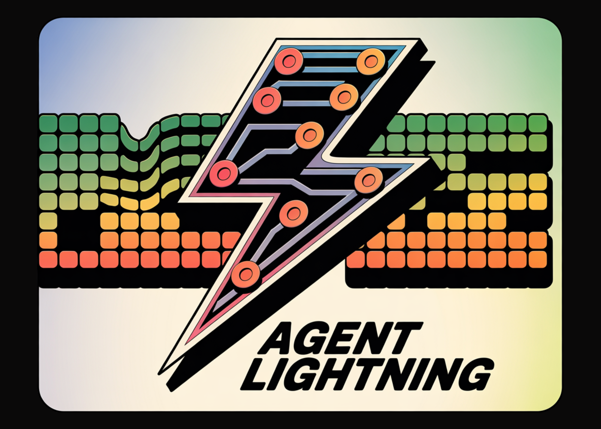

# Microsoft Releases Agent Lightning: A New AI Framework that Enables Reinforcement Learning (RL)-based Training of LLMs for Any AI Agent

> How do you convert real agent traces into reinforcement learning RL transitions to improve policy LLMs without changing your existing agent stack? Microsoft AI team releases Agent Lightning to help optimize multi-agent systems. Agent Lightning is a open-sourced framework that makes reinforcement learning work for any AI agent without rewrites. It separates training from execution, […]

How do you convert real agent traces into reinforcement learning RL transitions to improve policy LLMs without changing your existing agent stack? Microsoft AI team releases [Agent Lightning](https://github.com/microsoft/agent-lightning) to help optimize multi-agent systems. Agent Lightning is a open-sourced framework that makes reinforcement learning work for any AI agent without rewrites. It separates training from execution, defines a unified trace format, and introduces LightningRL, a hierarchical method that converts complex agent runs into transitions that standard single turn RL trainers can optimize.

### What Agent Lightning does?

The framework models an agent as a decision process. It formalizes the agent as a partially observable Markov decision process where the observation is the current input to the policy LLM, the action is the model call, and the reward can be terminal or intermediate. From each run it extracts only the calls made by the policy model, along with inputs, outputs, and rewards. This trims away other framework noise and yields clean transitions for training.

LightningRL performs credit assignment across multi step episodes, then optimizes the policy with a single turn RL objective. The research team describes compatibility with single turn RL methods. In practice, teams often use trainers that implement PPO or GRPO, such as VeRL, which fits this interface.

*https://arxiv.org/pdf/2508.03680v1*

### System architecture

Agent Lightning uses Training Agent Disaggregation. A Lightning [Server](https://www.marktechpost.com/2025/08/08/proxy-servers-explained-types-use-cases-trends-in-2025-technical-deep-dive/) runs training and serving, and exposes an OpenAI like API for the updated model. A Lightning Client runs the agent runtime where it already lives, captures traces of prompts, tool calls, and rewards, and streams them back to the server. This keeps tools, browsers, shells, and other dependencies close to production while the GPU training stays in the server tier.

*https://arxiv.org/pdf/2508.03680v1*

The runtime supports two tracing paths. A default path uses OpenTelemetry spans, so you can pipe agent telemetry through standard collectors. There is also a lightweight embedded tracer for teams that do not want to deploy OpenTelemetry. Both paths end up in the same store for training.

*https://arxiv.org/pdf/2508.03680v1*

### Unified data interface

Agent Lightning records each model call and each tool call as a span with inputs, outputs, and metadata. The algorithm layer adapts spans into ordered triplets of prompt, response, and reward. This selective extraction lets you optimize one agent in a multi agent workflow, or multiple agents at once, without touching orchestration code. The same traces can also drive automatic prompt optimization or supervised finetuning.

*https://arxiv.org/pdf/2508.03680v1*

### Experiments and datasets

The research team reports three tasks. For text to SQL, the team uses the Spider benchmark. Spider contains more than 10,000 questions across 200 databases that span 138 domains. The policy model is Llama 3.2 3B Instruct. The implementation uses LangChain with a writer agent, a rewriter agent, and a checker. The writer and the rewriter are optimized, and the checker is left fixed. Rewards improve steadily during training and at test time.

*https://arxiv.org/pdf/2508.03680v1*

For retrieval augmented generation, the setup uses the MuSiQue benchmark and a Wikipedia scale index with about 21 million documents. The retriever uses BGE embeddings with cosine similarity. The agent is built with the OpenAI Agents SDK. The reward is a weighted sum of a format score and an F1 correctness score. Reward curves show stable gains during training and evaluation with the same base model.

*https://arxiv.org/pdf/2508.03680v1*

For math question answering with tool use, the agent is implemented with AutoGen and calls a calculator tool. The dataset is Calc X. The base model again is Llama 3.2 3B Instruct. Training improves the ability to invoke tools correctly and integrate results into final answers.

*https://arxiv.org/pdf/2508.03680v1*

### Key Takeaways

- Agent Lightning uses Training Agent Disaggregation and a unified trace interface, so existing agents in LangChain, OpenAI Agents SDK, AutoGen, or CrewAI connect with near zero code change.

- LightningRL converts trajectories to transitions. It applies credit assignment to multi step runs, then optimizes the policy with single turn RL methods such as PPO or GRPO in standard trainers.

- Automatic Intermediate Rewarding, AIR, supplies dense feedback. AIR turns system signals such as tool return status into intermediate rewards to reduce sparse reward issues in long workflows.

- The research evaluates text to SQL on Spider, RAG on MuSiQue with a Wikipedia scale index using BGE embeddings and cosine similarity, and math tool use on Calc X, all with Llama 3.2 3B Instruct as the base model.

- The runtime records traces through OpenTelemetry, streams them to the training server, and exposes an OpenAI compatible endpoint for updated models, enabling scalable rollouts without moving tools.

### Editorial Comments

Agent Lightning is a practical bridge between agent execution and reinforcement learning, not another framework rewrite. It formalizes agent runs as an Markov Decision Process (MDP), introduces LightningRL for credit assignment, and extracts transitions that slot into single turn RL trainers. The Training Agent Disaggregation design separates a client that runs the agent from a server that trains and serves an OpenAI compatible endpoint, so teams keep existing stacks. Automatic Intermediate Rewarding converts runtime signals into dense feedback, reducing sparse rewards in long workflows. Overall, Agent Lightning is a clean, minimal-integration path to make agents learn from their own traces.

---

**Check out the [Paper](https://arxiv.org/abs/2508.03680v1) and [Repo](https://github.com/microsoft/agent-lightning)**. Feel free to check out our **[GitHub Page for Tutorials, Codes and Notebooks](https://github.com/Marktechpost/AI-Tutorial-Codes-Included)**. Also, feel free to follow us on **[Twitter](https://x.com/intent/follow?screen_name=marktechpost)** and don’t forget to join our **[100k+ ML SubReddit](https://www.reddit.com/r/machinelearningnews/)** and Subscribe to **[our Newsletter](https://www.aidevsignals.com/)**. Wait! are you on telegram? **[now you can join us on telegram as well.](https://t.me/machinelearningresearchnews)**
