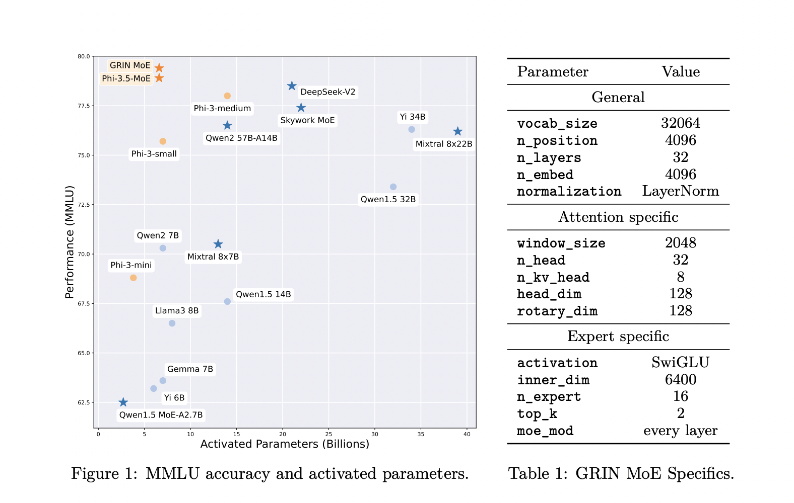

# Microsoft Releases GRIN MoE: A Gradient-Informed Mixture of Experts MoE Model for Efficient and Scalable Deep Learning

> Artificial intelligence (AI) research has increasingly focused on enhancing the efficiency & scalability of deep learning models. These models have revolutionized natural language processing, computer vision, and data analytics but have significant computational challenges. Specifically, as models grow larger, they require vast computational resources to process immense datasets. Techniques such as backpropagation are essential for […]

Artificial intelligence (AI) research has increasingly focused on enhancing the efficiency & scalability of deep learning models. These models have revolutionized natural language processing, computer vision, and data analytics but have significant computational challenges. Specifically, as models grow larger, they require vast computational resources to process immense datasets. Techniques such as backpropagation are essential for training these models by optimizing their parameters. However, traditional methods struggle to scale deep learning models efficiently without causing performance bottlenecks or requiring excessive computational power.

One of the main issues with current deep learning models is their reliance on dense computation, which activates all model parameters uniformly during training and inference. This method is inefficient when processing large-scale data, resulting in unnecessary activation of resources that may not be relevant to the task at hand. In addition, the non-differentiable nature of some components in these models makes it challenging to apply gradient-based optimization, limiting training effectiveness. As models continue to scale, overcoming these challenges is crucial to advancing the field of AI and enabling more powerful and efficient systems.

Current approaches to scaling AI models often include dense and sparse models that employ expert routing mechanisms. Dense models, like GPT-3 and GPT-4, activate all layers and parameters for every input, making them resource-heavy and difficult to scale. Sparse models, which aim to activate only a subset of parameters based on input requirements, have shown promise in reducing computational demands. However, existing methods like GShard and Switch Transformers still rely heavily on expert parallelism and employ techniques like token dropping to manage resource distribution. While effective, these methods have trade-offs in training efficiency and model performance.

Researchers from Microsoft have introduced an innovative solution to these challenges with GRIN (GRadient-INformed Mixture of Experts). This approach aims to address the limitations of existing sparse models by introducing a new method of gradient estimation for expert routing. GRIN enhances model parallelism, allowing for more efficient training without the need for token dropping, a common issue in sparse computation. By applying GRIN to autoregressive language models, the researchers have developed a top-2 mixture-of-experts model with 16 experts per layer, referred to as the GRIN MoE model. This model selectively activates experts based on input, significantly reducing the number of active parameters while maintaining high performance.

The GRIN MoE model employs several advanced techniques to achieve its impressive performance. The model’s architecture includes MoE layers where each layer consists of 16 experts, and only the top 2 are activated for each input token, using a routing mechanism. Each expert is implemented as a GLU (Gated Linear Unit) network, allowing the model to balance computational efficiency and expressive power. The researchers introduced SparseMixer-v2, a key component that estimates gradients related to expert routing, replacing conventional methods that use gating gradients as proxies. This allows the model to scale without relying on token dropping or expert parallelism, which is common in other sparse models.

The performance of the GRIN MoE model has been rigorously tested across a wide range of tasks, and the results demonstrate its superior efficiency and scalability. In the MMLU (Massive Multitask Language Understanding) benchmark, the model scored an impressive 79.4, surpassing several dense models of similar or larger sizes. It also achieved a score of 83.7 on HellaSwag, a benchmark for common-sense reasoning, and 74.4 on HumanEval, which measures the model’s ability to solve coding problems. Notably, the model’s performance on MATH, a benchmark for mathematical reasoning, was 58.9, reflecting its strength in specialized tasks. The GRIN MoE model uses only 6.6 billion activated parameters during inference, which is fewer than the 7 billion activated parameters of competing dense models, yet it matches or exceeds their performance. In another comparison, GRIN MoE outperformed a 7-billion parameter-dense model and matched the performance of a 14-billion parameter-dense model on the same dataset.

The introduction of GRIN also brings marked improvements in training efficiency. When trained on 64 H100 GPUs, the GRIN MoE model achieved an 86.56% throughput, demonstrating that sparse computation can scale effectively while maintaining high efficiency. This marks a significant improvement over previous models, which often suffer from slower training speeds as the number of parameters increases. Furthermore, the model’s ability to avoid token dropping means it maintains a high level of accuracy and robustness across various tasks, unlike models that lose information during training.

Overall, the research team’s work on GRIN presents a compelling solution to the ongoing challenge of scaling AI models. By introducing an advanced method for gradient estimation and model parallelism, they have successfully developed a model that not only performs better but also trains more efficiently. This advancement could lead to widespread applications in natural language processing, coding, mathematics, and more. The GRIN MoE model represents a significant step forward in AI research, offering a pathway to more scalable, efficient, and high-performing models in the future.

---

Check out the **[Paper](https://arxiv.org/abs/2409.12136)**, **[Model Card](https://huggingface.co/microsoft/GRIN-MoE)**, and **[Demo](https://huggingface.co/spaces/GRIN-MoE-Demo/GRIN-MoE)**. All credit for this research goes to the researchers of this project. Also, don’t forget to follow us on **[Twitter](https://twitter.com/Marktechpost)** and join our **[Telegram Channel](https://pxl.to/at72b5j)** and [**LinkedIn Gr**](https://www.linkedin.com/groups/13668564/)[**oup**](https://www.linkedin.com/groups/13668564/). **If you like our work, you will love our**[** newsletter..**](https://marktechpost-newsletter.beehiiv.com/subscribe)

Don’t Forget to join our **[50k+ ML SubReddit](https://www.reddit.com/r/machinelearningnews/)**

**[⏩ ⏩ FREE AI WEBINAR: ‘SAM 2 for Video: How to Fine-tune On Your Data’ (Wed, Sep 25, 4:00 AM – 4:45 AM EST)](https://encord.com/webinar/sam2-for-video/?utm_medium=affiliate&utm_source=newsletter&utm_campaign=marktechpost&utm_content=sam2video)**
