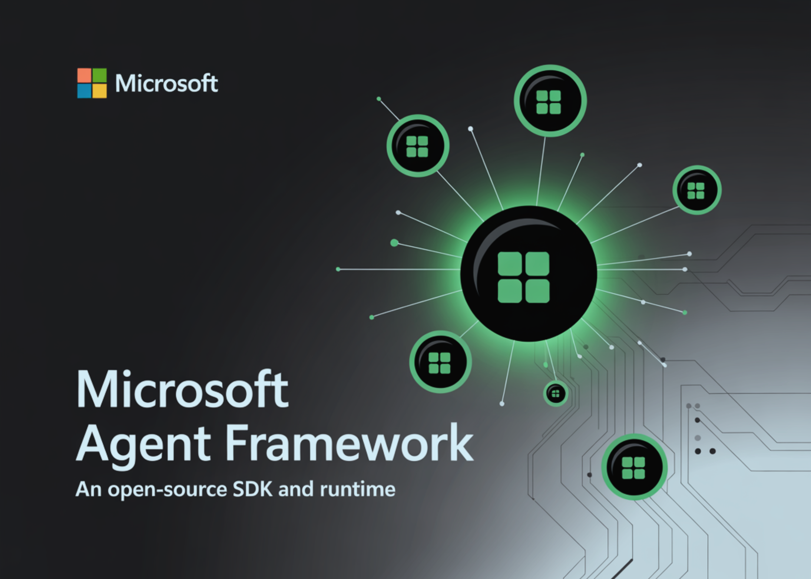

# Microsoft Releases ‘Microsoft Agent Framework’: An Open-Source SDK and Runtime that Simplifies the Orchestration of Multi-Agent Systems

> Microsoft released the Microsoft Agent Framework (public preview), an open-source SDK and runtime that unifies core ideas from AutoGen (agent runtime and multi-agent patterns) with Semantic Kernel (enterprise controls, state, plugins) to help teams build, deploy, and observe production-grade AI agents and multi-agent workflows. The framework is available for Python and .NET and integrates directly […]

Microsoft released the **[Microsoft Agent Framework](https://github.com/microsoft/agent-framework)** (public preview), an open-source SDK and runtime that unifies core ideas from AutoGen (agent runtime and multi-agent patterns) with Semantic Kernel (enterprise controls, state, plugins) to help teams build, deploy, and observe production-grade AI agents and multi-agent workflows. The framework is available for Python and .NET and integrates directly with **Azure AI Foundry’s Agent Service** for scaling and operations.

### What exactly is Microsoft shipping?

- **A consolidated agent runtime and API surface.** The Agent Framework carries forward AutoGen’s single- and multi-agent abstractions while adding Semantic Kernel’s enterprise features: thread-based state management, type safety, filters, telemetry, and broad model/embedding support. Microsoft positions it as the successor built by the same teams, rather than a replacement that abandons either project.

- **First-class orchestration modes.** It supports **agent orchestration** (LLM-driven decision-making) and **workflow orchestration** (deterministic, business-logic multi-agent flows), enabling hybrid systems where creative planning coexists with reliable handoffs and constraints.

- **Pro-code and platform interoperability.** The base `AIAgent` interface is designed to swap chat model providers and to interoperate with Azure AI Foundry Agents, OpenAI Assistants, and Copilot Studio, reducing vendor lock-in at the application layer.

- **Open-source, multi-language SDKs under MIT license.** The [GitHub repo](https://github.com/microsoft/agent-framework) publishes Python and .NET packages with examples and CI/CD-friendly scaffolding. AutoGen remains maintained (bug fixes, security patches) with guidance to consider Agent Framework for new builds.

### Where it runs in production?

Azure AI Foundry’s **Agent Service** provides the managed runtime: it links models, tools, and frameworks; manages thread state; enforces content safety and identity; and wires in observability. It also supports **multi-agent orchestration** natively and distinguishes itself from Copilot Studio’s low-code approach by targeting complex, pro-code enterprise scenarios.

### But how is it connected to ‘AI economics’?

Enterprise AI economics are dominated by token throughput, latency, failure recovery, and observability. Microsoft’s consolidation addresses those by (a) giving one runtime abstraction for agent collaboration and tool use, (b) attaching production controls—telemetry, filters, identity/networking, safety—to the same abstraction, and (c) deploying onto a managed service that handles scaling, policy, and diagnostics. This reduces the “glue code” that typically drives cost and brittleness in multi-agent systems and aligns with Azure AI Foundry’s model-catalog + toolchain approach.

### Architectural notes and developer surface

- **Runtime & state:** Agents coordinate via a runtime that handles lifecycles, identities, communication, and security boundaries—concepts inherited and formalized from AutoGen. **Threads** are the unit of state, enabling reproducible runs, retries, and audits.

- **Functions & plugins:** The framework leans on Semantic Kernel’s plugin architecture and function-calling to bind tools (code interpreters, custom functions) into agent policies with typed contracts. (

- **Model/provider flexibility:** The same agent interface can target Azure OpenAI, OpenAI, local runtimes (e.g., Ollama/Foundry Local), and GitHub Models, enabling cost/performance tuning per task without rewriting orchestration logic.

### Enterprise context

[Microsoft frames the release ](https://azure.microsoft.com/en-us/blog/introducing-microsoft-agent-framework/)as part of a broader push toward interoperable, standard-friendly “agentic” systems across Azure AI Foundry—consistent with prior statements about multi-agent collaboration, memory, and structured retrieval. Expect tighter ties to Foundry observability and governance controls as these stabilize.

### Our Comments

We like this direction because it collapses two divergent stacks—AutoGen’s multi-agent runtime and Semantic Kernel’s enterprise plumbing—into one API surface with a managed path to production. The thread-based state model and OpenTelemetry hooks address the usual blind spots in agentic systems (repro, latency tracing, failure triage), and Azure AI Foundry’s Agent Service takes on identity, content safety, and tool orchestration so teams can iterate on policies instead of glue code. The Python/.NET parity and provider flexibility (Azure OpenAI, OpenAI, GitHub Models, local runtimes) also make cost/perf tuning practical without rewriting orchestration.
