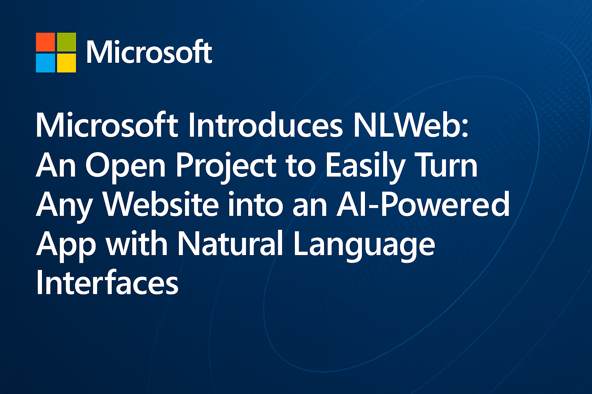

# Microsoft Releases NLWeb: An Open Project that Allows Developers to Easily Turn Any Website into an AI-Powered App with Natural Language Interfaces

> Many websites lack accessible and cost-effective ways to integrate natural language interfaces, making it difficult for users to interact with site content through conversational AI. Existing solutions often depend on centralized, proprietary services or require significant technical expertise, limiting scalability and adaptability. This creates a barrier for developers who want to implement intelligent agents capable […]

Many websites lack accessible and cost-effective ways to integrate natural language interfaces, making it difficult for users to interact with site content through conversational AI. Existing solutions often depend on centralized, proprietary services or require significant technical expertise, limiting scalability and adaptability. This creates a barrier for developers who want to implement intelligent agents capable of answering questions or assisting users using the site’s data. As a result, there is a need for an open, standardized approach that allows websites to expose structured information and support natural language interactions without relying heavily on external infrastructure or high-cost models. 

Building conversational interfaces for websites remains a complex challenge, often requiring custom solutions and deep technical expertise. NLWeb, developed by Microsoft researchers, aims to simplify this process by enabling sites to support natural language interactions easily. By natively integrating with the Machine Communication Protocol (MCP), NLWeb allows the same language interfaces to be used by both human users and AI agents. It builds on existing web standards like Schema.org and RSS—already used by millions of websites—to provide a semantic foundation that can be easily leveraged for natural language capabilities.

NLWeb is not a single tool or product but a suite of open protocols and open-source reference implementations designed to lay the groundwork for an AI-enabled web. Like HTML once did for document sharing, NLWeb envisions a shared infrastructure for integrating conversational AI into web content. Its sample code is a practical starting point rather than a final solution, encouraging community innovation and diverse implementations. This open, collaborative model draws inspiration from the early days of the internet, where shared standards and grassroots efforts drove rapid progress. NLWeb aims to do the same for AI-driven web experiences by enabling human-friendly interfaces and agent-to-agent communication through common protocols. 

NLWeb consists of two main parts: a simple protocol for natural language interaction with websites, and a JSON-based response format that uses Schema.org. It includes an implementation that works well for sites structured as item lists—like products or reviews—and offers UI widgets to enable conversational access to such content. NLWeb also acts as an MCP (Model Context Protocol) server, letting AI models ask questions via a standardized “ask” method. Responses combine existing site data with insights from large language models, enhancing user interaction. NLWeb is open, cross-platform, and compatible with various AI models and vector databases, offering flexible integration options. 

NLWeb offers web publishers a simple way to add conversational AI to their sites with minimal coding and without needing to build chatbots from scratch. It uses existing site data, ensuring accurate, real-time responses while keeping costs low. Publishers can choose which AI models to use and maintain control over their data. The system improves user engagement by enabling natural interactions, personalizing content, and enhancing support. Its open-source nature allows customization, and it positions websites for a future where AI agents browse and interact with the web. 

In conclusion, NLWeb represents a foundational step toward a more interactive and intelligent web, where users can engage with websites through natural language rather than rigid interfaces. By combining structured data formats like Schema.org with the power of AI models, NLWeb simplifies the creation of conversational experiences. It empowers publishers to enhance their sites with minimal effort, offering benefits like improved user engagement, faster support, and personalized content delivery. As the web evolves into an ecosystem where AI agents play a growing role, NLWeb ensures that websites are not only accessible to humans but also seamlessly integrable with the agent-driven digital future. 

---

**Check out the [GitHub Page](https://github.com/microsoft/NLWeb)_._** All credit for this research goes to the researchers of this project. Also, feel free to follow us on **[Twitter](https://x.com/intent/follow?screen_name=marktechpost)** and don’t forget to join our **[95k+ ML SubReddit](https://www.reddit.com/r/machinelearningnews/)** and Subscribe to **[our Newsletter](https://www.airesearchinsights.com/subscribe)**.
