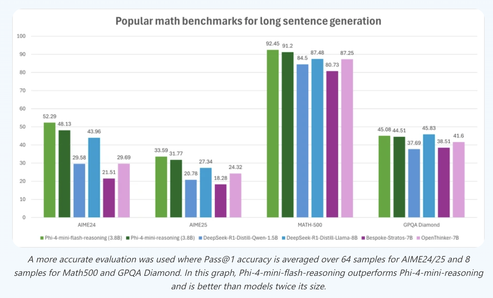

# Microsoft Releases Phi-4-mini-Flash-Reasoning: Efficient Long-Context Reasoning with Compact Architecture

> Phi-4-mini-Flash-Reasoning, the latest addition to Microsoft’s Phi-4 model family, is an open, lightweight language model designed to excel at long-context reasoning while maintaining high inference efficiency. Released on Hugging Face, this 3.8B parameter model is a distilled version of Phi-4-mini, fine-tuned for dense reasoning tasks like math problem solving and multi-hop question answering. Built using […]

**Phi-4-mini-Flash-Reasoning**, the latest addition to Microsoft’s Phi-4 model family, is an open, lightweight language model designed to excel at long-context reasoning while maintaining high inference efficiency. Released on [Hugging Face](https://huggingface.co/microsoft/Phi-4-mini-flash-reasoning), this 3.8B parameter model is a distilled version of Phi-4-mini, fine-tuned for dense reasoning tasks like math problem solving and multi-hop question answering. Built using Microsoft’s new _SambaY_ decoder-hybrid-decoder architecture, it achieves state-of-the-art performance among compact models and operates up to 10× faster than its predecessor on long-generation tasks.

### Architecture: Gated Memory Meets Hybrid Decoding

At the core of Phi-4-mini-Flash-Reasoning is the **SambaY** architecture, a novel decoder-hybrid-decoder model that integrates **State Space Models (SSMs)** with attention layers using a lightweight mechanism called the **Gated Memory Unit (GMU)**. This structure enables efficient memory sharing between layers, significantly reducing inference latency in long-context and long-generation scenarios.

Unlike Transformer-based architectures that rely heavily on memory-intensive attention computations, SambaY leverages **Samba** (a hybrid SSM architecture) in the self-decoder and replaces roughly half of the cross-attention layers in the cross-decoder with GMUs. GMUs serve as cheap, element-wise gating functions that reuse the hidden state from the final SSM layer, thereby avoiding redundant computation. This results in a linear-time prefill complexity and lower decoding I/O, yielding substantial speedups during inference.

### Training Pipeline and Reasoning Capabilities

The Phi-4-mini-Flash model is pre-trained on 5T tokens from high-quality synthetic and filtered real data, consistent with the rest of the Phi-4-mini family. Post pretraining, it undergoes **multi-stage supervised fine-tuning (SFT)** and **Direct Preference Optimization (DPO)** using reasoning-focused instruction datasets. Notably, unlike Phi-4-mini-Reasoning, it excludes reinforcement learning (RLHF) entirely.

Despite this, Phi-4-mini-Flash-Reasoning outperforms Phi-4-mini-Reasoning on a suite of complex reasoning tasks. On the Math500 benchmark, it achieves a pass@1 accuracy of 92.45%, outperforming Phi-4-mini-Reasoning (91.2%) and surpassing other open models like Qwen-1.5B and Bespoke-Stratos-7B. On AIME24/25, it shows strong gains as well, with over 52% accuracy on AIME24.

This performance leap is attributed to the architecture’s capacity for _long Chain-of-Thought (CoT) generation_. With 64K context length support and optimized inference under the **vLLM** framework, the model can generate and reason across multi-thousand-token contexts without bottlenecks. In latency benchmarks with 2K-token prompts and 32K-token generations, Phi-4-mini-Flash-Reasoning delivers up to **10× higher throughput** than its predecessor.

### Efficient Long-Context Processing

Efficiency gains in Phi-4-mini-Flash-Reasoning aren’t just theoretical. Through the decoder-hybrid-decoder design, the model achieves competitive performance on long-context benchmarks like Phonebook and RULER. For instance, with a **sliding window attention (SWA)** size as small as 256, it maintains high retrieval accuracy, indicating that long-range token dependencies are well captured via SSMs and GMU-based memory sharing.

These architectural innovations lead to reduced compute and memory overhead. For example, during decoding, GMU layers replace attention operations that would otherwise cost O(N·d) time per token, cutting that down to O(d), where N is sequence length and d is hidden dimension. The result is real-time inference capability even in multi-turn or document-level scenarios.

### Open Weights and Use Cases

Microsoft has open-sourced the model weights and configuration through Hugging Face, providing full access to the community. The model supports 64K context length, operates under standard Hugging Face and vLLM runtimes, and is optimized for fast token throughput on A100 GPUs.

Potential use cases for Phi-4-mini-Flash-Reasoning include:

- **Mathematical Reasoning** (e.g., SAT, AIME-level problems)

- **Multi-hop QA**

- **Legal and Scientific Document Analysis**

- **Autonomous Agents with Long-Term Memory**

- **High-throughput Chat Systems**

Its combination of open access, reasoning ability, and efficient inference makes it a strong candidate for deployment in environments where compute resources are constrained but task complexity is high.

### Conclusion

Phi-4-mini-Flash-Reasoning exemplifies how architectural innovation—particularly hybrid models leveraging SSMs and efficient gating—can bring transformative gains in reasoning performance without ballooning model size or cost. It marks a new direction in efficient long-context language modeling, paving the way for real-time, on-device reasoning agents and scalable open-source alternatives to commercial LLMs.

---

Check out the** _[Paper](https://arxiv.org/abs/2507.06607), [Codes](https://github.com/microsoft/ArchScale), [Model on Hugging Face](https://huggingface.co/microsoft/Phi-4-mini-flash-reasoning) and [Technical details](https://azure.microsoft.com/en-us/blog/reasoning-reimagined-introducing-phi-4-mini-flash-reasoning/)**._ All credit for this research goes to the researchers of this project. Also, feel free to follow us on **[Twitter](https://x.com/intent/follow?screen_name=marktechpost)**, **[Youtube](https://www.youtube.com/@Marktechpost)** and **[Spotify](https://open.spotify.com/show/1d5n4iy6LLTRo4khzTgKCp)** and don’t forget to join our **[100k+ ML SubReddit](https://www.reddit.com/r/machinelearningnews/)** and Subscribe to **[our Newsletter](https://www.airesearchinsights.com/subscribe)**.
