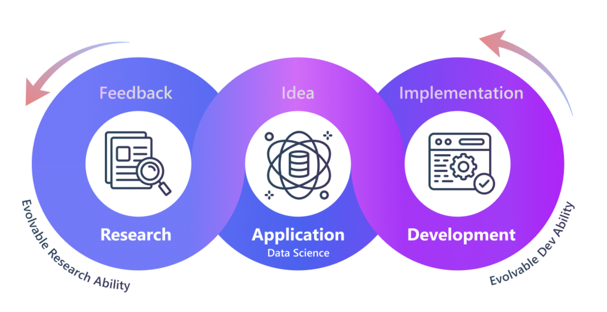

# Microsoft Releases RD-Agent: An Open-Source AI Tool Designed to Automate and Optimize Research and Development Processes

> Microsoft’s release of RD-Agent marks a milestone in the automation of research and development (R&D) processes, particularly in data-driven industries. This cutting-edge tool eliminates repetitive manual tasks, allowing researchers, data scientists, and engineers to streamline workflows, propose new ideas, and implement complex models more efficiently. RD-Agent offers an open-source solution to the many challenges faced […]

Microsoft’s release of [**RD-Agent**](https://github.com/microsoft/RD-Agent?tab=readme-ov-file) marks a milestone in the automation of research and development (R&D) processes, particularly in data-driven industries. This cutting-edge tool eliminates repetitive manual tasks, allowing researchers, data scientists, and engineers to streamline workflows, propose new ideas, and implement complex models more efficiently. RD-Agent offers an open-source solution to the many challenges faced in modern R&D, especially in scenarios requiring continuous model evolution, data mining, and hypothesis testing. By automating these critical processes, RD-Agent allows companies to maximize their productivity while enhancing the quality and speed of innovations.

**Introduction to RD-Agent**

RD-Agent aims to revolutionize R&D by eliminating redundant manual tasks, enabling companies and individuals to focus on research’s more conceptual and creative aspects. The software offers a framework that supports both idea proposal (“R”) and implementation (“D”), making it easier to iterate through multiple cycles of hypothesis generation, data mining, and model improvement. By automating these cycles, RD-Agent hopes to drive significant innovations across industries.

The open-source nature of RD-Agent further emphasizes Microsoft’s collaborative philosophy of encouraging the development of AI by allowing users to contribute to and build on the tool’s capabilities. Like most AI-driven initiatives, the system continually improves through feedback, increasing its utility and relevance.

**Automation of R&D in Data Science**

RD-Agent automates critical R&D tasks like data mining, model proposals, and iterative developments. Automating these key tasks allows AI models to evolve faster while continuously learning from the data provided. The software also enhances efficiency by applying AI methods to propose ideas autonomously and implement them directly through automated code generation and dataset development. The tool also features several industrial applications, including quantitative trading, medical predictions, and paper-based research copilot functionalities. Each application emphasizes RD-Agent’s ability to integrate real-world data, provide feedback loops, and iteratively propose new models or refine existing ones. 

RD-Agent was designed to address a gap in the automation of R&D processes, which are traditionally slow and require significant human intervention. By automating the full R&D lifecycle, RD-Agent increases productivity and enables more accurate, timely outcomes.

**Features of RD-Agent**

Some of the most notable features of RD-Agent include:

- **Automation of Model Evolution: **RD-Agent implements a self-looping mechanism where models are continuously iterated upon and improved based on the data provided. This process eliminates manual intervention in repetitive tasks, allowing data scientists & engineers to focus on more complex R&D goals.

- **Auto Paper Reading and Implementation:** One of RD-Agent’s most innovative features is its ability to extract key formulas and descriptions from research papers and financial reports automatically. This information is then implemented directly into runnable code, enabling users to skip the time-consuming process of manually translating research findings into practical applications.

- **Quantitative Trading Applications:** RD-Agent provides an application for financial scenarios that automates the extraction of factors from financial reports and the subsequent implementation of quantitative models. This feature is valuable for industries that rely heavily on financial data for predictive analytics.

- **Medical Predictions: **The tool can be applied to medical R&D to develop and refine prediction models based on patient data iteratively. This functionality demonstrates RD-Agent’s versatility in both health and industrial applications.

- **Collaborative and Data-Centric Framework: **Microsoft has designed RD-Agent to evolve continuously by learning from real-world feedback. This collaborative evolving strategy ensures that the tool stays relevant to industrial needs while pushing the boundaries of automated R&D.

**How RD-Agent Works**

RD-Agent operates by following steps that involve reading input data (like research papers or financial reports), proposing a model or hypothesis, implementing that model in code, and generating a report based on the outcome. This automated workflow saves significant time and ensures consistency across R&D efforts.

The tool integrates easily with Docker and Conda, ensuring compatibility with various computing environments. Users must create a new Conda environment, activate it, install RD-Agent, and configure their GPT model through a simple API key insertion. The system can be used with large language models like GPT-4, making it highly adaptive for modern AI needs. Another key component of RD-Agent is its role as both a “Copilot” and an “Agent.” The Copilot performs tasks based on human instructions, while the Agent operates autonomously, proposing new ideas and solutions based on the input it receives. This dual functionality allows RD-Agent to be flexible enough to cater to various R&D use cases.

**Applications and Scenarios**

RD-Agent has been successfully applied across multiple domains:

- **Finance:** Automates data extraction and model development for quantitative trading applications.

- **Medical:** Facilitates iterative model development for patient care predictions.

- **General Research:** Extracts key concepts and formulas from research papers and integrates them into working models.

- **Real-World Feedback:** Continuously improves model accuracy and efficiency using real-world usage data.

Each application represents a step towards a fully automated R&D process, where human intervention is minimized, and models evolve based on continuous feedback loops.

**Key Takeaways from the release of RD-Agent:**

- **Automates High-Value R&D Processes:** RD-Agent reduces manual intervention in R&D, allowing researchers and engineers to focus on complex & creative tasks.

- **Continuous Model Evolution: **The tool iterates and improves models based on real-time feedback, providing more accurate and relevant results over time.

- **Dual Functionality:** RD-Agent acts as a Copilot, following instructions and an Agent, proposing new ideas autonomously and offering flexibility in its applications.

- **Versatile Applications: **The software can be applied across multiple industries, including finance, healthcare, and general research, automating critical tasks and improving decision-making processes.

- **Open-Source and Collaborative:** By releasing RD-Agent to the public, Microsoft fosters collaboration and encourages the development of new features by the broader AI community.

- **Advanced AI Integration:** The tool integrates large language models like GPT-4, allowing for sophisticated AI-driven R&D solutions.

- **User-Friendly Setup:** RD-Agent can be easily installed and configured, making it accessible to users from various technical backgrounds.

In conclusion, RD-Agent represents a significant leap forward in the automation of research and development. By automating repetitive and time-consuming tasks, RD-Agent empowers organizations to focus on innovation, reducing the time it takes to bring ideas to life. Its evolving nature, driven by continuous feedback, ensures the tool stays relevant amid ever-changing industry demands. With its open-source framework, RD-Agent is poised to become a cornerstone in the future of AI-driven R&D, revolutionizing the way industries approach data, model development, and innovation.

---

Check out the **[GitHub](https://github.com/microsoft/RD-Agent?tab=readme-ov-file)**. All credit for this research goes to the researchers of this project. Also, don’t forget to follow us on **[Twitter](https://twitter.com/Marktechpost)** and join our **[Telegram Channel](https://pxl.to/at72b5j)** and [**LinkedIn Gr**](https://www.linkedin.com/groups/13668564/)[**oup**](https://www.linkedin.com/groups/13668564/). **If you like our work, you will love our**[** newsletter..**](https://marktechpost-newsletter.beehiiv.com/subscribe)

Don’t Forget to join our **[50k+ ML SubReddit](https://www.reddit.com/r/machinelearningnews/)**
