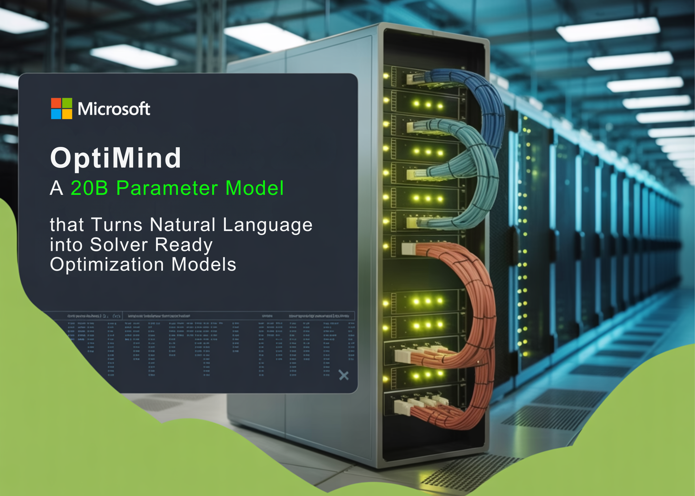

# Microsoft Research Releases OptiMind: A 20B Parameter Model that Turns Natural Language into Solver Ready Optimization Models

> Microsoft Research has released OptiMind, an AI based system that converts natural language descriptions of complex decision problems into mathematical formulations that optimization solvers can execute. It targets a long standing bottleneck in operations research, where translating business intent into mixed integer linear programs usually needs expert modelers and days of work. What OptiMind Is […]

Microsoft Research has released OptiMind, an AI based system that converts natural language descriptions of complex decision problems into mathematical formulations that optimization solvers can execute. It targets a long standing bottleneck in operations research, where translating business intent into mixed integer linear programs usually needs expert modelers and days of work.

### What OptiMind Is And What It Outputs?

[OptiMind-SFT](https://huggingface.co/microsoft/OptiMind-SFT) is a specialized 20B parameter Mixture of Experts model in the gpt oss transformer family. About 3.6B parameters are active per token, so inference cost is closer to a mid sized model while keeping high capacity. The context length is 128,000 tokens, which allows long specifications and multi step reasoning traces inside a single request.

The model takes a natural language description of an optimization problem as input. The output is a mathematical formulation along with executable Python code that uses GurobiPy. The generated script defines decision variables, constraints, and objective, calls the Gurobi solver, and prints the optimal objective value and decisions.

OptiMind acts as a formulation layer between domain experts and standard MILP solvers. It does not replace the solver, it generates the MILP that the solver will optimize.

### Architecture, Training Setup, And Datasets

The base model is `openai/gpt-oss-20b`, fine tuned into `microsoft/OptiMind-SFT` using cleaned optimization datasets. The architecture is a Mixture of Experts transformer, with routing that activates a subset of experts per token. The model is released under the MIT license.

Training uses 8 NVIDIA B200 GPUs, and inference and evaluation in the reference setup use 8 NVIDIA H100 GPUs. Reported fine tuning time is about 8 hours. For regular use, the team recommends at least 32 GB of GPU memory on hardware such as A100, H100, or B200.

For supervised fine tuning, the research team construct cleaned versions of OR Instruct and OptMATH Train. For testing, they use expert validated and re-cleaned versions of IndustryOR, Mamo Complex, and OptMATH. These benchmarks cover hard formulation tasks where existing models often reach only 20 to 50 percent accuracy on the original noisy versions.

### Class Based Error Analysis And Data Cleaning

A key technical idea in OptiMind is to combine optimization expertise with LLM training. The research team classifies problems from OR-Instruct and OptMATH into 53 seed classes, for example set cover, flow shop scheduling, or traveling salesman problem.

For each class, they run the gpt-oss-20b-base model on a sample of problems and select instances where the model output disagrees with the ground truth. Optimization experts inspect these items, identify the recurring formulation mistakes, and write short error descriptions and preventive hints. These hints describe correct constraints, variable bounds, or modeling tricks, such as the proper Miller Tucker Zemlin constraints for TSP.

The research team then uses a semi-automated pipeline. They regenerate solutions with a larger model that is prompted with the class specific hints, apply majority voting across samples to improve solution quality, and drop items that remain inconsistent. They also detect missing parameters and ambiguous statements and regenerate problem descriptions when needed. The result is a cleaned training corpus that is better aligned with correct mathematical formulations.

### Inference Pipeline, Hints, And Test Time Scaling

At inference time, OptiMind behaves as a multi stage system, not just a single prompt. The default pipeline first classifies each test instance into one of the 53 optimization classes used during error analysis. It then augments the prompt with the error summary and hint pairs associated with that class.

The model then generates a reasoning trace, the mathematical formulation, and the GurobiPy code. When more compute is available, the system can apply self consistency with majority voting. It generates several candidate scripts, executes them, and selects the solution that appears most often within set numerical tolerances.

A multi turn correction mode can also be enabled. The system runs the generated code, captures solver logs or execution errors, feeds this feedback back to the model, and lets the model revise the formulation and code for a few rounds. This closes some modeling and coding errors at the cost of higher latency.

### Quantitative Gains On Optimization Benchmarks

On cleaned versions of IndustryOR, Mamo-Complex, and OptMATH, the OptiMind framework significantly improves solution accuracy. The fine-tuned model improves formulation accuracy by 20.7 percent across multiple optimization benchmarks, with further gains when test time scaling techniques such as self consistency and multi turn feedback are applied.

Across these benchmarks, OptiMind improves absolute accuracy over the gpt-oss-20b-base model and outperforms other open source models of similar or larger size. It reaches performance that is competitive with proprietary frontier models such as GPT-o4 mini and GPT-5 under the [evaluation settings](https://arxiv.org/pdf/2509.22979v2).

These results rely on careful cleaning of both training and test data. The research team report that many apparent model errors on original benchmarks actually came from missing data, ambiguous descriptions, or incorrect reference solutions, and that re-cleaning can lift apparent accuracy for a fixed model from about 40 to 60 percent into the 70 to 90 percent range on the corrected sets.

### Key Takeaways

- OptiMind is a 20B parameter Mixture of Experts transformer in the gpt-oss-family that takes natural language optimization problems as input and outputs both a mathematical formulation and executable GurobiPy code, with about 3.6B parameters activated per token and a 128,000 token context length.

- The model is fine tuned from `openai/gpt-oss-20b` on cleaned optimization datasets such as OR-Instruct and OptMATH, and evaluated on expert validated benchmarks including IndustryOR and Mamo Complex, focusing on mixed integer linear programming formulations.

- OptiMind uses class based error analysis and expert written hints for 53 optimization classes, then applies these hints both in data cleaning and at inference time, which systematically reduces common modeling mistakes in generated MILPs.

- The framework improves formulation accuracy by 20.7 percent across multiple optimization benchmarks compared to the base model, and with test time scaling methods such as self consistency and multi turn feedback it reaches performance that is competitive with larger proprietary systems.

- OptiMind-SFT is released as `microsoft/OptiMind-SFT` on Hugging Face and as `microsoft-optimind-sft` in Azure AI Foundry, where it can be served via SGLang as an OpenAI compatible endpoint, enabling practical integration into decision support pipelines for supply chains, manufacturing, logistics, and scheduling.

---

Check out the **[Model Weights](https://huggingface.co/microsoft/OptiMind-SFT) **and** [Technical details](https://ai.azure.com/catalog/models/microsoft-optimind-sft)**. Also, feel free to follow us on **[Twitter](https://x.com/intent/follow?screen_name=marktechpost)** and don’t forget to join our **[100k+ ML SubReddit](https://www.reddit.com/r/machinelearningnews/)** and Subscribe to **[our Newsletter](https://www.aidevsignals.com/)**. Wait! are you on telegram? **[now you can join us on telegram as well.](https://t.me/machinelearningresearchnews)**
