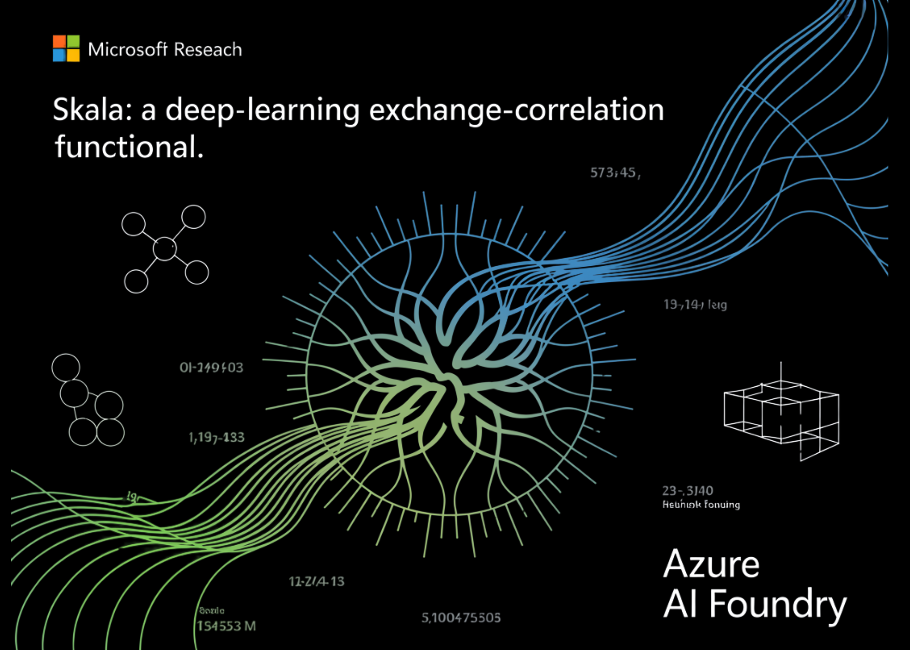

# Microsoft Research Releases Skala: a Deep-Learning Exchange–Correlation Functional Targeting Hybrid-Level Accuracy at Semi-Local Cost

> TL;DR: Skala is a deep-learning exchange–correlation functional for Kohn–Sham Density Functional Theory (DFT) that targets hybrid-level accuracy at semi-local cost, reporting MAE ≈ 1.06 kcal/mol on W4-17 (0.85 on the single-reference subset) and WTMAD-2 ≈ 3.89 kcal/mol on GMTKN55; evaluations use a fixed D3(BJ) dispersion correction. It is positioned for main-group molecular chemistry today, with […]

**TL;DR: **Skala is a deep-learning exchange–correlation functional for Kohn–Sham Density Functional Theory (DFT) that targets hybrid-level accuracy at semi-local cost, reporting MAE ≈ 1.06 kcal/mol on W4-17 (0.85 on the single-reference subset) and WTMAD-2 ≈ 3.89 kcal/mol on GMTKN55; evaluations use a fixed D3(BJ) dispersion correction. It is positioned for main-group molecular chemistry today, with transition metals and periodic systems slated as future extensions. [Azure AI Foundry](https://labs.ai.azure.com/projects/skala/?) The model and tooling are available now via Azure AI Foundry Labs and the open-source `microsoft/skala` repository.

**How much compression ratio and throughput would you recover by training a format-aware graph compressor and shipping only a self-describing graph to a universal decoder?** Microsoft Research has released **Skala**, a neural exchange–correlation (XC) functional for Kohn–Sham Density Functional Theory (DFT). Skala learns non-local effects from data while keeping the computational profile comparable to meta-GGA functionals.

*https://arxiv.org/pdf/2506.14665*

### What Skala is (and isn’t)?

Skala replaces a hand-crafted XC form with a neural functional evaluated on standard meta-GGA grid features. It explicitly **does not** attempt to learn dispersion in this first release; benchmark evaluations use a fixed **D3** correction (D3(BJ) unless noted). The goal is rigorous main-group thermochemistry at semi-local cost, not a universal functional for all regimes on day one.

*https://arxiv.org/pdf/2506.14665*

### Benchmarks

On **W4-17 atomization energies**, Skala reports **MAE 1.06 kcal/mol** on the full set and **0.85 kcal/mol** on the single-reference subset. On **GMTKN55**, Skala achieves **WTMAD-2 3.89 kcal/mol**, competitive with top hybrids; all functionals were evaluated with the same dispersion settings (D3(BJ) unless VV10/D3(0) applies).

*https://arxiv.org/pdf/2506.14665*

*https://arxiv.org/pdf/2506.14665*

### Architecture and training

Skala evaluates meta-GGA features on the standard numerical integration grid, then aggregates information via a **finite-range, non-local neural operator** (bounded enhancement factor; exact-constraint aware including Lieb–Oxford, size-consistency, and coordinate-scaling). Training proceeds in two phases: (1) pre-training on **B3LYP densities** with XC labels extracted from high-level wavefunction energies; (2) **SCF-in-the-loop fine-tuning** using Skala’s **own** densities (no backprop through SCF).

The model is trained on a large, curated corpus dominated by **~80k high-accuracy total atomization energies** (MSR-ACC/TAE) plus additional reactions/properties, with **W4-17** and **GMTKN55** removed from training to avoid leakage.

### Cost profile and implementation

Skala keeps **semi-local cost scaling** and is engineered for GPU execution via **GauXC**; the public repo exposes: (i) a **PyTorch** implementation and **`microsoft-skala`** PyPI package with **PySCF/ASE** hooks, and (ii) a **GauXC add-on** usable to integrate Skala into other DFT stacks. The README lists **~276k parameters** and provides minimal examples.

### Application

In practice, Skala slots into **main-group molecular** workflows where semi-local cost and hybrid-level accuracy matter: high-throughput **reaction energetics** (ΔE, barrier estimates), **conformer/radical stability** ranking, and **geometry/dipole** predictions feeding QSAR/lead-optimization loops. Because it’s exposed via **PySCF/ASE** and a **GauXC** GPU path, teams can run batched SCF jobs and screen candidates at near meta-GGA runtime, then reserve hybrids/CC for final checks. For managed experiments and sharing, Skala is available in **Azure AI Foundry Labs** and as an open GitHub/PyPI stack.

### Key Takeaways

- **Performance:** Skala achieves **MAE 1.06 kcal/mol** on W4-17 (0.85 on the single-reference subset) and **WTMAD-2 3.89 kcal/mol** on GMTKN55; dispersion is applied via **D3(BJ)** in reported evaluations.

- **Method:** A neural XC functional with meta-GGA inputs and **finite-range learned non-locality**, honoring key exact constraints; retains **semi-local O(N³)** cost and does not learn dispersion in this release.

- **Training signal:** Trained on ~**150k** high-accuracy labels, including ~**80k** CCSD(T)/CBS-quality atomization energies (MSR-ACC/TAE); **SCF-in-the-loop** fine-tuning uses Skala’s own densities; public test sets are de-duplicated from training.

### Editorial Comments

Skala is a pragmatic step: a neural XC functional reporting **MAE 1.06 kcal/mol** on W4-17 (0.85 on single-reference) and **WTMAD-2 3.89 kcal/mol** on GMTKN55, evaluated with **D3(BJ)** dispersion, and scoped today to **main-group molecular** systems. It’s accessible for testing via **Azure AI Foundry Labs** with code and PySCF/ASE integrations on GitHub, enabling direct head-to-head baselines against existing meta-GGAs and hybrids.

---

Check out the **[Technical Paper](https://arxiv.org/abs/2506.14665), [GitHub Page](https://github.com/microsoft/skala?tab=readme-ov-file) and [technical blog](https://labs.ai.azure.com/projects/skala/)**. Feel free to check out our **[GitHub Page for Tutorials, Codes and Notebooks](https://github.com/Marktechpost/AI-Tutorial-Codes-Included)**. Also, feel free to follow us on **[Twitter](https://x.com/intent/follow?screen_name=marktechpost)** and don’t forget to join our **[100k+ ML SubReddit](https://www.reddit.com/r/machinelearningnews/)** and Subscribe to **[our Newsletter](https://www.aidevsignals.com/)**. Wait! are you on telegram? **[now you can join us on telegram as well.](https://t.me/machinelearningresearchnews)**
