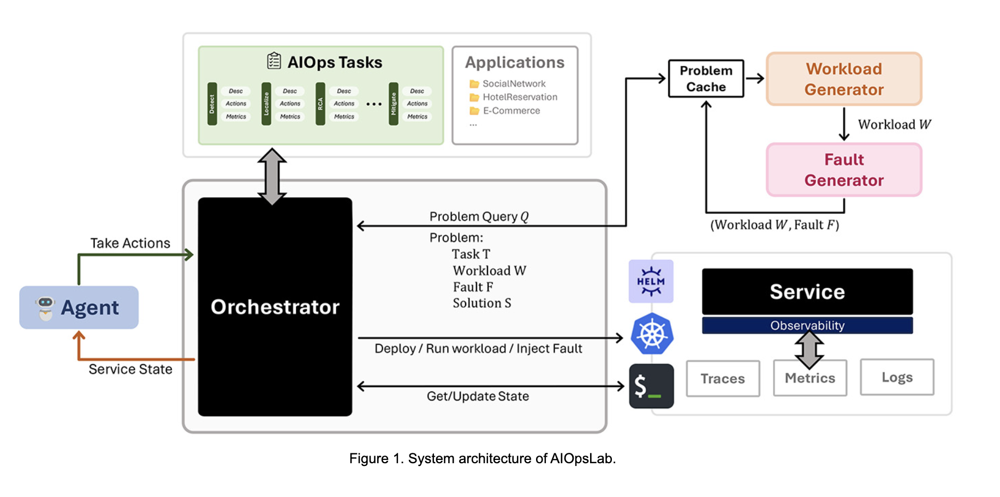

# Microsoft Researchers Release AIOpsLab: An Open-Source Comprehensive AI Framework for AIOps Agents

> The increasing complexity of cloud computing has brought both opportunities and challenges. Enterprises now depend heavily on intricate cloud-based infrastructures to ensure their operations run smoothly. Site Reliability Engineers (SREs) and DevOps teams are tasked with managing fault detection, diagnosis, and mitigation—tasks that have become more demanding with the rise of microservices and serverless architectures. […]

The increasing complexity of cloud computing has brought both opportunities and challenges. Enterprises now depend heavily on intricate cloud-based infrastructures to ensure their operations run smoothly. Site Reliability Engineers (SREs) and DevOps teams are tasked with managing fault detection, diagnosis, and mitigation—tasks that have become more demanding with the rise of microservices and serverless architectures. While these models enhance scalability, they also introduce numerous potential failure points. For instance, a single hour of downtime on platforms like Amazon AWS can result in substantial financial losses. Although efforts to automate IT operations with AIOps agents have progressed, they often fall short due to a lack of standardization, reproducibility, and realistic evaluation tools. Existing approaches tend to address specific aspects of operations, leaving a gap in comprehensive frameworks for testing and improving AIOps agents under practical conditions.

To tackle these challenges, Microsoft researchers, along with a team of researchers from the University of California, Berkeley, the University of Illinois Urbana-Champaign, the Indian Institue of Science, and Agnes Scott College, have developed AIOpsLab, an evaluation framework designed to enable the systematic design, development, and enhancement of AIOps agents. AIOpsLab aims to address the need for reproducible, standardized, and scalable benchmarks. At its core, AIOpsLab integrates real-world workloads, fault injection capabilities, and interfaces between agents and cloud environments to simulate production-like scenarios. This open-source framework covers the entire lifecycle of cloud operations, from detecting faults to resolving them. By offering a modular and adaptable platform, AIOpsLab supports researchers and practitioners in advancing the reliability of cloud systems and reducing dependence on manual interventions.

### Technical Details and Benefits

The AIOpsLab framework features several key components. The orchestrator, a central module, mediates interactions between agents and cloud environments by providing task descriptions, action APIs, and feedback. Fault and workload generators replicate real-world conditions to challenge the agents being tested. Observability, another cornerstone of the framework, provides comprehensive telemetry data, such as logs, metrics, and traces, to aid in fault diagnosis. This flexible design allows integration with diverse architectures, including Kubernetes and microservices. By standardizing the evaluation of AIOps tools, AIOpsLab ensures consistent and reproducible testing environments. It also offers researchers valuable insights into agent performance, enabling continuous improvements in fault localization and resolution capabilities.

### Results and Insights

In one case study, AIOpsLab’s capabilities were evaluated using the SocialNetwork application from DeathStarBench. Researchers introduced a realistic fault—a microservice misconfiguration—and tested an LLM-based agent employing the ReAct framework powered by GPT-4. The agent identified and resolved the issue within 36 seconds, demonstrating the framework’s effectiveness in simulating real-world conditions. Detailed telemetry data proved essential for diagnosing the root cause, while the orchestrator’s API design facilitated the agent’s balanced approach between exploratory and targeted actions. These findings underscore AIOpsLab’s potential as a robust benchmark for assessing and improving AIOps agents.

### Conclusion

AIOpsLab offers a thoughtful approach to advancing autonomous cloud operations. By addressing the gaps in existing tools and providing a reproducible and realistic evaluation framework, it supports the ongoing development of reliable and efficient AIOps agents. With its open-source nature, AIOpsLab encourages collaboration and innovation among researchers and practitioners. As cloud systems grow in scale and complexity, frameworks like AIOpsLab will become essential for ensuring operational reliability and advancing the role of AI in IT operations.

---

Check out **the _[Paper](https://arxiv.org/pdf/2407.12165)_**, **_[GitHub Page](https://github.com/microsoft/AIOpsLab/?tab=readme-ov-file)_**, and **_[Microsoft Details](https://www.microsoft.com/en-us/research/blog/aiopslab-building-ai-agents-for-autonomous-clouds/)_**. All credit for this research goes to the researchers of this project. Also, don’t forget to follow us on **[Twitter](https://twitter.com/Marktechpost)** and join our **[Telegram Channel](https://github.com/XGenerationLab/XiYan-SQL)** and [**LinkedIn Gr**](https://www.linkedin.com/groups/13668564/)[**oup**](https://www.linkedin.com/groups/13668564/). Don’t Forget to join our **[60k+ ML SubReddit](https://www.reddit.com/r/machinelearningnews/)**.

**[🚨 Trending: LG AI Research Releases EXAONE 3.5: Three Open-Source Bilingual Frontier AI-level Models Delivering Unmatched Instruction Following and Long Context Understanding for Global Leadership in Generative AI Excellence….](https://www.marktechpost.com/2024/12/11/lg-ai-research-releases-exaone-3-5-three-open-source-bilingual-frontier-ai-level-models-delivering-unmatched-instruction-following-and-long-context-understanding-for-global-leadership-in-generative-a/)**
