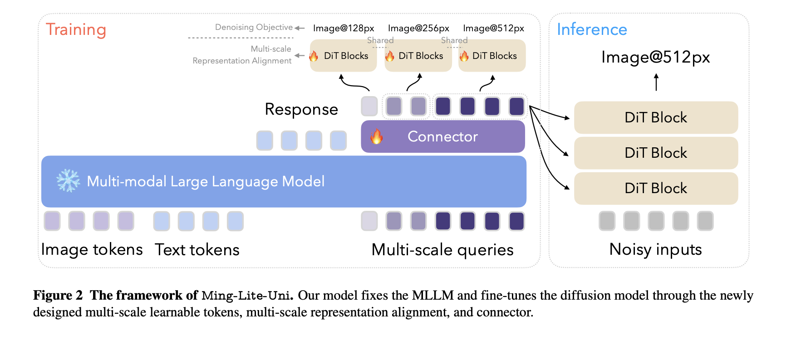

# Ming-Lite-Uni: An Open-Source AI Framework Designed to Unify Text and Vision through an Autoregressive Multimodal Structure

> Multimodal AI rapidly evolves to create systems that can understand, generate, and respond using multiple data types within a single conversation or task, such as text, images, and even video or audio. These systems are expected to function across diverse interaction formats, enabling more seamless human-AI communication. With users increasingly engaging AI for tasks like […]

Multimodal AI rapidly evolves to create systems that can understand, generate, and respond using multiple data types within a single conversation or task, such as text, images, and even video or audio. These systems are expected to function across diverse interaction formats, enabling more seamless human-AI communication. With users increasingly engaging AI for tasks like image captioning, text-based photo editing, and style transfers, it has become important for these models to process inputs and interact across modalities in real time. The frontier of research in this domain is focused on merging capabilities once handled by separate models into unified systems that can perform fluently and precisely.

A major obstacle in this area stems from the misalignment between language-based semantic understanding and the visual fidelity required in image synthesis or editing. When separate models handle different modalities, the outputs often become inconsistent, leading to poor coherence or inaccuracies in tasks that require interpretation and generation. The visual model might excel in reproducing an image but fail to grasp the nuanced instructions behind it. In contrast, the language model might understand the prompt but cannot shape it visually. There is also a scalability concern when models are trained in isolation; this approach demands significant compute resources and retraining efforts for each domain. The inability to seamlessly link vision and language into a coherent and interactive experience remains one of the fundamental problems in advancing intelligent systems.

In recent attempts to bridge this gap, researchers have combined architectures with fixed visual encoders and separate decoders that function through diffusion-based techniques. Tools such as TokenFlow and Janus integrate token-based language models with image generation backends, but they typically emphasize pixel accuracy over semantic depth. These approaches can produce visually rich content, yet they often miss the contextual nuances of user input. Others, like GPT-4o, have moved toward native image generation capabilities but still operate with limitations in deeply integrated understanding. The friction lies in translating abstract text prompts into meaningful and context-aware visuals in a fluid interaction without splitting the pipeline into disjointed parts.

Researchers from Inclusion AI, Ant Group introduced [Ming-Lite-Uni](https://github.com/inclusionAI/Ming/tree/main/Ming-unify), an open-source framework designed to unify text and vision through an autoregressive multimodal structure. The system features a native autoregressive model built on top of a fixed large language model and a fine-tuned diffusion image generator. This design is based on two core frameworks: MetaQueries and M2-omni. Ming-Lite-Uni introduces an innovative component of multi-scale learnable tokens, which act as interpretable visual units, and a corresponding multi-scale alignment strategy to maintain coherence between various image scales. The researchers provided all the model weights and implementation openly to support community research, positioning Ming-Lite-Uni as a prototype moving toward general artificial intelligence.

The core mechanism behind the model involves compressing visual inputs into structured token sequences across multiple scales, such as 4×4, 8×8, and 16×16 image patches, each representing different levels of detail, from layout to textures. These tokens are processed alongside text tokens using a large autoregressive transformer. Each resolution level is marked with unique start and end tokens and assigned custom positional encodings. The model employs a multi-scale representation alignment strategy that aligns intermediate and output features through a mean squared error loss, ensuring consistency across layers. This technique boosts image reconstruction quality by over 2 dB in PSNR and improves generation evaluation (GenEval) scores by 1.5%. Unlike other systems that retrain all components, Ming-Lite-Uni keeps the language model frozen and only fine-tunes the image generator, allowing faster updates and more efficient scaling.

The system was tested on various multimodal tasks, including text-to-image generation, style transfer, and detailed image editing using instructions like “make the sheep wear tiny sunglasses” or “remove two of the flowers in the image.” The model handled these tasks with high fidelity and contextual fluency. It maintained strong visual quality even when given abstract or stylistic prompts such as “Hayao Miyazaki’s style” or “Adorable 3D.” The training set spanned over 2.25 billion samples, combining LAION-5B (1.55B), COYO (62M), and Zero (151M), supplemented with filtered samples from Midjourney (5.4M), Wukong (35M), and other web sources (441M). Furthermore, it incorporated fine-grained datasets for aesthetic assessment, including AVA (255K samples), TAD66K (66K), AesMMIT (21.9K), and APDD (10K), which enhanced the model’s ability to generate visually appealing outputs according to human aesthetic standards.

The model combines semantic robustness with high-resolution image generation in a single pass. It achieves this by aligning image and text representations at the token level across scales, rather than depending on a fixed encoder-decoder split. The approach allows autoregressive models to carry out complex editing tasks with contextual guidance, which was previously hard to achieve. FlowMatching loss and scale-specific boundary markers support better interaction between the transformer and the diffusion layers. Overall, the model strikes a rare balance between language comprehension and visual output, positioning it as a significant step toward practical multimodal AI systems.

Several Key Takeaways from the Research on Ming-Lite-Uni:

- Ming-Lite-Uni introduced a unified architecture for vision and language tasks using autoregressive modeling.

- Visual inputs are encoded using multi-scale learnable tokens (4×4, 8×8, 16×16 resolutions).

- The system maintains a frozen language model and trains a separate diffusion-based image generator.

- A multi-scale representation alignment improves coherence, yielding an over 2 dB improvement in PSNR and a 1.5% boost in GenEval.

- Training data includes over 2.25 billion samples from public and curated sources.

- Tasks handled include text-to-image generation, image editing, and visual Q&A, all processed with strong contextual fluency.

- Integrating aesthetic scoring data helps generate visually pleasing results consistent with human preferences.

- Model weights and implementation are open-sourced, encouraging replication and extension by the community.

---

Check out the[ **Paper**](https://arxiv.org/pdf/2505.02471)**, [Model on Hugging Face](https://huggingface.co/inclusionAI/Ming-Lite-Uni) and [GitHub Page](https://github.com/inclusionAI/Ming/tree/main/Ming-unify).** Also, don’t forget to follow us on **[Twitter](https://x.com/intent/follow?screen_name=marktechpost)**.

**Here’s a brief overview of what we’re building at Marktechpost:**

- **ML News Community –[ r/machinelearningnews](https://www.reddit.com/r/machinelearningnews/) (92k+ members)**

- **Newsletter– [airesearchinsights.com/](https://minicon.marktechpost.com/)(30k+ subscribers)**

- **miniCON AI Events – [minicon.marktechpost.com](https://minicon.marktechpost.com/)**

- **AI Reports & Magazines – [magazine.marktechpost.com](https://magazine.marktechpost.com/)**

- **AI Dev & Research News – [marktechpost.com](https://marktechpost.com/) (1M+ monthly readers)**
