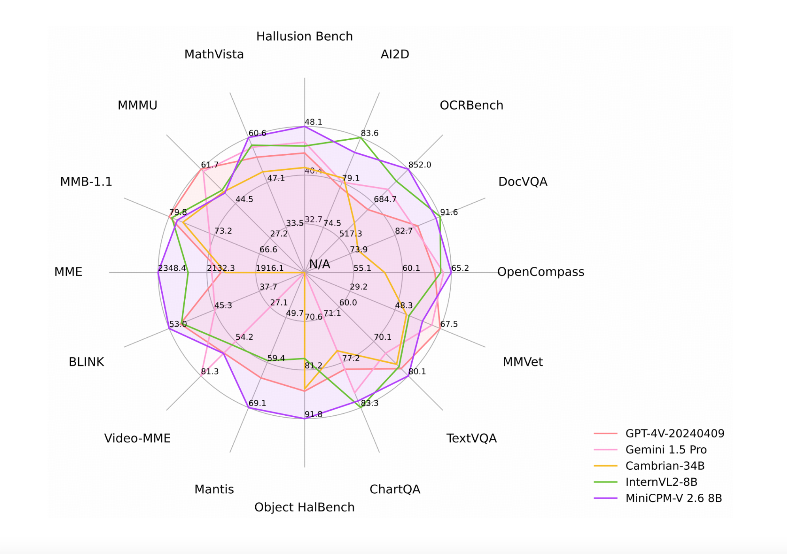

# MiniCPM-V 2.6: A GPT-4V Level Multimodal LLMs for Single Image, Multi-Image, and Video on Your Phone

> MiniCPM-V 2.6 represents the latest and most advanced iteration in the MiniCPM-V series, constructed on the SigLip-400M and Qwen2-7B frameworks, boasting a total of 8 billion parameters. This model introduces significant enhancements in performance and new features tailored for multi-image and video understanding, achieving substantial advancements over its predecessor, MiniCPM-Llama3-V 2.5. Key Features of MiniCPM-V […]

MiniCPM-V 2.6 represents the latest and most advanced iteration in the MiniCPM-V series, constructed on the SigLip-400M and Qwen2-7B frameworks, boasting a total of 8 billion parameters. This model introduces significant enhancements in performance and new features tailored for multi-image and video understanding, achieving substantial advancements over its predecessor, MiniCPM-Llama3-V 2.5.

**Key Features of MiniCPM-V 2.6:**

- **Leading Performance**: MiniCPM-V 2.6 attains an average score of 65.2 on OpenCompass, a comprehensive evaluation across eight popular benchmarks. With its 8 billion parameters, this model surpasses prominent proprietary models such as GPT-4o mini, GPT-4V, Gemini 1.5 Pro, and Claude 3.5 Sonnet in single image understanding.

- **Multi-Image Understanding and In-context Learning**: Capable of conversation and reasoning over multiple images, MiniCPM-V 2.6 achieves state-of-the-art results on multi-image benchmarks including Mantis-Eval, BLINK, Mathverse mv, and Sciverse mv. It also exhibits promising in-context learning abilities.

- **Video Understanding:** Accepting video inputs, MiniCPM-V 2.6 provides conversation and dense captions for spatial-temporal information. It outperforms models like GPT-4V, Claude 3.5 Sonnet, and LLaVA-NeXT-Video-34B on Video-MME, both with and without subtitles.

- **Strong OCR Capability**: Processing images with various aspect ratios and up to 1.8 million pixels, MiniCPM-V 2.6 sets a new standard on OCRBench, outperforming proprietary models such as GPT-4o, GPT-4V, and Gemini 1.5 Pro. Leveraging the latest RLAIF-V and VisCPM techniques, it ensures trustworthy behaviors with significantly lower hallucination rates on Object HalBench, supporting multilingual capabilities across English, Chinese, German, French, Italian, and Korean.

- **Superior Efficiency**: Despite its compact size, MiniCPM-V 2.6 exhibits state-of-the-art token density, encoding a 1.8 million pixel image into just 640 tokens, 75% fewer than most models. This enhances inference speed, first-token latency, memory usage, and power consumption, enabling efficient real-time video understanding on devices such as iPads.

- **Ease of Use**: MiniCPM-V 2.6 is versatile in its application, supporting efficient CPU inference on local devices through llama.cpp and ollama, offering quantized models in int4 and GGUF formats in 16 sizes, vLLM support for high-throughput and memory-efficient inference, domain-specific fine-tuning, quick local WebUI demo setup with Gradio, and online web demos.

MiniCPM-V 2.6 represents a significant leap in machine learning for visual understanding, offering unmatched performance, efficiency, and usability across single image, multi-image, and video processing tasks

---

Check out the **[HF Model](https://huggingface.co/openbmb/MiniCPM-V-2_6) and [GitHub](https://github.com/OpenBMB/MiniCPM-V)**. All credit for this research goes to the researchers of this project. Also, don’t forget to follow us on **[Twitter](https://twitter.com/Marktechpost)** and join our **[Telegram Channel](https://pxl.to/at72b5j)** and [**LinkedIn Gr**](https://www.linkedin.com/groups/13668564/)[**oup**](https://www.linkedin.com/groups/13668564/). **If you like our work, you will love our**[** newsletter..**](https://marktechpost-newsletter.beehiiv.com/subscribe)

Don’t Forget to join our **[47k+ ML SubReddit](https://www.reddit.com/r/machinelearningnews/)**

**Find Upcoming [AI Webinars here](https://www.marktechpost.com/ai-webinars-list-llms-rag-generative-ai-ml-vector-database/)**

---

> [Arcee AI Released DistillKit: An Open Source, Easy-to-Use Tool Transforming Model Distillation for Creating Efficient, High-Performance Small Language Models](https://www.marktechpost.com/2024/08/01/arcee-ai-released-distillkit-an-open-source-easy-to-use-tool-transforming-model-distillation-for-creating-efficient-high-performance-small-language-models/)
