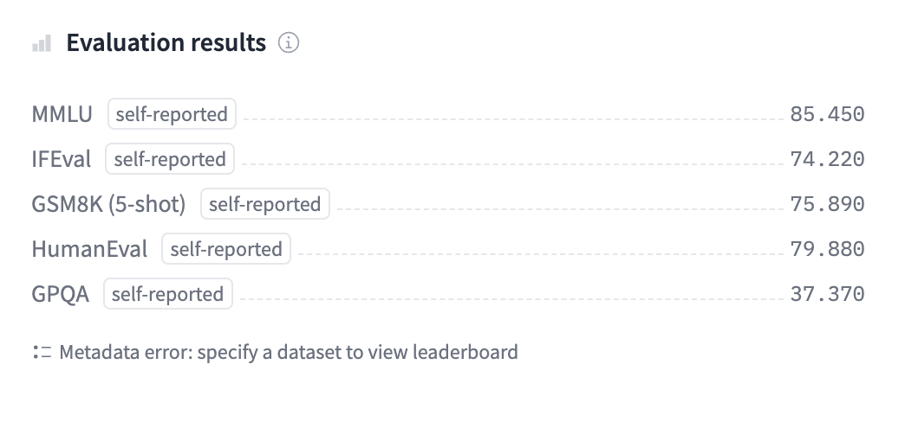

# miniG Released by CausalLM: A Groundbreaking Scalable AI-Language Model Trained on a Synthesis Dataset of 120 Million Entries

> CausalLM has released miniG, a groundbreaking language model designed to bridge the gap between performance & efficiency. This innovative model stands out for its powerful capabilities and compact design, making advanced AI technology more accessible to a wider audience. As industries increasingly seek cost-effective and scalable AI solutions, miniG emerges as a transformative tool, setting […]

CausalLM has released [**miniG**](https://huggingface.co/CausalLM/miniG), a groundbreaking language model designed to bridge the gap between performance & efficiency. This innovative model stands out for its powerful capabilities and compact design, making advanced AI technology more accessible to a wider audience. As industries increasingly seek cost-effective and scalable AI solutions, miniG emerges as a transformative tool, setting a new standard in developing and deploying AI models.

**Background and Development of miniG**

miniG, the latest creation by CausalLM, represents a substantial leap in the field of AI language models. CausalLM, known for its expertise in developing advanced AI models, has once again demonstrated its prowess with the release of miniG. The development of miniG was driven by the need for a more efficient, scalable, and versatile language model that could perform at a level comparable to its larger counterparts while maintaining a smaller footprint.

*[**Image Source**](https://huggingface.co/CausalLM/miniG)*

The creation of miniG involved a meticulous research and development process, during which the team at CausalLM focused on optimizing the model’s architecture. The objective was to build a model that could deliver high performance with fewer computational resources. This goal was achieved by leveraging state-of-the-art techniques in model compression, fine-tuning, and knowledge distillation. The result is a language model that is powerful and accessible to a broader range of users, from large enterprises to individual developers.

**Key Features and Capabilities of miniG**

One of the most remarkable aspects of miniG is its ability to perform complex language tasks with impressive accuracy. Despite its smaller size, miniG does not compromise performance. It excels in natural language processing (NLP) tasks such as text generation, sentiment analysis, translation, and summarization. The model’s architecture is designed to handle large datasets efficiently, making it suitable for various real-world applications.

Another feature that sets miniG apart is its scalability. CausalLM has ensured that miniG can be easily integrated into different platforms, whether deployed on cloud services or edge devices. This flexibility is crucial for industries or businesses that require real-time processing & analysis, such as finance, healthcare, and customer service. miniG’s ability to function seamlessly across different environments makes it an important tool for developers who need to build AI-powered applications with limited resources.

In addition to its technical capabilities, miniG is designed with user-friendliness in mind. CausalLM has provided comprehensive documentation and support to help users get started with the model quickly. The company has also made the model available through various interfaces, including APIs and open-source libraries, ensuring that developers can integrate miniG into their projects with minimal effort.

**Impact on the AI Community and Industry**

The release of miniG is expected to impact the AI community and various industries profoundly. MiniG provides a new benchmark for model efficiency and performance for the AI research community. It challenges the notion that bigger models are always better by demonstrating that smaller, well-optimized models can achieve comparable results. This shift in perspective will likely influence future research directions, encouraging the development of more efficient models accessible to a wider audience.

In the industry, miniG’s release comes with a growing demand for powerful, cost-effective AI solutions. Businesses are increasingly looking for AI models that can be deployed at scale without incurring prohibitive costs. miniG addresses this need by offering a model that delivers high performance at a fraction of the cost of larger models. This affordability and versatility make miniG an attractive option for companies and businesses looking to integrate AI into their operations.

miniG’s release is likely to spur innovation in AI applications. With a powerful yet accessible model, developers and businesses can explore new use cases for AI previously considered too resource-intensive. This could lead to the development novel AI-powered products and services, driving growth in the tech industry and beyond.

**Ethical Considerations and Future Prospects**

As with any AI model, the release of miniG also raises important ethical considerations. CausalLM has emphasized the importance of responsible AI development and has taken steps to ensure that miniG is used in a manner that aligns with ethical standards. The company has implemented safeguards to prevent model misuse, such as limiting access to certain features and providing guidelines on responsible AI usage. CausalLM has already hinted at future updates and iterations of the model, which could include enhancements in performance, security, and user experience. The company’s commitment to innovation suggests that miniG is just the beginning of a new era in AI development, where efficiency and accessibility are prioritized alongside power and performance.

**Conclusion**

CausalLM’s release of miniG combines high performance with efficiency and accessibility. miniG can potentially revolutionize how AI is used across various industries. Its impact will likely be felt in the tech sector and fields such as healthcare, finance, and customer service, where AI is becoming an integral part of operations.

---

Check out the [**Model Card**.](https://huggingface.co/CausalLM/miniG) All credit for this research goes to the researchers of this project. Also, don’t forget to follow us on **[Twitter](https://twitter.com/Marktechpost)** and join our **[Telegram Channel](https://www.zyphra.com/post/zamba2-mini)** and [**LinkedIn Gr**](https://www.linkedin.com/groups/13668564/)[**oup**](https://www.linkedin.com/groups/13668564/). **If you like our work, you will love our**[** newsletter..**](https://marktechpost-newsletter.beehiiv.com/subscribe)

Don’t Forget to join our **[50k+ ML SubReddit](https://www.reddit.com/r/machinelearningnews/)**

Here is a highly recommended webinar from our sponsor: **[‘Building Performant AI Applications with NVIDIA NIMs and Haystack’](https://landing.deepset.ai/webinar-nvidia-nims-and-haystack?utm_campaign=2409-campaign-nvidia-nims-and-haystack-&utm_source=marktechpost&utm_medium=banner-ad-desktop)**
