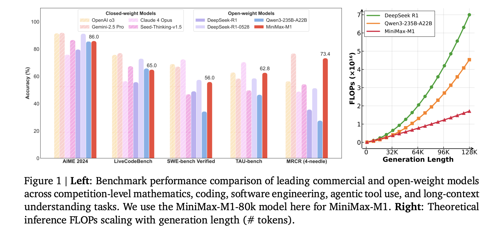

# MiniMax AI Releases MiniMax-M1: A 456B Parameter Hybrid Model for Long-Context and Reinforcement Learning RL Tasks

> The Challenge of Long-Context Reasoning in AI Models Large reasoning models are not only designed to understand language but are also structured to think through multi-step processes that require prolonged attention spans and contextual comprehension. As the expectations from AI grow, especially in real-world and software development environments, researchers have sought architectures that can handle […]

### The Challenge of Long-Context Reasoning in AI Models

Large reasoning models are not only designed to understand language but are also structured to think through multi-step processes that require prolonged attention spans and contextual comprehension. As the expectations from AI grow, especially in real-world and software development environments, researchers have sought architectures that can handle longer inputs and sustain deep, coherent reasoning chains without overwhelming computational costs.

### Computational Constraints with Traditional Transformers

The primary difficulty in expanding these reasoning capabilities lies in the excessive computational load that comes with longer generation lengths. Traditional transformer-based models employ a softmax attention mechanism, which scales quadratically with the input size. This limits their capacity to handle long input sequences or extended chains of thought efficiently. This problem becomes even more pressing in areas that require real-time interaction or cost-sensitive applications, where inference expenses are significant.

### Existing Alternatives and Their Limitations

Efforts to address this issue have yielded a range of methods, including sparse attention and linear attention variants. Some teams have experimented with state-space models and recurrent networks as alternatives to traditional attention structures. However, these innovations have seen limited adoption in the most competitive reasoning models due to either architectural complexity or a lack of scalability in real-world deployments. Even large-scale systems, such as Tencent’s Hunyuan-T1, which utilizes a novel Mamba architecture, remain closed-source, thereby restricting wider research engagement and validation.

### Introduction of MiniMax-M1: A Scalable Open-Weight Model

Researchers at MiniMax AI introduced MiniMax-M1, a new open-weight, large-scale reasoning model that combines a mixture of experts’ architecture with lightning-fast attention. Built as an evolution of the MiniMax-Text-01 model, MiniMax-M1 contains 456 billion parameters, with 45.9 billion activated per token. It supports context lengths of up to 1 million tokens—eight times the capacity of DeepSeek R1. This model addresses compute scalability at inference time, consuming only 25% of the FLOPs required by DeepSeek R1 at 100,000 token generation length. It was trained using large-scale reinforcement learning on a broad range of tasks, from mathematics and coding to software engineering, marking a shift toward practical, long-context AI models.

### Hybrid-Attention with Lightning Attention and Softmax Blocks

To optimize this architecture, MiniMax-M1 employs a hybrid attention scheme where every seventh transformer block uses traditional softmax attention, followed by six blocks using lightning attention. This significantly reduces computational complexity while preserving performance. The lightning attention itself is I/O-aware, adapted from linear attention, and is particularly effective at scaling reasoning lengths to hundreds of thousands of tokens. For reinforcement learning efficiency, the researchers introduced a novel algorithm called CISPO. Instead of clipping token updates as traditional methods do, CISPO clips importance sampling weights, enabling stable training and consistent token contributions, even in off-policy updates.

### The CISPO Algorithm and RL Training Efficiency

The CISPO algorithm proved essential in overcoming the training instability faced in hybrid architectures. In comparative studies using the Qwen2.5-32B baseline, CISPO achieved a 2x speedup compared to DAPO. Leveraging this, the full reinforcement learning cycle for MiniMax-M1 was completed in just three weeks using 512 H800 GPUs, with a rental cost of approximately $534,700. The model was trained on a diverse dataset comprising 41 logic tasks generated via the SynLogic framework and real-world software engineering environments derived from the SWE bench. These environments utilized execution-based rewards to guide performance, resulting in stronger outcomes in practical coding tasks.

### Benchmark Results and Comparative Performance

MiniMax-M1 delivered compelling benchmark results. Compared to DeepSeek-R1 and Qwen3-235B, it excelled in software engineering, long-context processing, and agentic tool use. Although it trailed the latest DeepSeek-R1-0528 in math and coding contests, it surpassed both OpenAI o3 and Claude 4 Opus in long-context understanding benchmarks. Furthermore, it outperformed Gemini 2.5 Pro in the TAU-Bench agent tool use evaluation.

### Conclusion: A Scalable and Transparent Model for Long-Context AI

MiniMax-M1 presents a significant step forward by offering both transparency and scalability. By addressing the dual challenge of inference efficiency and training complexity, the research team at MiniMax AI has set a precedent for open-weight reasoning models. This work not only brings a solution to compute constraints but also introduces practical methods for scaling language model intelligence into real-world applications.

---

Check out the** [Paper](https://github.com/MiniMax-AI/MiniMax-M1/blob/main/MiniMax_M1_tech_report.pdf), [Model](https://huggingface.co/collections/MiniMaxAI/minimax-m1-68502ad9634ec0eeac8cf094) and [GitHub Page](https://github.com/MiniMax-AI/MiniMax-M1/tree/main)_._** All credit for this research goes to the researchers of this project. Also, feel free to follow us on **[Twitter](https://x.com/intent/follow?screen_name=marktechpost)** and don’t forget to join our **[100k+ ML SubReddit](https://www.reddit.com/r/machinelearningnews/)** and Subscribe to **[our Newsletter](https://www.airesearchinsights.com/subscribe)**.
