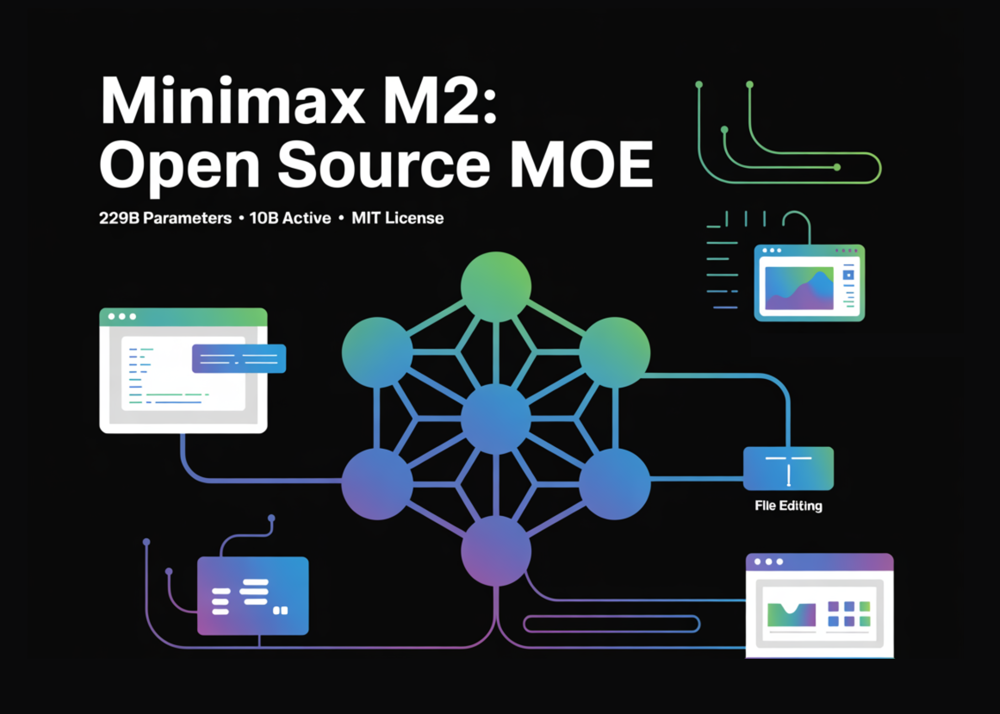

# MiniMax Releases MiniMax M2: A Mini Open Model Built for Max Coding and Agentic Workflows at 8% Claude Sonnet Price and ~2x Faster

> Can an open source MoE truly power agentic coding workflows at a fraction of flagship model costs while sustaining long-horizon tool use across MCP, shell, browser, retrieval, and code? MiniMax team has just released MiniMax-M2, a mixture of experts MoE model optimized for coding and agent workflows. The weights are published on Hugging Face under […]

Can an open source MoE truly power agentic coding workflows at a fraction of flagship model costs while sustaining long-horizon tool use across MCP, shell, browser, retrieval, and code? MiniMax team has just released **MiniMax-M2**, a mixture of experts MoE model optimized for coding and agent workflows. The weights are published on Hugging Face under the MIT license, and the model is positioned as for end to end tool use, multi file editing, and long horizon plans, It lists 229B total parameters with about 10B active per token, which keeps memory and latency in check during agent loops.

*https://github.com/MiniMax-AI/MiniMax-M2*

### Architecture and why activation size matters?

**MiniMax-M2** is a compact MoE that routes to about 10B active parameters per token. The smaller activations reduce memory pressure and tail latency in plan, act, and verify loops, and allow more concurrent runs in CI, browse, and retrieval chains. This is the performance budget that enables the speed and cost claims relative to dense models of similar quality.

**MiniMax-M2** is an interleaved thinking model. The research team wrapped internal reasoning in `<think>...</think>` blocks, and instructs users to keep these blocks in the conversation history across turns. Removing these segments harms quality in multi step tasks and tool chains. This requirement is explicit on the [model page on HF](https://huggingface.co/MiniMaxAI/MiniMax-M2).

### Benchmarks that target coding and agents

The MiniMax team reports a set of agent and code evaluations are closer to developer workflows than static QA. On Terminal Bench, the table shows 46.3. On Multi SWE Bench, it shows 36.2. On BrowseComp, it shows 44.0. SWE Bench Verified is listed at 69.4 with the scaffold detail, OpenHands with 128k context and 100 steps.

*https://github.com/MiniMax-AI/MiniMax-M2*

MiniMax’s official announcement stresses 8% of Claude Sonnet pricing, and near 2x speed, plus a free access window. The same note provides the specific token prices and the trial deadline.

### Comparison M1 vs M2

AspectMiniMax M1MiniMax M2Total parameters456B total229B in model card metadata, model card text says 230B totalActive parameters per token45.9B active10B activeCore designHybrid Mixture of Experts with Lightning AttentionSparse Mixture of Experts targeting coding and agent workflowsThinking formatThinking budget variants 40k and 80k in RL training, no think tag protocol requiredInterleaved thinking with `<think>...</think>` segments that must be preserved across turnsBenchmarks highlightedAIME, LiveCodeBench, SWE-bench Verified, TAU-bench, long context MRCR, MMLU-ProTerminal-Bench, Multi SWE-Bench, SWE-bench Verified, BrowseComp, GAIA text only, Artificial Analysis intelligence suiteInference defaultstemperature 1.0, top p 0.95model card shows temperature 1.0, top p 0.95, top k 40, launch page shows top k 20Serving guidancevLLM recommended, Transformers path also documentedvLLM and SGLang recommended, tool calling guide providedPrimary focusLong context reasoning, efficient scaling of test time compute, CISPO reinforcement learningAgent and code native workflows across shell, browser, retrieval, and code runners

### Key Takeaways

- M2 ships as open weights on Hugging Face under MIT, with safetensors in F32, BF16, and FP8 F8_E4M3.

- The model is a compact MoE with 229B total parameters and ~10B active per token, which the card ties to lower memory use and steadier tail latency in plan, act, verify loops typical of agents.

- Outputs wrap internal reasoning in `...` and the model card explicitly instructs retaining these segments in conversation history, warning that removal degrades multi-step and tool-use performance.

- Reported results cover Terminal-Bench, (Multi-)SWE-Bench, BrowseComp, and others, with scaffold notes for reproducibility, and day-0 serving is documented for SGLang and vLLM with concrete deploy guides.

### Editorial Notes

MiniMax M2 lands with open weights under MIT, a mixture of experts design with 229B total parameters and about 10B activated per token, which targets agent loops and coding tasks with lower memory and steadier latency. It ships on Hugging Face in safetensors with FP32, BF16, and FP8 formats, and provides deployment notes plus a chat template. The API documents Anthropic compatible endpoints and lists pricing with a limited free window for evaluation. vLLM and SGLang recipes are available for local serving and benchmarking. Overall, MiniMax M2 is a very solid open release.

---

Check out the **[API Doc](https://platform.minimax.io/docs/guides/text-generation), [Weights](https://huggingface.co/MiniMaxAI/MiniMax-M2) and [Repo](https://github.com/MiniMax-AI/MiniMax-M2)**. Feel free to check out our **[GitHub Page for Tutorials, Codes and Notebooks](https://github.com/Marktechpost/AI-Tutorial-Codes-Included)**. Also, feel free to follow us on **[Twitter](https://x.com/intent/follow?screen_name=marktechpost)** and don’t forget to join our **[100k+ ML SubReddit](https://www.reddit.com/r/machinelearningnews/)** and Subscribe to **[our Newsletter](https://www.aidevsignals.com/)**. Wait! are you on telegram? **[now you can join us on telegram as well.](https://t.me/machinelearningresearchnews)**
