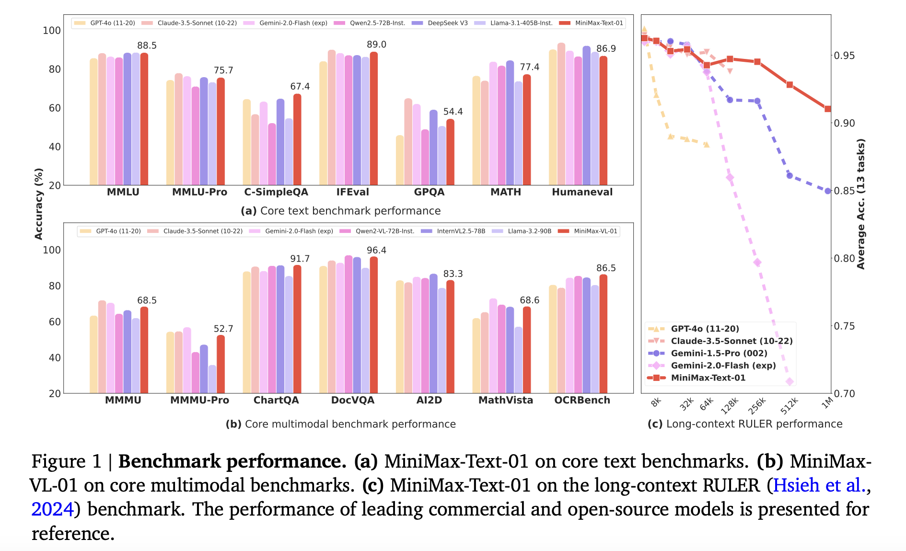

# MiniMax-Text-01 and MiniMax-VL-01 Released: Scalable Models with Lightning Attention, 456B Parameters, 4M Token Contexts, and State-of-the-Art Accuracy

> Large Language Models (LLMs) and Vision-Language Models (VLMs) transform natural language understanding, multimodal integration, and complex reasoning tasks. Yet, one critical limitation remains: current models cannot efficiently handle extremely large contexts. This challenge has prompted researchers to explore new methods and architectures to improve these models’ scalability, efficiency, and performance. Existing models typically support token […]

Large Language Models (LLMs) and Vision-Language Models (VLMs) transform natural language understanding, multimodal integration, and complex reasoning tasks. Yet, one critical limitation remains: current models cannot efficiently handle extremely large contexts. This challenge has prompted researchers to explore new methods and architectures to improve these models’ scalability, efficiency, and performance.

Existing models typically support token context lengths between 32,000 and 256,000, which limits their ability to handle scenarios requiring larger context windows, such as extended programming instructions or multi-step reasoning tasks. Increasing context sizes is computationally expensive due to the quadratic complexity of traditional softmax attention mechanisms. Researchers have explored alternative attention methods, such as sparse attention, linear attention, and state-space models, to address these challenges, but large-scale implementation remains limited.

Sparse attention focuses on relevant inputs to reduce computational overhead, while linear attention simplifies the attention matrix for scalability. However, adoption has been slow due to compatibility issues with existing architectures and suboptimal real-world performance. For example, state-space models effectively process long sequences but often lack the robustness and accuracy of transformer-based systems in complex tasks.

**Researchers from MiniMax have introduced the MiniMax-01 series, including two variants to address these limitations:**

- [**MiniMax-Text-01:** ](https://huggingface.co/spaces/MiniMaxAI/MiniMax-Text-01)MiniMax-Text-01 comprises 456 billion total parameters, with 45.9 billion activated per token. It leverages a hybrid attention mechanism for efficient long-context processing. Its context window extends to 1 million tokens during training and 4 million tokens during inference.

- [**MiniMax-VL-01:**](https://huggingface.co/MiniMaxAI/MiniMax-VL-01)** **MiniMax-VL-01 integrates a lightweight Vision Transformer (ViT) module and processes 512 billion vision-language tokens through a four-stage training pipeline.

The models employ a novel lightning attention mechanism, reducing the computational complexity of processing long sequences. Also, integrating a Mixture of Experts (MoE) architecture enhances scalability and efficiency. The MiniMax models feature 456 billion parameters, of which 45.9 billion are activated for each token. This combination allows the models to process context windows of up to 1 million tokens during training and extrapolate to 4 million tokens during inference. By leveraging advanced computational strategies, the MiniMax-01 series offers unprecedented capabilities in long-context processing while maintaining performance on par with state-of-the-art models such as GPT-4 and Claude-3.5.

*[**Image Source**](https://www.minimaxi.com/en/news/minimax-01-series-2)*

The lightning attention mechanism achieves linear computational complexity, enabling the model to scale effectively. The hybrid attention architecture alternates between lightning and softmax attention layers, ensuring a balance between computational efficiency and retrieval capabilities. The models also incorporate an enhanced Linear Attention Sequence Parallelism (LASP+) algorithm, efficiently handling extensive sequences. Also, the vision-language model MiniMax-VL-01 integrates a lightweight vision transformer module, enabling it to process 512 billion vision-language tokens through a four-stage training process. These innovations are complemented by optimized CUDA kernels and parallelization strategies, achieving over 75% Model Flops Utilization on Nvidia H20 GPUs.

*[**Image Source**](https://www.minimaxi.com/en/news/minimax-01-series-2)*

**Performance evaluations reveal that the MiniMax models achieve groundbreaking results across various benchmarks: **

- For instance, MiniMax-Text-01 is 88.5% accurate on MMLU and performs competitively against models like GPT-4.

- The vision-language model MiniMax-VL-01 surpasses many peers, with a 96.4% accuracy rate on DocVQA and 91.7% on AI2D benchmarks.

These models also offer a 20–32 times longer context window than traditional counterparts, significantly enhancing their utility for long-context applications.

*[**Image Source**](https://www.minimaxi.com/en/news/minimax-01-series-2)*

In conclusion, the MiniMax-01 series, comprising MiniMax-Text-01 and MiniMax-VL-01, represents a breakthrough in addressing scalability and long-context challenges. It combines innovative techniques like lightning attention with a hybrid architecture. By leveraging advanced computational frameworks and optimization strategies, researchers have introduced a solution that extends context capabilities to an unprecedented 4 million tokens and matches or surpasses the performance of leading models like GPT-4.

---

Check out **_the [Paper](https://filecdn.minimax.chat/_Arxiv_MiniMax_01_Report.pdf) and [Models on Hugging Face](https://huggingface.co/MiniMaxAI)._** All credit for this research goes to the researchers of this project. Also, don’t forget to follow us on **[Twitter](https://x.com/intent/follow?screen_name=marktechpost)** and join our **[Telegram Channel](https://arxiv.org/abs/2406.09406)** and [**LinkedIn Gr**](https://www.linkedin.com/groups/13668564/)[**oup**](https://www.linkedin.com/groups/13668564/). Don’t Forget to join our **[65k+ ML SubReddit](https://www.reddit.com/r/machinelearningnews/)**.

**🚨 [Recommend Open-Source Platform](https://pxl.to/kgqelf6): [Parlant is a framework that transforms how AI agents make decisions in customer-facing scenarios.](https://pxl.to/kgqelf6)** _(Promoted)_
