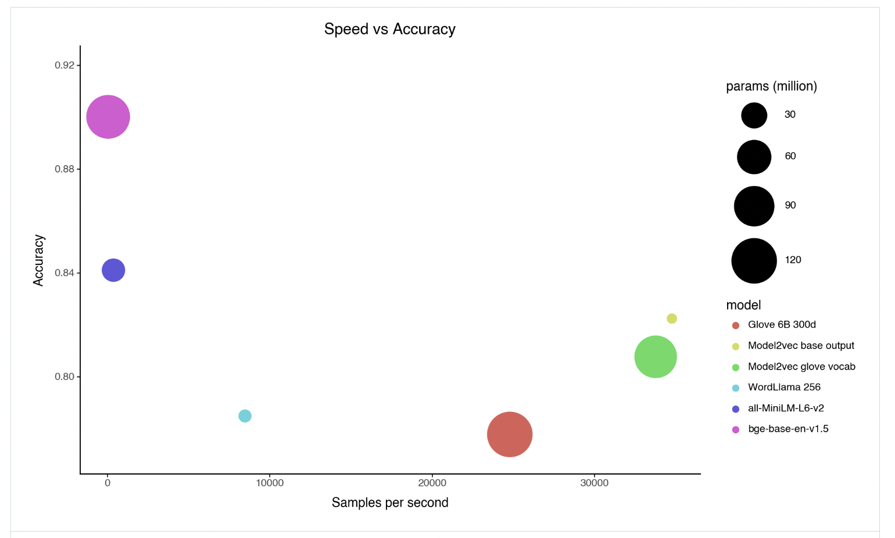

# Minish Lab Releases Model2Vec: An AI Tool for Distilling Small, Super-Fast Models from Any Sentence Transformer

> Minish Lab recently unveiled Model2Vec, a revolutionary tool designed to distill smaller, faster models from any Sentence Transformer. With this innovation, Minish Lab aims to provide researchers and developers with a highly efficient alternative for handling natural language processing (NLP) tasks. Model2Vec allows for the rapid distillation of compact models without sacrificing performance, positioning it […]

Minish Lab recently unveiled [**Model2Vec**](https://github.com/MinishLab/model2vec), a revolutionary tool designed to distill smaller, faster models from any Sentence Transformer. With this innovation, Minish Lab aims to provide researchers and developers with a highly efficient alternative for handling natural language processing (NLP) tasks. Model2Vec allows for the rapid distillation of compact models without sacrificing performance, positioning it as a powerful solution in language models.

**Overview of Model2Vec**

Model2Vec is a distillation tool that creates small, fast, and efficient models for various NLP tasks. Unlike traditional models, which often require large amounts of data and training time, Model2Vec operates without training data, offering a level of simplicity and speed previously unattainable.

**Model2vec has two modes:**

**Output**: Functions similarly to a sentence transformer, utilizing a subword tokenizer to encode all wordpieces. It is quick to create and compact (around 30 MB), though it may have lower performance on certain tasks.

**Vocab**: Operates like GloVe or standard word2vec vectors but offers improved performance. These models are slightly larger, depending on the vocabulary size, but remain fast and are ideal for scenarios where you have extra RAM but still require speed.

Model2Vec involves passing a vocabulary through a Sentence Transformer model, reducing the dimensionality of embeddings using principal component analysis (PCA), and applying Zipf weighting to enhance performance. The result is a small, static model performing exceptionally well on various tasks, making it ideal for setups with limited computing resources.

**Distillation and Model Inference**

The distillation process with Model2Vec is remarkably fast. According to the release, using the MPS backend, a model can be distilled in as little as 30 seconds on a 2024 MacBook. This efficiency is achieved without additional training data, a significant departure from traditional machine learning models that rely on large datasets for training. The distillation process converts a Sentence Transformer model into a much smaller Model2Vec model, reducing its size by 15, from 120 million parameters to just 7.5 million. The resulting model is only 30 MB on disk, making it ideal for deployment in resource-constrained environments.

Once distilled, the model can be used for inference tasks such as text classification, clustering, or even building retrieval-augmented generation (RAG) systems. Inference using Model2Vec models is significantly faster than traditional methods. The models can perform up to 500 times faster on CPU than their larger counterparts, offering a green and highly efficient alternative for NLP tasks.

**Key Features and Advantages**

One of Model2Vec’s standout features is its versatility. The tool works with any Sentence Transformer model, meaning users can bring their models and vocabulary. This flexibility allows users to create domain-specific models, such as biomedical or multilingual models, by simply inputting the relevant vocabulary. Model2Vec is tightly integrated with the HuggingFace hub, making it easy for users to share and load models directly from the platform. Another advantage of Model2Vec is its ability to handle multi-lingual tasks. Whether the need is for English, French, or a multilingual model, Model2Vec can accommodate these requirements, further broadening its applicability across different languages and domains. The ease of evaluation is also a significant benefit. Model2Vec models are designed to work out of the box on benchmark tasks like the Massive Text Embedding Benchmark (MTEB), allowing users to measure the performance of their distilled models quickly.

**Performance and Evaluation**

Model2Vec has undergone rigorous testing and evaluation, showing impressive results. Model2Vec models outperformed traditional static embedding models like GloVe and Word2Vec in benchmark evaluations. For example, the M2V_base_glove model, based on GloVe vocabulary, demonstrated better performance across a range of tasks than the original GloVe embeddings.

Model2Vec models were shown to be competitive with state-of-the-art models like all-MiniLM-L6-v2 while being significantly smaller and faster. The speed advantage is particularly noteworthy, with Model2Vec models offering classification performance comparable to larger models but at a fraction of the computational cost. This balance of speed and performance makes Model2Vec a great option for developers looking to optimize both model size and efficiency.

**Use Cases and Applications**

The release of Model2Vec opens up a wide range of potential applications. Its small size and fast inference times make it particularly suitable for deployment in edge devices, where computational resources are limited. The ability to distill models without training data makes it a valuable tool for researchers and developers working in data-scarce environments. Model2Vec can be used in enterprise settings for various tasks, including sentiment analysis, document classification, and information retrieval. Its compatibility with the HuggingFace hub makes it a natural fit for organizations already utilizing HuggingFace models in their workflows.

**Conclusion**

Model2Vec represents a significant advancement in the field of NLP, offering a powerful and efficient solution. By enabling the distillation of small, fast models without the need for training data, Minish Lab has created a tool that can democratize access to NLP technology. Model2Vec provides a versatile and scalable solution for various language-related tasks, whether for academic research, enterprise applications, or deployment in resource-constrained environments.

---

Check out the **[HF Page](https://huggingface.co/minishlab)** and **[GitHub](https://github.com/MinishLab/model2vec?tab=readme-ov-file)**. All credit for this research goes to the researchers of this project. Also, don’t forget to follow us on **[Twitter](https://twitter.com/Marktechpost)** and join our **[Telegram Channel](https://pxl.to/at72b5j)** and [**LinkedIn Gr**](https://www.linkedin.com/groups/13668564/)[**oup**](https://www.linkedin.com/groups/13668564/). **If you like our work, you will love our**[** newsletter..**](https://marktechpost-newsletter.beehiiv.com/subscribe)

Don’t Forget to join our **[50k+ ML SubReddit](https://www.reddit.com/r/machinelearningnews/)**

**[⏩ ⏩ FREE AI WEBINAR: ‘SAM 2 for Video: How to Fine-tune On Your Data’ (Wed, Sep 25, 4:00 AM – 4:45 AM EST)](https://encord.com/webinar/sam2-for-video/?utm_medium=affiliate&utm_source=newsletter&utm_campaign=marktechpost&utm_content=sam2video)**
