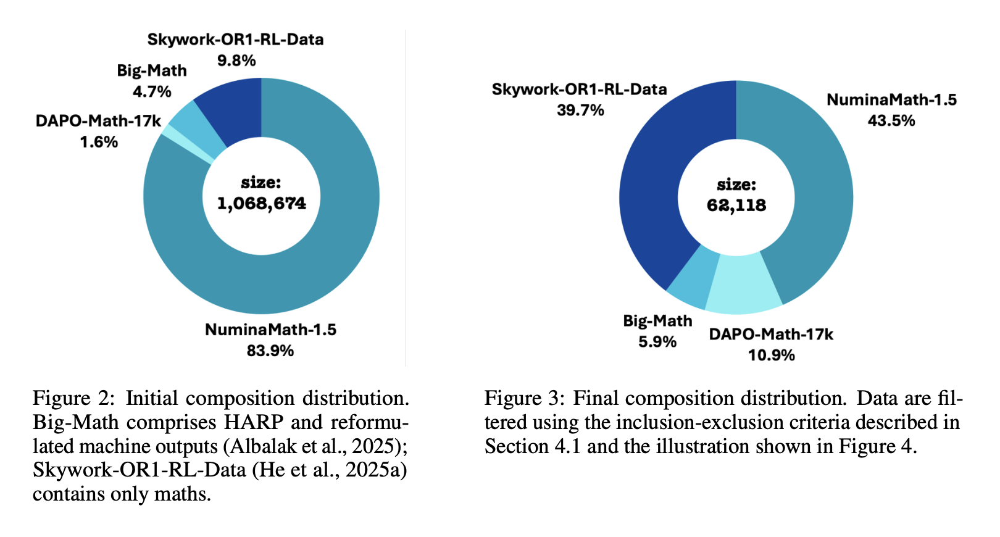

# MiroMind-M1: Advancing Open-Source Mathematical Reasoning via Context-Aware Multi-Stage Reinforcement Learning

> Large language models (LLMs) have recently demonstrated remarkable progress in multi-step reasoning, establishing mathematical problem-solving as a rigorous benchmark for assessing advanced capabilities. While proprietary models like GPT-4o and Claude Sonnet 4 lead performance, their closed-source nature impedes transparency and reproducibility. Addressing these gaps, MiroMind AI Released the MiroMind-M1 series, a fully open-source pipeline—spanning datasets, […]

Large language models (LLMs) have recently demonstrated remarkable progress in multi-step reasoning, establishing mathematical problem-solving as a rigorous benchmark for assessing advanced capabilities. While proprietary models like GPT-4o and Claude Sonnet 4 lead performance, their closed-source nature impedes transparency and reproducibility. Addressing these gaps, **MiroMind AI Released the MiroMind-M1 series, a fully open-source pipeline**—spanning datasets, models, training code, and evaluation scripts—that sets new standards for openness and state-of-the-art mathematical reasoning within the Qwen-2.5 model ecosystem.

### Architectural Foundation and Motivation

**MiroMind-M1** is built on the robust Qwen-2.5 backbone, with enhancements geared explicitly for mathematical reasoning. The team adopts a two-stage training protocol:

- **Supervised Fine-Tuning (SFT):** The model is fine-tuned on 719K carefully curated and verified mathematical problems, equipping it with strong step-by-step reasoning abilities.

- **Reinforcement Learning with Verifiable Rewards (RLVR):** Next, the model undergoes RL on 62K challenging and rigorously verifiable math problems, leveraging reward signals from a robust external verifier.

This approach is motivated by both the need for strong mathematical logic and by the lessons learned from leading RLMs: imitating chain-of-thought exemplars improves general reasoning, while reinforcement learning, guided by precise rewards, further refines accuracy and efficiency.

### Data Transparency and Quality

A hallmark of the MiroMind-M1 project is the full openness and cleanliness of its training data:

- **SFT corpus composition:** Draws from OpenR1, OpenThoughts, Light-R1, and Synthetic-1, ensuring problems have verified solutions and rich, multi-step reasoning traces.

- **Stringent deduplication and decontamination:** Employs N-gram overlap filtering to eliminate duplication and data leakage with evaluation sets (e.g., AIME24, AIME25, MATH500).

- **Preference for long trajectories:** Experiments show that training on samples with longer reasoning traces consistently yields higher benchmark scores, highlighting the importance of deep semantic content in the reasoning signal.

The resulting dataset provides 719K verified training traces—significantly advancing open reproducible research over prior efforts.

### Supervised Fine-Tuning: Empirical Excellence

For SFT, MiroMind-SFT-7B is initialized from Qwen2.5-Math-7B and trained with a large context window (max 32,768 tokens) and a no-packing strategy to avoid cross-sample attention contamination. Its performance on key math benchmarks outpaces peer open models:

ModelAIME24AIME25MATH500DeepSeek-R1-Distill55.540.492.8MiMo-7B-SFT58.744.393.0**MiroMind-SFT-7B**60.445.094.6

These results validate the efficacy of the data curation and training design: richer, deeper samples and no-packing lead to consistently superior performance.

### CAMPO: Context-Aware Multi-Stage Policy Optimization

A key innovation in MiroMind-M1’s RLVR phase is the **CAMPO** algorithm. CAMPO addresses two critical RL challenges—training instability and token inefficiency—by:

- **Multi-stage training with expanding context limits:** Training starts with constrained output lengths (e.g., 16K tokens), then gradually increases to allow deeper reasoning, balancing efficiency and thoroughness.

- **Dynamic repetition penalty:** A dedicated repetition critic penalizes outputs exhibiting early or excessive repetition, preventing utility collapse and enforcing output diversity.

- **Accurate external verifier:** The reward feedback system is substantially improved to robustly score math answers (including tricky cases with units, π, and percentages), ensuring training signals are tightly aligned with true correctness.

CAMPO not only stabilizes RL dynamics but also results in models that solve problems with fewer, more relevant tokens—accelerating inference and reducing costs without sacrificing accuracy.

### Benchmark Performance: State-of-the-Art Efficiency

MiroMind’s open models achieve highly competitive or state-of-the-art results for open Qwen-2.5-based math models (7B/32B parameters):

ModelAIME24AIME25MATH500DeepSeek-R1-7B55.539.2–MiMo-7B-RL68.255.495.8Skywork-OR1-7B72.254.6–**MiroMind-RL-7B**73.457.896.7Skywork-OR1-32B77.168.297.5**MiroMind-RL-32B**77.565.696.4

Notably, MiroMind-M1-RL models not only match or exceed peer accuracy, but do so with greater token efficiency—the 32B model produces shorter, more concise solutions without loss of correctness, thanks to CAMPO’s training.

### Full Stack and Reproducibility

Every component of the MiroMind-M1 stack is openly released:

- **Model weights** (SFT and RL checkpoints for both 7B and 32B scales)

- **Datasets** (full 719K SFT, 62K RLVR)

- **Training scripts** (supporting multi-node distributed training on Ray)

- **Evaluation code** (standardized scripts and benchmark configs)

Researchers can replicate, audit, and extend MiroMind-M1 from raw data to trained models, advancing reproducibility and accelerating new open research.

### Conclusion

MiroMind-M1 demonstrates that with careful data curation, innovative RL algorithms (CAMPO), and radical transparency, open-source language models can rival proprietary systems in advanced mathematical reasoning. This project sets a new bar for reproducibility and collaborative advancement in reasoning LLMs, providing both a high-quality resource and a robust platform for future innovation.

---

Check out the **[Paper](https://arxiv.org/abs/2507.14683), [GitHub Page](https://github.com/MiroMindAsia/MiroMind-M1) and [Model on Hugging Face](https://huggingface.co/miromind-ai/MiroMind-M1-RL-7B)_._** All credit for this research goes to the researchers of this project. Also, feel free to follow us on **[Twitter](https://x.com/intent/follow?screen_name=marktechpost)** and don’t forget to join our **[100k+ ML SubReddit](https://www.reddit.com/r/machinelearningnews/)** and Subscribe to **[our Newsletter](https://www.aidevsignals.com/)**.
